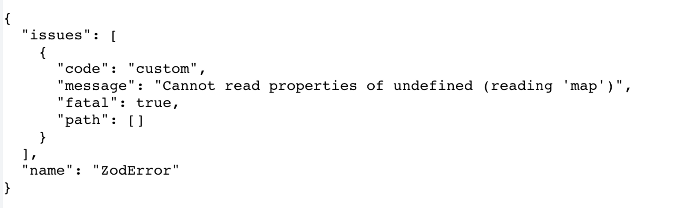
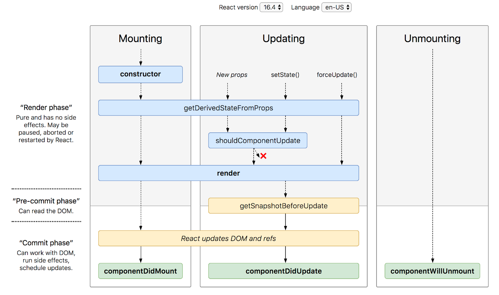

## 목차

- [Introduction](#Introduction)
- [Zod 란?](#Zod-란?)
- [에러 바운더리](#에러-바운더리)
- [Zod에서의 에러 바운더리 구현](#Zod에서의-에러-바운더리-구현)

<!--truncate-->

<br />

## Introduction

안녕하세요 오늘은 `Zod`에서 에러 바운더리 구현하기 라는 주제로 이야기해보려 합니다.

현재 구현된 프로젝트에서는 컨테이너 컴포넌트에서 퀴리를 요청하여 에러 발생 시 `Zod`에서 던진 메시지를 catch하여 화면에 렌더링 하는 방식으로 처리하고 있었습니다.

커스텀으로 생성한 스키마이기에 코드와 메시지가 유저 친화적이지 못하다는 의견들이 나오고 있던터라 본격적으로 에러 처리하기 위한 작업을 시작하였습니다.

<br />

## Zod 란?

시작에 앞서 Zod란 TypeScript에서 강력하고 유연한 스키마 검증을 위한 라이브러리입니다. Zod를 이용하면, 사용자의 입력, API 응답 및 다른 데이터의 유효성을 검사하고 검증하는 것이 가능합니다. 그런데 이런 프로세스에서는 종종 예기치 않은 에러가 발생하곤 합니다. 이럴 때 필요한 것이 바로 에러 바운더리입니다. 에러 바운더리는 에러를 예상하고, 그에 대응하는 로직을 구현함으로써 시스템 전체의 안정성을 확보하는 중요한 개념입니다.

<br />

## 에러 바운더리

에러를 처리하는 다양한 방법들이 있지만, 선언적인 에러 처리를 위하여 [리액트 공식 문서](https://react.dev/reference/react/Component#catching-rendering-errors-with-an-error-boundary)에 작성되어 있는 에러 바운더리를 적용하려고 합니다. 에러 바운더리는 예상치 못한 문제가 발생했을 때, 이를 대응하고 제어하는 방법을 제공합니다. 예를 들어, 서버에서 올바르지 않은 형식의 데이터를 받아올 때, 이를 그대로 사용하려 하면 시스템 전체가 문제를 일으킬 수 있습니다. 에러 바운더리는 이런 문제를 방지하고, 문제가 발생했을 때 적절하게 대응하도록 돕습니다.

다음은 공식문서에서 제안하고 있는 ErrorBoundary code 입니다.

```tsx title="./ErrorBoundary.tsx"
class ErrorBoundary extends React.Component {
  constructor(props) {
    super(props);
    this.state = { hasError: false };
  }

  static getDerivedStateFromError(error) {
    // Update state so the next render will show the fallback UI.
    return { hasError: true };
  }

  componentDidCatch(error, info) {
    // Example "componentStack":
    //   in ComponentThatThrows (created by App)
    //   in ErrorBoundary (created by App)
    //   in div (created by App)
    //   in App
    logErrorToMyService(error, info.componentStack);
  }

  render() {
    if (this.state.hasError) {
      // You can render any custom fallback UI
      return this.props.fallback;
    }

    return this.props.children;
  }
}
```

보통 함수형 컴포넌트로 작성하다 class로 작성되어 어색하긴 하지만, 코드의 핵심을 이해하기 위해서는 React Component의 생명주기에 대한 배경 지식이 필요합니다.



보통 함수형 컴포넌트로 작성하다 class로 작성되어 어색하긴 하지만, 코드의 핵심을 이해하기 위해서는 React Component의 생명주기에 대한 배경 지식이 필요합니다.

버전마다 약간의 차이는 있지만 리액트 Component의 생명주기는 실행 이벤트 관점에서 mount, update, unmount로 구분 할 수 있으며, 실행 단계 관점에서는 랜더링 이전, 업데이트 반영 전, 업데이트 반영 후 3단계로 구분 할 수 있습니다. 버전별 일반 생명주기 메서드 표는 아래 링크를 참고하세요.

**react-lifecycle-methods-diagram : http://projects.wojtekmaj.pl/react-lifecycle-methods-diagram/**

다양한 메서드들이 존재 하지만, 에러 바운더리를 이해하기 위해서 필요한 두 가지 메서드를 알아보겠습니다.

getDerivedStateFromError, componentDidCatch 입니다.

### getDerivedStateFromError

React에서 제공하는 **`getDerivedStateFromError`** 메서드는 에러가 발생했을 때 그 에러를 잡아내고, 컴포넌트의 state를 업데이트하여 컴포넌트가 렌더링하는 동안 발생한 JavaScript 에러를 처리할 수 있게 해줍니다. 이 메서드는 발생한 에러를 파라미터로 받아오며, 새로운 state를 반환하는 형태입니다.

다음은 **`getDerivedStateFromError`** 메서드의 사용 예시입니다:

```tsx
class ErrorBoundary extends React.Component {
  state = { hasError: false };

  static getDerivedStateFromError(error) {
    // 에러가 발생하면, state를 업데이트한다.
    return { hasError: true };
  }

  render() {
    if (this.state.hasError) {
      // 에러 발생 시, fallback UI를 렌더링한다.
      return <h1>Something went wrong.</h1>;
    }

    return this.props.children;
  }
}
```

위의 **`ErrorBoundary`** 컴포넌트는 **`getDerivedStateFromError`**를 사용하여 에러를 잡아내고, 에러가 발생하면 **`hasError`** state를 **`true`**로 설정합니다. 그 후 에러가 발생했을 때 보여줄 UI를 렌더링합니다.

### componentDidCatch

**`componentDidCatch`** 메서드는 **`getDerivedStateFromError`**와 마찬가지로 에러를 잡아내지만, 이 메서드는 state를 업데이트하는 대신 에러 정보를 로깅하거나 리포팅하는 등의 부수적인 효과(side effect)를 발생시키는 데 사용됩니다. 이 메서드는 두 개의 파라미터를 받아옵니다: 발생한 에러와 에러에 대한 정보를 포함하는 객체입니다.

다음은 **`componentDidCatch`** 메서드의 사용 예시입니다:

```tsx
class ErrorBoundary extends React.Component {
  state = { hasError: false };

  static getDerivedStateFromError(error) {
    return { hasError: true };
  }

  componentDidCatch(error, errorInfo) {
    // logErrorToMyService함수는 에러와 에러 정보를 로깅합니다.
    logErrorToMyService(error, errorInfo);
  }

  render() {
    if (this.state.hasError) {
      return <h1>Something went wrong.</h1>;
    }

    return this.props.children;
  }
}
```

위의 **`ErrorBoundary`** 컴포넌트에서는 **`componentDidCatch`**를 사용하여 에러를 잡아내고, 에러 정보를 외부 서비스로 로깅하고 있습니다.

이렇게 **`getDerivedStateFromError`**와 **`componentDidCatch`** 메서드를 이용하여 에러 바운더리를 구현하면, 에러가 발생했을 때 적절하게 대응하고 사용자에게 친숙한 에러 메시지를 제공할 수 있습니다. 이 두 메서드는 React의 클래스 컴포넌트에서만 사용 가능하여 함수형 컴포넌트보다 더 최적화 된 기능을 사용할 수 있기 때문에 클래스로 작성합니다.

여기까지 에러 바운더리 적용에 앞서 기본 개념을 살펴보는 시간이였습니다.

다음은 직접 Zod를 활용하여 에러를 발생 시킨 후 선언적인 에러 처리를 작성해보겠습니다.

## Zod에서의 에러 바운더리 구현
