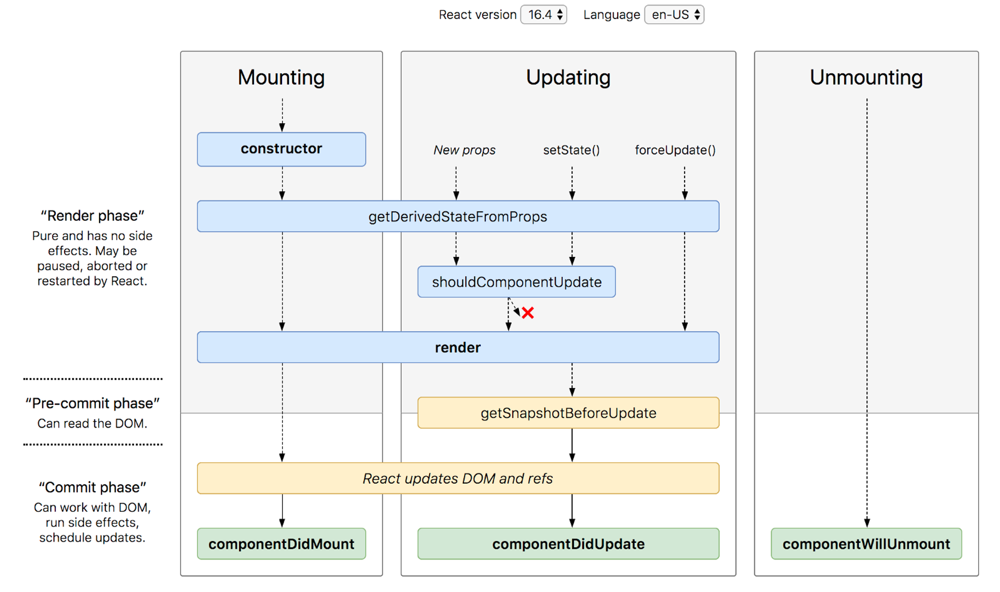

## 목차

- [Introduction](#Introduction)
- [Zod 란?](#Zod-란?)
- [에러 바운더리](#에러-바운더리)
- [Zod에서의 에러 바운더리 구현](#Zod에서의-에러-바운더리-구현)
- [고차 컴포넌트(Higher-Order Components, HOC)와 withErrorBoundary의 활용](<#고차 컴포넌트(Higher-Order Components, HOC)와 withErrorBoundary의 활용>)
- [결론](#결론)

<!--truncate-->

<br />

## Introduction

안녕하세요 오늘은 `Zod`에서 에러 바운더리 구현하기 라는 주제로 이야기해보려 합니다.

현재 구현된 프로젝트에서는 컨테이너 컴포넌트에서 퀴리를 요청하여 에러 발생 시 `Zod`에서 던진 메시지를 catch하여 화면에 렌더링 하는 방식으로 처리하고 있었습니다.

커스텀으로 생성한 스키마이기에 코드와 메시지가 유저 친화적이지 못하다는 의견들이 나오고 있던터라 본격적으로 에러 처리하기 위한 작업을 시작하였습니다.

<br />

## Zod 란?

시작에 앞서 Zod란 TypeScript에서 강력하고 유연한 스키마 검증을 위한 라이브러리입니다. Zod를 이용하면, 사용자의 입력, API 응답 및 다른 데이터의 유효성을 검사하고 검증하는 것이 가능합니다. 그런데 이런 프로세스에서는 종종 예기치 않은 에러가 발생하곤 합니다. 이럴 때 필요한 것이 바로 에러 바운더리입니다. 에러 바운더리는 에러를 예상하고, 그에 대응하는 로직을 구현함으로써 시스템 전체의 안정성을 확보하는 중요한 개념입니다.

<br />

## 에러 바운더리

에러를 처리하는 다양한 방법들이 있지만, 선언적인 에러 처리를 위하여 [리액트 공식 문서](https://react.dev/reference/react/Component#catching-rendering-errors-with-an-error-boundary)에 작성되어 있는 에러 바운더리를 적용하려고 합니다. 에러 바운더리는 예상치 못한 문제가 발생했을 때, 이를 대응하고 제어하는 방법을 제공합니다. 예를 들어, 서버에서 올바르지 않은 형식의 데이터를 받아올 때, 이를 그대로 사용하려 하면 시스템 전체가 문제를 일으킬 수 있습니다. 에러 바운더리는 이런 문제를 방지하고, 문제가 발생했을 때 적절하게 대응하도록 돕습니다.

다음은 공식문서에서 제안하고 있는 ErrorBoundary code 입니다.

```tsx title="./ErrorBoundary.tsx"
class ErrorBoundary extends React.Component {
  constructor(props) {
    super(props);
    this.state = { hasError: false };
  }

  static getDerivedStateFromError(error) {
    // Update state so the next render will show the fallback UI.
    return { hasError: true };
  }

  componentDidCatch(error, info) {
    // Example "componentStack":
    //   in ComponentThatThrows (created by App)
    //   in ErrorBoundary (created by App)
    //   in div (created by App)
    //   in App
    logErrorToMyService(error, info.componentStack);
  }

  render() {
    if (this.state.hasError) {
      // You can render any custom fallback UI
      return this.props.fallback;
    }

    return this.props.children;
  }
}
```

보통 함수형 컴포넌트로 작성하다 class로 작성되어 어색하긴 하지만, 코드의 핵심을 이해하기 위해서는 React Component의 생명주기에 대한 배경 지식이 필요합니다.



버전마다 약간의 차이는 있지만 리액트 Component의 생명주기는 실행 이벤트 관점에서 mount, update, unmount로 구분 할 수 있으며, 실행 단계 관점에서는 랜더링 이전, 업데이트 반영 전, 업데이트 반영 후 3단계로 구분 할 수 있습니다. 버전별 일반 생명주기 메서드 표는 아래 링크를 참고하세요.

**react-lifecycle-methods-diagram : http://projects.wojtekmaj.pl/react-lifecycle-methods-diagram/**

다양한 메서드들이 존재 하지만, 에러 바운더리를 이해하기 위해서 필요한 두 가지 메서드를 알아보겠습니다.

getDerivedStateFromError, componentDidCatch 입니다.

### getDerivedStateFromError

React에서 제공하는 **`getDerivedStateFromError`** 메서드는 에러가 발생했을 때 그 에러를 잡아내고, 컴포넌트의 state를 업데이트하여 컴포넌트가 렌더링하는 동안 발생한 JavaScript 에러를 처리할 수 있게 해줍니다. 이 메서드는 발생한 에러를 파라미터로 받아오며, 새로운 state를 반환하는 형태입니다.

다음은 **`getDerivedStateFromError`** 메서드의 사용 예시입니다:

```tsx
class ErrorBoundary extends React.Component {
  state = { hasError: false };

  static getDerivedStateFromError(error) {
    // 에러가 발생하면, state를 업데이트한다.
    return { hasError: true };
  }

  render() {
    if (this.state.hasError) {
      // 에러 발생 시, fallback UI를 렌더링한다.
      return <h1>Something went wrong.</h1>;
    }

    return this.props.children;
  }
}
```

위의 **`ErrorBoundary`** 컴포넌트는 **`getDerivedStateFromError`**를 사용하여 에러를 잡아내고, 에러가 발생하면 **`hasError`** state를 **`true`**로 설정합니다. 그 후 에러가 발생했을 때 보여줄 UI를 렌더링합니다.

### componentDidCatch

**`componentDidCatch`** 메서드는 **`getDerivedStateFromError`**와 마찬가지로 에러를 잡아내지만, 이 메서드는 state를 업데이트하는 대신 에러 정보를 로깅하거나 리포팅하는 등의 부수적인 효과(side effect)를 발생시키는 데 사용됩니다. 이 메서드는 두 개의 파라미터를 받아옵니다: 발생한 에러와 에러에 대한 정보를 포함하는 객체입니다.

다음은 **`componentDidCatch`** 메서드의 사용 예시입니다:

```tsx
class ErrorBoundary extends React.Component {
  state = { hasError: false };

  static getDerivedStateFromError(error) {
    return { hasError: true };
  }

  componentDidCatch(error, errorInfo) {
    // logErrorToMyService함수는 에러와 에러 정보를 로깅합니다.
    logErrorToMyService(error, errorInfo);
  }

  render() {
    if (this.state.hasError) {
      return <h1>Something went wrong.</h1>;
    }

    return this.props.children;
  }
}
```

위의 **`ErrorBoundary`** 컴포넌트에서는 **`componentDidCatch`**를 사용하여 에러를 잡아내고, 에러 정보를 외부 서비스로 로깅하고 있습니다.

이렇게 **`getDerivedStateFromError`**와 **`componentDidCatch`** 메서드를 이용하여 에러 바운더리를 구현하면, 에러가 발생했을 때 적절하게 대응하고 사용자에게 친숙한 에러 메시지를 제공할 수 있습니다. 이 두 메서드는 React의 클래스 컴포넌트에서만 사용 가능하여 함수형 컴포넌트보다 더 최적화 된 기능을 사용할 수 있기 때문에 클래스로 작성합니다.

여기까지 에러 바운더리 적용에 앞서 기본 개념을 살펴보는 시간이였습니다.

다음은 직접 Zod를 활용하여 에러를 발생 시킨 후 선언적인 에러 처리를 작성해보겠습니다.

## Zod에서의 에러 바운더리 구현

Zod에서 에러 바운더리를 구현하려면, 우선 Zod 스키마를 정의해야 합니다. 이때, Zod의 **`.safeParse()`** 메소드를 사용하면 편리합니다. **`.safeParse()`** 메소드는 스키마 검증에 실패하면 에러를 발생시키는 대신 실패 정보를 반환합니다.

다음은 사용자 데이터를 검증하는 Zod 스키마와 에러 바운더리를 활용하여 fallback 컴포넌트를 구현한 예시입니다.

```jsx
import React from 'react';
import { z } from 'zod';

// Zod 스키마 정의
const UserSchema = z.object({
  name: z.string(),
  age: z.number(),
});

// fallback UI를 렌더링하는 컴포넌트
const ErrorFallbackComponent = () => <h1>Something went wrong with user data.</h1>;

// 에러 바운더리 구현
class ErrorBoundary extends React.Component {
  constructor(props) {
    super(props);
    this.state = { hasError: false };
  }

  // 에러가 발생하면, state를 업데이트하여 에러 상태를 표시
  static getDerivedStateFromError(error) {
    return { hasError: true };
  }

  render() {
    const parsed = UserSchema.safeParse(this.props.user);

    if (!parsed.success || this.state.hasError) {
      // 데이터가 스키마에 부합하지 않거나 에러가 발생하면,
      // fallback UI를 렌더링
      return <ErrorFallbackComponent />;
    }

    // 에러가 없으면 children을 렌더링
    return this.props.children;
  }
}

// 사용 예시
const UserProfileComponent = ({ user }) => (
  <ErrorBoundary user={user}>
    <h1>{user.name}</h1>
    <h2>{user.age}</h2>
  </ErrorBoundary>
);
```

위 예시에서 **`UserProfileComponent`**는 **`ErrorBoundary`** 컴포넌트로 감싸져 있습니다. 이렇게 함으로써 **`UserProfileComponent`**에서 발생하는 에러를 **`ErrorBoundary`** 컴포넌트에서 잡아낼 수 있습니다. 또한, **`UserSchema.safeParse(this.props.user)`**를 통해 사용자 데이터의 유효성 검증을 수행하고, 만약 검증에 실패하거나 에러가 발생하면 **`ErrorFallbackComponent`**를 렌더링하여 사용자에게 에러 상황을 알립니다.

[slash/packages/react/error-boundary/src/ErrorBoundary.ko.md at main · toss/slash](https://github.com/toss/slash/blob/main/packages/react/error-boundary/src/ErrorBoundary.ko.md)

또한 토스에서 제공하는 라이브러리 중 error-boundary를 활용하면 선언적으로 에러를 관리할 수 있게 됩니다. 자세한 정보는 링크를 통해 확인 가능합니다. 또한 리액트의 [Error Boundary](https://ko.reactjs.org/docs/error-boundaries.html)는 이벤트 핸들러 등에서 발생한 에러는 인지하지 못하기 때문에 `useErrorBoundary`를 사용하면 Error Boundary가 인지하지 못하는 에러를 전달해줄 수 있습니다.

핵심 코드들은 문서에서 확인이 가능하지만, 토스에서 제공하는 고차 컴포넌트에 대해 더 알아보겠습니다.

## 고차 컴포넌트(Higher-Order Components, HOC)와 withErrorBoundary의 활용

React에서 HOC란, 컴포넌트 로직을 재사용하기 위해 사용하는 고급 테크닉 중 하나입니다. HOC는 컴포넌트를 입력으로 받아 새로운 컴포넌트를 반환하는 함수입니다. 이는 컴포넌트 로직을 재사용하는 또 다른 방법인 Hook과 비슷하지만, 각 기술을 적용하는 상황은 다릅니다.

그럼 이제 HOC를 이용하여 에러 바운더리를 구현한 예시인 **`withErrorBoundary`**를 살펴봅시다.

```jsx
export const withErrorBoundary = <Props extends Record<string, unknown> = Record<string, never>>(
  Component: ComponentType<Props>,
  errorBoundaryProps: ComponentPropsWithoutChildren<typeof ErrorBoundary>
) => {
  const Wrapped = (props: Props) => (
    <ErrorBoundary {...errorBoundaryProps}>
      <Component {...props} />
    </ErrorBoundary>
  );

  if (process.env.NODE_ENV !== 'production') {
    const name = Component.displayName || Component.name || 'Component';
    Wrapped.displayName = `withErrorBoundary(${name})`;
  }

  return Wrapped;
};
```

**`withErrorBoundary`**는 HOC로, 컴포넌트와 에러 바운더리에 사용될 속성을 입력으로 받습니다. 그리고 입력받은 컴포넌트를 에러 바운더리로 감싸는 새로운 컴포넌트를 반환합니다.

이렇게 하면 **`withErrorBoundary`** HOC를 사용하는 모든 컴포넌트에서 에러 바운더리를 적용할 수 있으며, 에러 바운더리의 코드를 일일이 각 컴포넌트에 작성할 필요가 없어집니다. 즉, 에러 바운더리의 로직을 재사용할 수 있게 됩니다.

**`withErrorBoundary`**를 사용하여 컴포넌트를 감싸면, 감싼 컴포넌트에서 발생하는 에러를 **`ErrorBoundary`** 컴포넌트에서 처리하고, 에러 발생 시 fallback UI를 렌더링하게 됩니다.

마지막으로, **`withErrorBoundary`** HOC는 **`Wrapped.displayName`** 속성을 설정하여 개발자 도구에서 컴포넌트의 이름을 쉽게 확인할 수 있게 합니다. 이는 디버깅을 보다 쉽게 해주는 장점을 제공합니다.

```jsx
import React from 'react';
import { withErrorBoundary } from './withErrorBoundary';
import { ErrorFallbackComponent } from './ErrorFallbackComponent';

function ContainerPage() {
  const query = useCustomQuery < Custom > (custom, { suspense: false });

  return <div>테스트 페이지 {query}</div>;
}

export default withErrorBoundary(ContainerPage, { FallbackComponent: ErrorFallbackComponent });
```

이 예제는 **`ContainerPage`** 컴포넌트를 **`withErrorBoundary`** 고차 컴포넌트로 감싸, 에러 바운더리를 적용하였습니다. **`withErrorBoundary`** 함수의 첫 번째 인자로 컴포넌트(**`ContainerPage`**)를 전달하고, 두 번째 인자로 에러 발생 시 보여줄 fallback 컴포넌트(**`ErrorFallbackComponent`**)를 지정합니다.

**`ContainerPage`** 컴포넌트에서는 **`useCustomQuery`**를 사용해 쿼리를 호출하며 이 때, 에러가 발생하면 이 에러는 **`withErrorBoundary`**로 감싸져 있기 때문에, **`ErrorBoundary`**에서 잡아내게 됩니다.

그렇게 되면 에러 발생 시 렌더링 될 fallback 컴포넌트인 **`ErrorFallbackComponent`**가 렌더링됩니다. 이는 사용자에게 에러가 발생했음을 알리는 동시에, 에러가 전체 페이지를 중단시키는 것을 방지하여 애플리케이션의 안정성을 높이는 데 도움이 됩니다.

이처럼 에러 바운더리는 애플리케이션의 오류 처리를 개선하고, 안정성을 높이는 데 중요한 역할을 합니다. HOC인 **`withErrorBoundary`**를 사용하여 에러 바운더리를 쉽게 적용하고 재사용함으로써, 전체적인 페이지 구조를 유지하고 보다 나은 유지 보수를 가능케 합니다.

## 결론

에러 바운더리는 리액트 애플리케이션의 안정성을 높이는 중요한 도구입니다. 에러가 발생하더라도 적절한 에러 처리를 통해 사용자에게 친화적인 메시지를 전달하고, 애플리케이션의 중단을 막을 수 있습니다.

특히, Zod와 함께 사용하면, 강력한 유효성 검사와 함께 예상치 못한 에러를 안전하게 처리할 수 있게 됩니다.

withErrorBoundary를 활용한 에러 바운더리의 구현은 코드 재사용성을 높이고, 개발자가 각 컴포넌트에서 발생할 수 있는 에러를 일관되게 처리할 수 있도록 돕습니다. 이로써 개발자는 비즈니스 로직에 더욱 집중하고, 더 나은 사용자 경험을 제공할 수 있게 됩니다.

리액트의 에러 바운더리와 Zod를 활용하여, 보다 안정적이고 유지 보수가 용이한 애플리케이션을 구축할 수 있습니다. 에러 처리는 복잡한 소프트웨어 개발의 일부이며, 에러 바운더리는 그 복잡성을 관리하는 데 도움이 됩니다.

그래서 우리는 항상 최선의 프랙티스를 추구하며, 가능한 한 최고의 사용자 경험을 제공하려는 노력을 계속해야 합니다. 앞으로도 Zod와 리액트 에러 바운더리를 적극 활용하여 효율적이고 안정적인 애플리케이션을 개발해 나가기를 바랍니다.
