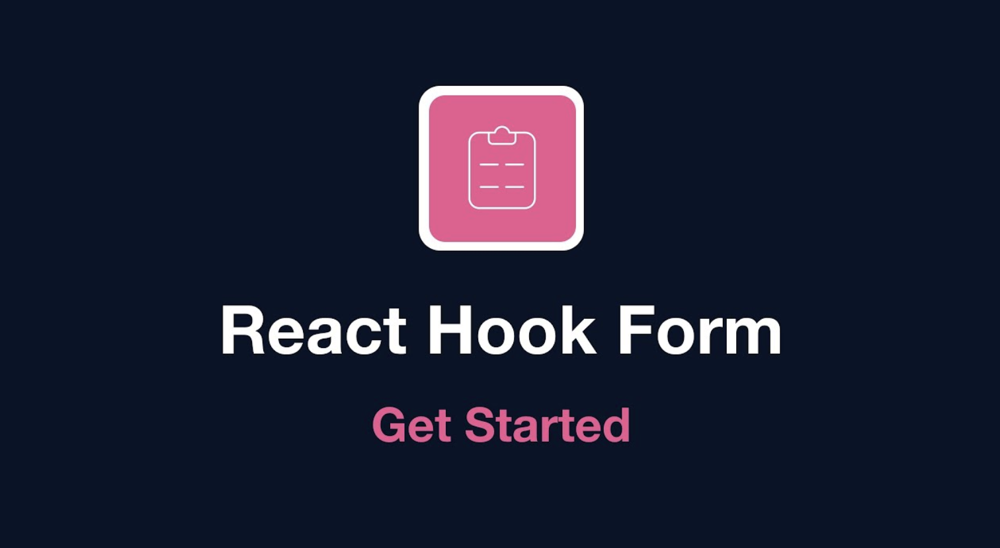
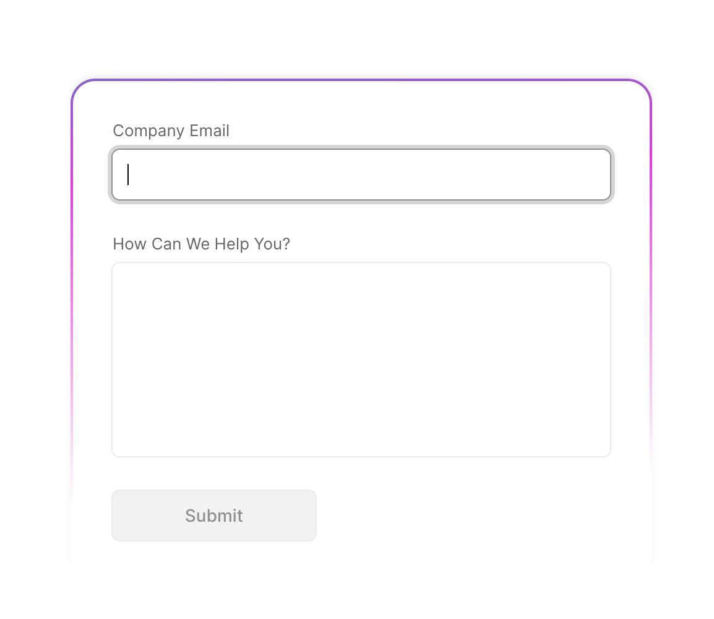

## 목차

- [리액트 훅 폼이란 무엇일까?](#리액트-훅-폼이란-무엇일까?)
- [리액트 훅 폼의 기본 구조 및 동작 원리](#리액트-훅-폼의-기본-구조-및-동작-원리)
- [리액트 훅 폼 사용법](#리액트-훅-폼-사용법)
- [실제 적용 예시](#실제-적용-예시)
- [결론 및 요약](#결론-및-요약)

<!--truncate-->

<br />



## 리액트 훅 폼이란 무엇일까?

폼은 웹 애플리케이션에서 중요한 역할을 담당하며, 사용자의 입력을 수집하고 처리하는 데 사용됩니다. 그러나 리액트에서 상태를 통해 폼을 관리하는 것은 복잡하고 무거워질 수 있습니다. 리액트 훅 폼(React Hook Form)은 이러한 문제를 해결하고자 만들어진 라이브러리입니다.

리액트 훅 폼을 사용하면 다음과 같은 장점을 얻을 수 있습니다.

### 최적화된 성능

리액트 훅 폼은 불필요한 리렌더링을 피하고, 최소한의 리렌더링만을 수행합니다. 이는 매번 상태가 업데이트될 때마다 전체 폼이 다시 렌더링되는 것을 피하고, 입력 필드의 변경이 해당 필드 외에는 아무런 영향을 끼치지 않도록 하는 원리에 기반합니다. 이는 특히 대규모 폼에서 애플리케이션의 성능을 크게 향상시킬 수 있습니다.

### 쉬운 폼 관리

전통적인 폼 관리에서는 각 입력 필드를 별도의 상태로 관리하고, 이 상태들을 수동으로 업데이트하고 동기화해야 합니다. 이와는 달리 리액트 훅 폼은 **`ref`**를 이용해 폼 요소를 직접 제어함으로써 이러한 번거로움을 줄입니다. 이는 코드의 복잡성을 줄이고 가독성을 향상시킵니다.

### 간편한 유효성 검사

리액트 훅 폼은 폼의 유효성 검사를 간편하게 수행할 수 있습니다. 유효성 검사 규칙을 입력 필드와 함께 선언하면, 리액트 훅 폼이 자동으로 입력값의 유효성을 검사하고 오류 메시지를 제공합니다. 이는 유효성 검사 로직을 수동으로 처리하는 것에 비해 훨씬 간단하고 안정적입니다. 또한, joi, Yup, Superstruct 등의 외부 유효성 검사 라이브러리와도 쉽게 통합할 수 있습니다.

그러나 모든 상황에서 리액트 훅 폼을 사용해야 하는 것은 아닙니다. 예를 들어, 폼의 상태를 전역 상태로 관리해야 하거나 다른 라이브러리와 통합해야 하는 경우에는 다른 상태 관리 라이브러리를 사용하는 것이 더 적합할 수 있습니다.

이제 리액트 훅 폼이 어떤 것인지, 그리고 왜 필요한지에 대해 이해했다면, 이제 그 동작 원리와 사용법에 대해 알아보겠습니다.


## 리액트 훅 폼의 기본 구조 및 동작 원리

리액트 훅 폼은 **`register`**, **`handleSubmit`**, **`errors`**, **`watch`** 등의 메소드를 제공하여 폼과 관련된 다양한 기능을 쉽게 수행할 수 있게 합니다.

시작하기에 앞서, React Hook Form은 `useForm`이라는 훅을 통해 여러 가지 기능을 제공합니다. `useForm` 훅은 폼 관련 로직과 상태를 캡슐화하고, 이를 통해 폼의 상태를 쉽게 관리할 수 있게 해줍니다.

아래에는 `useForm` 훅의 간략한 설명을 추가하였습니다.

### useForm

`useForm`은 React Hook Form의 핵심 훅입니다. 이 훅을 통해 여러 폼 관련 메소드와 속성에 접근할 수 있습니다. 사용 방법은 매우 간단합니다. `useForm`을 호출하면, 다음과 같은 메소드와 속성들을 객체 형태로 반환합니다.

```jsx
const {
  register, // 입력 항목을 등록하고 관리하는 메소드
  handleSubmit, // 폼 제출을 관리하는 메소드
  formState: { errors }, // 폼 상태 중 에러 관련 정보를 담은 객체
  watch, // 폼 상태를 실시간으로 관찰하는 메소드
} = useForm();
```

위에서 볼 수 있듯이, `useForm` 훅을 호출하여 반환받은 객체에서 필요한 메소드나 속성들을 추출하여 사용할 수 있습니다. 이를 통해 각각의 입력 항목을 등록하고, 폼 제출을 관리하며, 폼 상태를 실시간으로 관찰하거나 에러 정보를 확인할 수 있습니다.

이제 본격적으로 각 요소에 대해 알아보겠습니다.

### 1. register

"register"는 폼 요소를 리액트 훅 폼에 등록하는 메소드입니다. 이것은 두 가지 방식으로 사용될 수 있습니다. 첫째, HTML의 "ref" 속성을 이용하여 직접적으로 폼 요소에 연결할 수 있습니다. 이를 통해, 해당 요소의 상태를 리액트 훅 폼이 자동으로 관리하게 됩니다. 둘째, register 함수를 통해 사용자 정의 입력 컴포넌트를 생성하는 것도 가능합니다. 이 경우, 직접 폼 요소의 상태를 관리해야 할 수도 있습니다.

```jsx
import React from 'react';
import { useForm } from 'react-hook-form';

function Form() {
  const { register } = useForm();

  return (
    <form>
      <input {...register('firstName')} placeholder="First Name" />
      <input {...register('lastName')} placeholder="Last Name" />
    </form>
  );
}
```

위 코드에서는 "firstName"과 "lastName"이라는 이름의 두 개의 입력 항목을 폼에 등록했습니다. 이를 통해, 이 두 항목의 상태는 자동으로 리액트 훅 폼에 의해 관리됩니다.

### 2. handleSubmit

"handleSubmit"는 폼의 제출을 관리하는 함수입니다. 이 함수는 실제로 폼의 제출을 처리하는 콜백 함수를 매개변수로 받습니다. 콜백 함수는 사용자가 폼을 제출할 때 호출되며, 이 때 폼 데이터를 매개변수로 받습니다. "handleSubmit" 함수는 콜백을 호출하기 전에, 폼 데이터의 유효성을 검사하고, 필요하다면 에러를 설정합니다.

```jsx
import React from 'react';
import { useForm } from 'react-hook-form';

function Form() {
  const { register, handleSubmit } = useForm();

  const onSubmit = (data) => console.log(data);

  return (
    <form onSubmit={handleSubmit(onSubmit)}>
      <input {...register('firstName')} placeholder="First Name" />
      <input {...register('lastName')} placeholder="Last Name" />
      <button type="submit">Submit</button>
    </form>
  );
}
```

이 코드에서는 "handleSubmit" 함수를 통해 폼 제출을 관리하고 있습니다. 사용자가 "Submit" 버튼을 클릭하면, "onSubmit" 콜백이 호출되며, 이 때 폼 데이터가 매개변수로 전달됩니다.

### 3. errors

"errors" 객체는 폼의 유효성 검사에서 발생한 에러를 저장합니다. 각각의 입력 항목은 해당 항목의 이름을 키로 가지는 에러를 가질 수 있습니다. 에러 객체는 메시지 속성을 가지며, 이는 에러 메시지를 표시하는 데 사용됩니다.

```jsx
import React from 'react';
import { useForm } from 'react-hook-form';

function Form() {
  const {
    register,
    handleSubmit,
    formState: { errors },
  } = useForm();

  return (
    <form onSubmit={handleSubmit(onSubmit)}>
      <input {...register('firstName', { required: true })} placeholder="First Name" />
      {errors.firstName && <p>This field is required</p>}
      <input {...register('lastName', { required: true })} placeholder="Last Name" />
      {errors.lastName && <p>This field is required</p>}
      <button type="submit">Submit</button>
    </form>
  );
}
```

"firstName"과 "lastName" 입력 항목은 모두 필수 항목입니다. 따라서, 이들 중 하나라도 빈 상태로 제출하려고 하면 에러 메시지가 표시됩니다.

### 4. watch

"watch" 함수는 폼의 상태를 실시간으로 관찰하게 해주는 메소드입니다. 이 메소드를 호출하면, 특정 입력 항목의 현재 값이 반환됩니다. "watch" 함수는 매개변수로 관찰하려는 입력 항목의 이름을 받습니다. 매개변수가 주어지지 않으면, 전체 폼의 상태가 반환됩니다. 이를 통해, 사용자가 입력하는 내용을 실시간으로 반영하는 UI를 구현할 수 있습니다.

```jsx
import React from 'react';
import { useForm } from 'react-hook-form';

function Form() {
  const { register, watch } = useForm();
  const firstName = watch('firstName');

  return (
    <form>
      <input {...register('firstName')} placeholder="First Name" />
      <p>{firstName}</p>
    </form>
  );
}
```

위의 코드에서 "watch" 함수를 이용하여 "firstName" 입력 항목의 값을 실시간으로 관찰하고 있습니다. 사용자가 "firstName" 항목에 입력하는 내용은 즉시 **`<p>`** 태그에 반영됩니다.

:::tip

### getValues와 watch의 차이점

**`getValues`**와 **`watch`**는 둘 다 폼의 상태를 가져오는 역할을 합니다만, 그 사용 방식과 동작 원리에는 약간의 차이가 있습니다.

- **getValues**: 이 메소드는 현재 폼의 상태를 반환합니다. 이 메소드는 리렌더링을 발생시키지 않으며, 호출하는 시점의 폼 상태를 단순히 가져옵니다. 즉, 'getValues'를 사용하면 폼의 상태를 가져올 수 있지만, 상태 변경에 따른 업데이트는 추적하지 않습니다.
- **watch**: 이 메소드는 실시간으로 폼의 상태를 관찰하며, 폼의 상태가 변경될 때마다 해당 변경 사항을 반영하여 반환합니다. 따라서 'watch'를 사용하면 폼의 상태를 실시간으로 추적하고, 상태가 변경될 때마다 즉시 반영된 상태를 얻을 수 있습니다. 하지만 이 기능은 추가적인 리렌더링을 발생시킬 수 있으므로 성능에 주의해야 합니다.

### formState

**`formState`**는 useForm 훅에서 반환되는 객체 중 하나로, 현재 폼의 상태 정보를 담고 있습니다. 'formState' 객체는 'isDirty', 'isValid', 'errors' 등 폼의 상태와 관련된 다양한 속성들을 포함하고 있습니다.

- **isDirty**: 사용자가 폼의 어떤 입력 필드라도 한 번이라도 변경했는지를 나타냅니다.
- **isValid**: 폼의 모든 필드가 유효성 검사를 통과했는지를 나타냅니다.
- **errors**: 각 필드에 대한 에러 정보를 담은 객체입니다. 각 필드의 이름을 키로 가지며, 해당 필드의 유효성 검사 에러 정보를 값으로 가집니다.

```jsx
const {
  formState: { isDirty, isValid, errors },
} = useForm();
```

이처럼 'formState'는 폼의 전반적인 상태를 관리하고 추적하는 데 유용하게 사용될 수 있습니다.

:::

### 5. control

**`control`**은 리액트 훅 폼의 **`useForm`**에서 반환되는 객체 중 하나로서, 주로 커스텀 훅과 함께 사용됩니다. 이를 사용하면 FormProvider를 통해 전달되는 메소드들과 form 상태를 커스텀 훅 내에서 직접 접근할 수 있습니다.

**`control`** 객체를 사용하여 Controller 컴포넌트를 만들면, 더 복잡한 로직과 유효성 검사를 수행하는 등, 사용자 정의 입력 컴포넌트를 만드는 데 유용합니다.

Controller 컴포넌트는 리액트 훅 폼 라이브러리의 일부로, register 대신 사용하여 리액트 훅 폼과 함께 원하는 컴포넌트를 감쌀 수 있습니다. 이 컴포넌트를 사용하면, 복잡한 입력 컴포넌트에서도 필요한 모든 prop을 쉽게 연결할 수 있습니다.

예를 들어, 아래와 같이 Controller 컴포넌트를 사용하여 Material-UI의 TextField 컴포넌트를 감쌀 수 있습니다.

```jsx
import { useForm, Controller } from 'react-hook-form';
import { TextField } from '@material-ui/core';

function Form() {
  const { handleSubmit, control } = useForm();

  return (
    <form onSubmit={handleSubmit((data) => console.log(data))}>
      <Controller name="firstName" control={control} defaultValue="" render={({ field }) => <TextField {...field} />} />
      <input type="submit" />
    </form>
  );
}
```

위의 코드에서는 Controller 컴포넌트가 TextField 컴포넌트를 감싸고 있으며, 이를 통해 필요한 모든 props와 이벤트를 제어합니다. 이런 식으로 **`control`**을 사용하면 리액트 훅 폼의 메소드와 상태를 커스텀 입력 컴포넌트와 효과적으로 연결할 수 있습니다.

## 리액트 훅 폼 사용법

### 폼 등록하기

폼 요소를 등록하는 것은 **`register`** 함수를 사용하여 수행됩니다. 이 함수는 폼의 상태를 추적하고 관리합니다. 이를 사용하면 폼 요소의 ref를 설정할 수 있으며, 이를 통해 폼의 상태를 가져올 수 있습니다.

예를 들어, 아래의 코드는 간단한 입력 필드를 등록하는 예제입니다.

```jsx
import React from 'react';
import { useForm } from 'react-hook-form';

export default function App() {
  const { register } = useForm();

  return (
    <form>
      <input {...register('firstName')} />
    </form>
  );
}
```

위의 코드에서, **`register`** 함수는 "firstName"이라는 이름의 입력 필드를 등록하고 관리합니다.

### 폼 제출하기

폼을 제출하는 것은 **`handleSubmit`** 함수를 사용하여 수행됩니다. 이 함수는 콜백 함수를 인자로 받아, 폼 제출 시 해당 콜백 함수를 실행합니다.

예를 들어, 아래의 코드는 폼 제출 시 사용자의 이름을 콘솔에 출력하는 예제입니다.

```jsx
import React from 'react';
import { useForm } from 'react-hook-form';

export default function App() {
  const { register, handleSubmit } = useForm();

  const onSubmit = (data) => console.log(data);

  return (
    <form onSubmit={handleSubmit(onSubmit)}>
      <input {...register('firstName')} />
      <button type="submit">Submit</button>
    </form>
  );
}
```

위의 코드에서, **`handleSubmit`** 함수는 **`onSubmit`** 콜백 함수를 인자로 받아 폼 제출 시 **`onSubmit`** 함수를 실행합니다.

### 유효성 검사

**`register`** 함수에 유효성 검사 규칙을 추가하여 간단하게 유효성 검사를 수행할 수 있습니다. 규칙이 불일치하면 **`errors`** 객체에 오류 정보가 저장됩니다.

예를 들어, 아래의 코드는 입력 필드에 최소 길이를 요구하는 유효성 검사를 수행하는 예제입니다.

```jsx
import React from 'react';
import { useForm } from 'react-hook-form';

export default function App() {
  const { register, errors } = useForm();

  return (
    <form>
      <input {...register('firstName', { minLength: 2 })} />
      {errors.firstName && <p>이름은 최소 2자 이상이어야 합니다.</p>}
    </form>
  );
}
```

위의 코드에서, **`register`** 함수는 "firstName" 입력 필드를 최소 길이 2로 설정하여 유효성 검사를 수행합니다. 만약 유효성 검사에 실패하면 **`errors`** 객체에 오류 정보가 저장되고, 오류 메시지가 화면에 출력됩니다.

### 폼 상태 관찰하기

**`watch`** 함수를 사용하여 특정 입력 항목 또는 전체 폼의 상태를 실시간으로 관찰할 수 있습니다. 이 함수는 입력 항목의 상태가 변경될 때마다 호출되어, 최신 상태를 반환합니다.

예를 들어, 아래의 코드는 "firstName" 입력 필드의 상태를 실시간으로 관찰하고 화면에 출력하는 예제입니다.

```jsx
import React from 'react';
import { useForm } from 'react-hook-form';

export default function App() {
  const { register, watch } = useForm();

  const firstName = watch('firstName');

  return (
    <form>
      <input {...register('firstName')} />
      <p>{firstName}</p>
    </form>
  );
}
```

위의 코드에서, **`watch`** 함수는 "firstName" 입력 필드의 상태를 실시간으로 관찰하고, **`firstName`** 변수에 상태를 저장하여 화면에 출력합니다.

이처럼 리액트 훅 폼은 각 기능별로 제공하는 API를 통해 폼 상태를 효율적으로 관리할 수 있습니다. 여기서 제공된 예제들을 통해 리액트 훅 폼의 기본적인 사용법을 이해하고, 실제 애플리케이션에 적용해 보는 것이 도움이 될 것입니다.

## 실제 적용 예시

리액트 훅 폼을 사용하여 실제로 간단한 로그인 폼을 만드는 예제를 작성해보겠습니다. 이 예제에서는 이름과 비밀번호 필드를 가진 로그인 폼을 만들고, 각 필드에 대한 유효성 검사를 수행하고, 폼 제출 시 유효성 검사를 통과한 데이터를 콘솔에 출력합니다.

```jsx
import React from 'react';
import { useForm } from 'react-hook-form';

export default function LoginForm() {
  const {
    register,
    handleSubmit,
    formState: { errors },
  } = useForm();

  const onSubmit = (data) => console.log(data);

  return (
    <form onSubmit={handleSubmit(onSubmit)}>
      <div>
        <label htmlFor="username">Username</label>
        <input id="username" {...register('username', { required: 'Username is required' })} />
        {errors.username && <p>{errors.username.message}</p>}
      </div>

      <div>
        <label htmlFor="password">Password</label>
        <input id="password" type="password" {...register('password', { required: 'Password is required' })} />
        {errors.password && <p>{errors.password.message}</p>}
      </div>

      <button type="submit">Log In</button>
    </form>
  );
}
```

위의 코드에서는 **`register`** 함수를 사용하여 'username'과 'password' 필드를 등록하고 있습니다. 각 필드에는 **`required`** 옵션이 추가되어 있어서, 이 필드가 비어 있으면 해당 메시지를 오류로 출력합니다.

**`handleSubmit`** 함수는 **`onSubmit`** 콜백 함수를 인자로 받아 폼 제출 시 해당 함수를 실행합니다. 이 **`onSubmit`** 함수에서는 사용자가 입력한 폼 데이터를 콘솔에 출력하고 있습니다.

이렇게 리액트 훅 폼을 사용하면 간단하게 폼 관리를 할 수 있고, 코드 복잡성을 줄이면서도 다양한 폼 관련 기능을 쉽게 구현할 수 있습니다.

다음은 **`control`**을 사용하여 **`Controller`** 컴포넌트를 만들고, 그 컴포넌트를 사용하여 복잡한 입력 요소를 처리하는 예제입니다.

```jsx
import React from 'react';
import { useForm, Controller } from 'react-hook-form';
import DatePicker from 'react-datepicker';
import 'react-datepicker/dist/react-datepicker.css';

function MyForm() {
  const { handleSubmit, control } = useForm();

  const onSubmit = (data) => {
    console.log(data);
  };

  return (
    <form onSubmit={handleSubmit(onSubmit)}>
      <Controller
        control={control}
        name="birthday"
        render={({ field }) => (
          <DatePicker selected={field.value} onChange={(date) => field.onChange(date)} dateFormat="MM/dd/yyyy" />
        )}
      />
      <input type="submit" />
    </form>
  );
}

export default MyForm;
```

이 예제에서는 **`react-datepicker`** 라이브러리를 사용하는데, **`Controller`** 컴포넌트를 사용하여 **`DatePicker`** 컴포넌트를 감쌉니다. 이를 통해 **`DatePicker`**의 상태를 리액트 훅 폼으로 쉽게 연결할 수 있습니다.

**`Controller`**의 **`render`** prop은 **`field`** 객체를 제공하며, 이 객체는 **`value`**와 **`onChange`**, **`onBlur`** 등의 속성을 가지고 있습니다. 이를 사용하여 **`DatePicker`** 컴포넌트의 동작을 제어합니다.

폼 제출시, **`birthday`**라는 이름으로 선택된 날짜가 출력됩니다. 이처럼 **`Controller`**와 **`control`**을 사용하면 복잡한 로직과 컴포넌트를 처리하는 데 있어 유용합니다.

## 결론 및 요약

리액트 훅 폼은 리액트에서 폼 상태를 관리하고 폼 관련 작업을 쉽게 처리할 수 있는 라이브러리입니다. 불필요한 리렌더링을 최소화하고쉬운 폼 관리, 간편한 유효성 검사 등 다양한 장점이 있습니

이 글에서는 리액트 훅 폼의 주요 기능과 메소드(**`register`**, **`handleSubmit`**, **`watch`**, **`errors`**, **`control`**)에 대해 살펴보고, 이를 활용한 간단한 예제를 통해 실제 사용법을 이해해 보았습니다.

리액트 훅 폼은 간결하고 선언적인 API를 제공하며, 모든 상태 변경을 자동으로 추적하여 불필요한 리렌더링을 피하는 등의 특징이 있습니다. 이런 특징들은 코드의 복잡성을 줄이고 개발자의 생산성을 향상시키는 데 크게 기여합니다.

그러나 모든 애플리케이션에 리액트 훅 폼이 적합한 것은 아닙니다. 복잡한 상태 관리나 사이드 이펙트가 필요한 경우, 또는 폼 요소가 아닌 다른 UI 요소의 상태를 관리해야 하는 경우에는 다른 상태 관리 라이브러리를 고려해 볼 수 있습니다.

마지막으로, 리액트 훅 폼은 계속 발전하고 있으며, 커뮤니티에서 많은 지원을 받고 있습니다. 이 라이브러리를 통해 효율적인 폼 관리를 경험해 보시기 바랍니다. 또한 공식 문서를 통해 더욱 다양한 기능과 최신 업데이트 정보를 확인하실 수 있습니다.
