# 재미있는 CSS 기초

- [재미있는 CSS 기초](#재미있는-css-기초)
- [왜 HTML은 왼쪽 상단을 기준으로 그려질까요?](#왜-html은-왼쪽-상단을-기준으로-그려질까요)
- [노멀 플로우 (Normal Flow)](#노멀-플로우-normal-flow)
- [본격적인 CSS 핵심](#본격적인-css-핵심)
- [HTML 요소 선택하기](#html-요소-선택하기)
- [왜 이렇게 다양한 방법으로 부를까요?](#왜-이렇게-다양한-방법으로-부를까요)
- [선택한 요소에 원하는 스타일 적용하기](#선택한-요소에-원하는-스타일-적용하기)
- [박스 모델과 인라인 모델의 차이](#박스-모델과-인라인-모델의-차이)
- [기본 박스 모델 렌더링](#기본-박스-모델-렌더링)
- [요소를 이루는 4가지 구성 요소 (박스 모델)](#요소를-이루는-4가지-구성-요소-박스-모델)
- [총정리 문제](#총정리-문제)
- [마무리](#마무리)

## 재미있는 CSS 기초

작성하다 보니 CSS 딥다이브에 가깝습니다...

- CSS를 처음 입문하는 사람
- CSS 작업보다 백엔드 기능 하나 더 추가하는 게 맘편한 사람
- margin, padding 값을 주기 전에 화면에 어떻게 그려질지 모르는 사람

이 중 하나라도 해당된다면, 지금부터 재미있는 CSS의 매력에 같이 **딥다이브** 해보겠습니다.

먼저 질문으로 시작해 보겠습니다.

### 왜 HTML은 왼쪽 상단을 기준으로 그려질까요?

브라우저 개발자의 관점에서 생각해봅시다.

대부분의 서양 언어(영어 포함)는 왼쪽에서 오른쪽으로, 위에서 아래로 읽는 방식입니다. 초기 컴퓨터 디스플레이와 텍스트 시스템은 이러한 읽기 방향을 반영하여 왼쪽 상단에서부터 내용을 그리는 방식이 표준으로 자리 잡았습니다. 웹 브라우저도 이 표준을 따르며, HTML 문서를 렌더링할 때 기본적으로 왼쪽 상단에서 시작합니다.

하지만, 만약 페이지의 언어가 아랍어나 히브리어와 같은 오른쪽에서 왼쪽으로 읽는 언어라면 어떻게 될까요? 이 경우, CSS의 direction: rtl; 속성을 통해 요소의 기본 배치 방향을 오른쪽에서 왼쪽으로 바꿀 수 있습니다. 그러나 여전히 좌표계의 원점은 왼쪽 상단에 유지됩니다.

예를 들어, [알자지라 아랍어 웹사이트](https://www.aljazeera.net/)는 오른쪽에서 왼쪽으로 읽히도록 설계되었습니다.
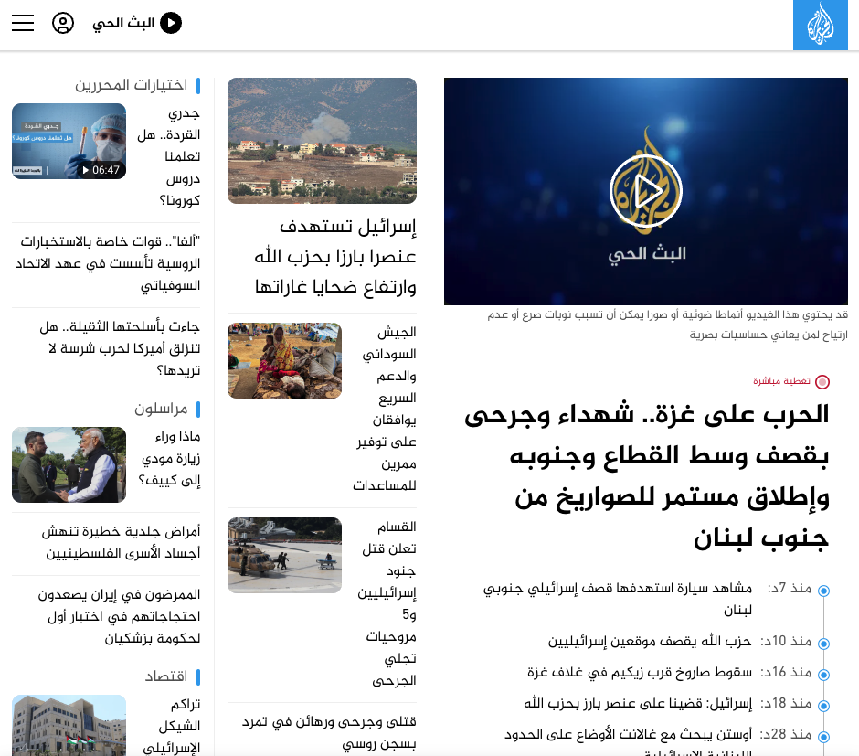

### 노멀 플로우 (Normal Flow)

웹 페이지에서 요소들이 어떻게 배치되는지 이해하는 핵심은 "**노멀 플로우(Normal Flow)**"입니다.
기본적으로 HTML 요소들은 부모 요소의 왼쪽 상단에서부터 오른쪽으로, 그리고 아래로 순차적으로 쌓입니다.


위 이미지처럼, 테트리스 블록이 위에서 아래로 쌓이는 것처럼, HTML 요소들은 왼쪽 상단에서부터 자연스럽게 아래로 쌓입니다. 이를 노멀 플로우라고 하며, CSS의 float나 position 속성을 사용하면 요소가 이 기본 흐름에서 벗어날 수 있습니다.

요소가 노멀 플로우를 벗어나면, 그 요소가 어느 위치에 그려질지 예측하기 어려워집니다. 따라서 프론트엔드 개발자는 가능하면 노멀 플로우 안에서 작업을 진행하는 것이 좋습니다. 그래야만 코드만 보고도 요소가 어디에 배치될지 쉽게 예측할 수 있기 때문입니다. 물론, 필요에 따라 position 같은 속성을 활용해 작업을 진행할 수 있지만, 그 원리를 정확히 이해하고 사용해야 합니다.

## 본격적인 CSS 핵심

CSS의 본질은 다음 두 가지로 요약할 수 있습니다

**1. HTML 요소를 선택하는 것**
**2. 선택한 요소에 원하는 스타일을 입히는 것**

하나씩 살펴보겠습니다.

## HTML 요소 선택하기

> 내가 그의 이름을 불러주었을 때, 그는 나에게로 와서 꽃이 되었다. - 김춘수 꽃

사람을 부를 때, "저기 남자분"이라고 부르는 것과 "반팔티 입으신 남자분", 혹은 "지수님"이라고 부르는 방식에 따라 그 구체성이 달라집니다. HTML 요소를 선택할 때도 이와 비슷합니다. 요소를 선택하는 방법에 따라 스타일의 적용 범위와 우선순위가 달라집니다.


아래 예시를 통해 이해해봅시다:

```html
<!DOCTYPE html>
<html lang="en">
  <head>
    <meta charset="UTF-8" />
    <meta name="viewport" content="width=device-width, initial-scale=1.0" />
    <title>Document</title>
  </head>
  <style>
    #luckyBox {
      background-color: red;
    }

    .box {
      background-color: pink;
    }

    main {
      background-color: yellow;
      width: 100px;
      height: 100px;
    }
  </style>
  <body>
    <main id="lucky" class="box"></main>
  </body>
</html>
```

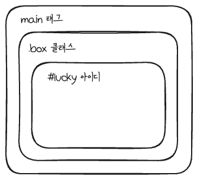

위 코드에서 main 요소는 태그명, 클래스명, ID를 통해 각각 다른 방식으로 선택될 수 있습니다.

이름을 부르는 방법 (선택자)

1. 태그명으로 선택하기:
   모든 main 태그를 선택하여 스타일을 적용합니다.

```css
main {
}
```

2. 클래스명으로 선택하기:
   class="box" 속성이 부여된 모든 요소를 선택합니다.

```css
.box {
}
```

3. ID로 선택하기:
   id="lucky" 속성이 부여된 유일한 요소를 선택합니다. ID는 페이지 내에서 고유해야 하므로, 한 번만 사용할 수 있습니다.

```css
#lucky {
}
```

### 왜 이렇게 다양한 방법으로 부를까요?

**CSS 선택자 우선순위(Specificity)**

CSS는 "Cascading Style Sheets"라는 이름에서 알 수 있듯이, 스타일이 위에서 아래로 "케스케이딩" 방식으로 적용됩니다. 즉, 스타일이 상속되고, 후속 규칙들이 이전 규칙들을 덮어쓰는 방식으로 동작합니다. 하지만 모든 스타일을 항상 아래에 작성하는 것은 실용적이지 않기 때문에, **선택자 우선순위(Specificity)**라는 개념이 등장합니다. 이 개념을 통해 스타일 적용 시 구체적으로 선택한 요소일수록 우선순위를 가지게 됩니다.

**선택자 우선순위 이해하기**

- **태그 선택자**는 가장 낮은 우선순위를 가집니다. 예를 들어, 모든 p 태그에 적용될 스타일을 정의할 때 사용합니다.
- **클래스 선택자**는 중간 우선순위를 가집니다. 클래스는 여러 요소에 공통으로 적용할 수 있어, 해당 그룹의 스타일을 쉽게 관리할 수 있습니다.
- **ID 선택자**는 가장 높은 우선순위를 가집니다. ID는 각 페이지에서 유일해야 하며, 특정 요소를 구체적으로 선택할 때 사용됩니다.

```css
#luckyBox {
  background-color: red;
}

.box {
  background-color: pink;
}

main {
  background-color: yellow;
  width: 100px;
  height: 100px;
}
```

CSS 작성 규칙에 따라 main의 배경은 노란색이 되어야 하지만, 구체적으로 작성한 아이디의 우선순위로 red 색상을 보이게 됩니다.

:::tip
**선택자 우선순위 규칙**

인라인 스타일 HTML 요소에 직접 적용된 스타일은 가장 높은 우선순위를 가집니다.

- 예: `<div style="color: blue;">`
- ID 선택자: ID 선택자는 고유하기 때문에 높은 우선순위를 가집니다.
- 클래스, 가상 클래스, 속성 선택자: 클래스명이나 가상 클래스, 그리고 속성 선택자는 그다음으로 높은 우선순위를 가집니다.
- 태그 선택자: 태그명으로 선택된 요소의 스타일은 상대적으로 낮은 우선순위를 가집니다.
- 전체 선택자: \*로 지정된 전체 선택자는 가장 낮은 우선순위를 가집니다.

:::

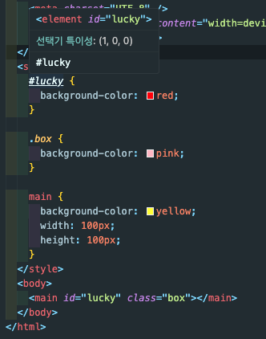
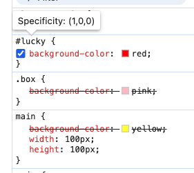

**Specificity(특이성)**는 올림픽 메달처럼 순위 체계를 가지고 있습니다.

10개의 동메달이 1개의 은메달을 이길 수 없고, 10개의 은메달이 1개의 금메달을 이길 수 없듯이, 여러 개의 클래스로 선택된 요소도 하나의 ID로 선택된 요소를 이길 수 없습니다. 같은 우선순위일 경우, CSS의 캐스케이딩 규칙에 따라 나중에 작성된 스타일이 적용됩니다.

### 10개의 은매달의 의미는 무엇인가요?

예를 들어, 누군가에게 "거기 있는 연필 줘"라고 말하는 것보다 "거기 있는 연필, 연필! 빨리 연필 줘"라고 여러 번 강조해서 말한다면, 연필을 더 확실히 지칭하는 셈입니다. CSS에서도 비슷하게, 같은 요소를 여러 번 지칭하면 선택자의 우선순위를 높일 수 있습니다.

```css
/* 동일한 요소를 여러 번 지칭하여 우선순위를 높임 */
.box.box {
  color: red;
}
```

이처럼, .box.box와 같이 동일한 클래스명을 반복적으로 작성하면 선택자의 우선순위가 높아집니다. 이는 CSS의 우선순위 체계에서 중요한 역할을 하며, 더욱 구체적으로 스타일을 적용할 수 있게 해줍니다.

이렇게 되면 0, 2, 0 의 점수를 갖게 됩니다.

> 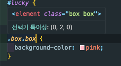

지금까지 CSS에서 요소를 선택하는 다양한 방법에 대해 이야기했습니다. 내용을 정리해보겠습니다:

1. 선택자 유형: CSS에서 요소를 선택하는 방법은 주로 세 가지입니다. 태그 선택자, 클래스 선택자, 그리고 ID 선택자입니다.
2. 선택자 우선순위: 선택자의 우선순위에 따라 스타일 적용이 결정됩니다. 특정한 선택자가 다른 선택자보다 높은 우선순위를 가질 수 있습니다.
3. 명확한 네이밍: 스타일 적용의 예측 가능성과 유지보수성을 높이기 위해, 명확하고 일관된 클래스명과 ID를 사용하는 것이 중요합니다.

이러한 기본 개념들을 이해하고 나면, CSS를 더 효과적으로 사용하고, 예기치 않은 스타일 충돌을 예방할 수 있습니다.

## 선택한 요소에 원하는 스타일 적용하기

이제 요소를 선택한 후, 그 요소에 어떻게 원하는 스타일을 적용할 수 있는지 알아보겠습니다. CSS를 활용하여 다양한 스타일을 적용할 때, 몇 가지 중요한 개념을 이해하는 것이 필요합니다.

**학습 키워드**

- **레이아웃 배치**
- **요소의 크기**
- **글꼴, 이미지, 영상**

### 박스 모델과 인라인 모델의 차이

스타일을 효과적으로 적용하기 위해서는 요소가 브라우저에서 어떻게 렌더링되는지 이해해야 합니다. HTML 요소는 크게 두 가지 방식으로 렌더링됩니다: 박스 모델과 인라인 모델입니다.

- 박스 모델(Box Model): 대부분의 블록 요소들은 이 모델을 따릅니다. 이 모델에서는 요소가 사각형 상자처럼 취급되며, 요소의 content, padding, border, margin이 상자를 구성하는 요소들입니다. 이 모델을 이해하는 것은 레이아웃 작업에서 매우 중요합니다.

- 인라인 모델(Inline Model): 인라인 요소는 텍스트 줄 안에 포함되어 흐르며, 박스 모델과는 다르게 width나 height와 같은 속성을 직접 지정할 수 없습니다. 이 모델은 주로 텍스트와 작은 요소에 사용됩니다.

**왜 박스와 인라인이 나오게 되었는가?**

박스 모델과 인라인 모델의 도입은 웹 페이지의 구조를 명확하게 하고, 다양한 콘텐츠를 효과적으로 배치하기 위해 필요했습니다. 웹 페이지는 주로 문서 구조와 사용자 인터페이스 요소들로 구성되며, 이러한 요소들은 각각의 역할에 맞게 레이아웃이 이루어져야 합니다.

박스 모델은 주로 블록 레벨 요소들로, 페이지의 구조와 레이아웃을 정의하는 데 사용됩니다. 이러한 요소들은 각기 다른 섹션을 구분하고, 그 섹션들 사이에 여백을 두거나, 특정 영역을 차지하게 하여 페이지 레이아웃을 형성합니다. 예를 들어, div, header, main과 같은 요소들이 박스 모델을 사용하여 전체 레이아웃의 구조를 결정합니다.

인라인 모델은 텍스트나 작은 아이콘과 같이 줄 안에 자연스럽게 배치되어야 하는 요소들을 위한 것입니다. 문서의 가독성을 유지하면서도, 스타일을 적용하여 텍스트 강조, 링크 등의 역할을 수행합니다.

**왜 main이나 div 태그는 박스 모델이 될 수밖에 없을까?**

main, div와 같은 태그는 문서 구조와 레이아웃을 정의하는 블록 레벨 요소이기 때문에, 자연스럽게 박스 모델을 사용합니다. 이 요소들은 주로 페이지의 섹션을 구분하거나, 콘텐츠를 묶는 역할을 하며, 이를 위해 특정한 공간을 차지해야 합니다.

- 전체적인 레이아웃 관리: div, main과 같은 요소들은 페이지의 주요 섹션을 구성하며, 그 안에 포함된 콘텐츠의 배치, 크기, 여백 등을 관리해야 합니다. 이를 위해 박스 모델은 매우 적합합니다.

- 디자인 일관성 유지: 박스 모델을 사용함으로써 페이지의 다른 요소들과 일관된 방식으로 레이아웃을 구성할 수 있습니다.

결론적으로, 태그의 역할이 레이아웃을 담당하거나 섹션을 구분하는 틀 역할을 한다면 박스 모델,
텍스트와 이미지 처럼 내부 요소의 역할을 하면서 옆으로 배치될 것 같다면 인라인 모델로 이해하면 됩니다.

이 원리를 기억하면, 어떤 태그가 박스 모델을 사용할지, 어떤 태그가 인라인 모델을 사용할지 쉽게 판단할 수 있습니다.

### 기본 박스 모델 렌더링

박스 모델에서 요소의 width는 기본적으로 부모 요소의 width를 기준으로 100%를 차지합니다. 즉, 박스 모델에서 모든 블록 레벨 요소는 부모 요소의 가로 너비를 꽉 채우는 것을 기본으로 합니다. 이는 레이아웃 작업에서 중요한 기본 규칙입니다.

예를 들어, 최상위 요소인 html 태그는 브라우저 전체를 부모 요소로 간주하여, 브라우저 창의 너비만큼 공간을 차지합니다. 이 규칙은 기본적인 박스 모델의 작동 방식을 이해하는 데 중요하며, 대부분의 HTML 요소들이 이 방식을 따릅니다.

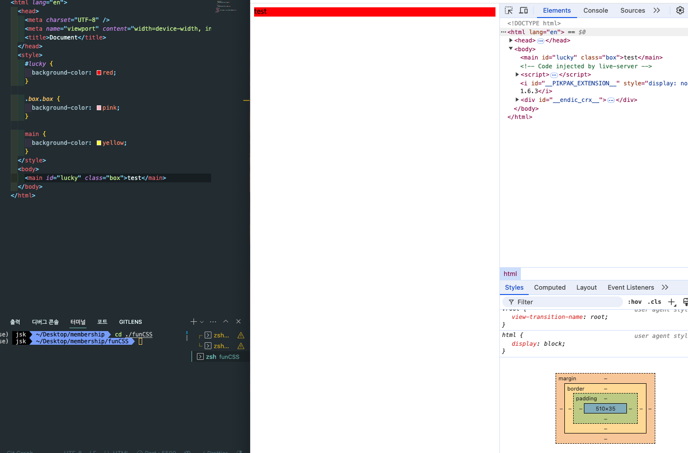

:::tip브라우저마다 다른 태그 렌더링 방식
각 브라우저(예: 크롬, 파이어폭스, 엣지 등)는 HTML 태그를 렌더링하는 방식에 약간의 차이가 있습니다. 이러한 차이점은 기본적으로 브라우저마다 내장된 스타일시트(user agent stylesheet)에 의해 발생합니다. 각 브라우저는 HTML 요소에 대해 기본 스타일을 적용하는데, 이 기본 스타일은 브라우저마다 다를 수 있어 웹 페이지가 다르게 보일 가능성이 있습니다.

**리셋 CSS와 초기화**

이러한 브라우저 간의 차이를 줄이고, 일관된 스타일을 적용하기 위해 개발자들은 리셋 CSS 또는 노멀라이즈 CSS를 사용합니다.

- 리셋 CSS: 브라우저가 기본적으로 적용하는 모든 스타일을 제거하여, 모든 요소를 동일한 기본 상태로 초기화합니다. 이 방식은 개발자가 모든 스타일을 처음부터 정의해야 하므로, 완전한 제어를 원하는 경우 유용합니다.

- 노멀라이즈 CSS: 브라우저 간의 차이를 최소화하면서도, 브라우저 기본 스타일 중 유용한 부분을 유지합니다. 노멀라이즈는 리셋 CSS보다 덜 극단적이어서, 보다 자연스러운 브라우저 간 일관성을 유지할 수 있습니다.

**다양한 플랫폼에서 스타일 적용**

리셋 CSS 또는 노멀라이즈 CSS를 사용한 후, 개발자는 모든 플랫폼에서 일관된 디자인을 보장할 수 있는 자신만의 스타일을 정의합니다. 이를 통해 다양한 브라우저와 기기에서 웹 페이지가 동일한 방식으로 렌더링되도록 조정할 수 있습니다.
:::

### 요소를 이루는 4가지 구성 요소 (박스 모델)

HTML 요소들은 **CSS 박스 모델(Box Model)**에 따라 렌더링됩니다. 박스 모델은 웹 페이지의 레이아웃을 결정하는 기본적인 개념으로, 각 요소가 사각형의 박스로 표현되며, 이 박스는 다음과 같은 4가지 구성 요소로 이루어집니다:

1. 콘텐츠(Content)
2. 패딩(Padding)
3. 테두리(Border)
4. 마진(Margin)

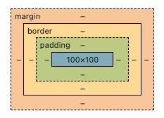

이들은 안쪽에서 바깥쪽 순서로 구성됩니다. 자세히 살펴보겠습니다.

### 1. 콘텐츠의 높이와 노멀 플로우

**HTML 태그와 콘텐츠의 높이**

HTML 태그는 기본적으로 문서의 흐름에 따라 위에서 아래로 쌓입니다. 이로 인해, 각 요소는 콘텐츠의 양에 따라 고유의 높이를 가지게 됩니다. 만약 요소의 높이가 명시적으로 설정되지 않았다면, 그 높이는 내부 콘텐츠의 양에 따라 동적으로 결정됩니다.

예를 들어, div 요소 안에 텍스트가 많아지면, 이 div의 높이는 텍스트를 모두 수용할 수 있을 만큼 커집니다. 반대로, 텍스트가 적다면 div의 높이도 상대적으로 작아집니다. 이러한 특성 때문에 노멀 플로우에서 요소들의 높이는 고정된 값이 아닌, 가변적인 높이를 가지게 됩니다.

**왜 고정된 높이를 설정하지 않을까?**

고정된 높이를 설정하지 않는 이유는 주로 유연한 레이아웃을 유지하기 위해서입니다. 고정된 높이를 설정하면, 콘텐츠가 늘어나거나 줄어들 때 레이아웃이 깨지거나 콘텐츠가 잘려나갈 수 있습니다. 반면, 높이를 가변적으로 설정하면 콘텐츠의 양에 따라 요소의 크기가 자동으로 조정되어, 다양한 화면 크기와 콘텐츠 양에 유연하게 대응할 수 있습니다.

콘텐츠의 양이 요소의 높이를 결정한다는 점은 웹 디자인에서 중요한 개념입니다. 이를 이해하면, 콘텐츠가 동적으로 변할 때에도 레이아웃이 어떻게 변할지 예측할 수 있으며, 유연한 디자인을 구현할 수 있습니다. 고정된 높이를 설정하는 것보다 콘텐츠에 따라 높이가 조정되는 방식은 다양한 기기와 화면 크기에 대응하는 반응형 웹 디자인에서 특히 유용합니다.

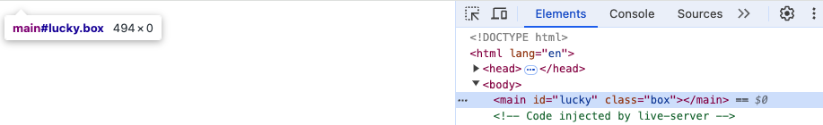
`494px * 0px`
컨텐츠 내용물이 없는 main 태그는 높이는 없지만, 브라우저 크기 만큼 width 를 갖고 있습니다.

### 2. 패딩(padding)

패딩을 이해하기 위해, 사람이 벽에 딱 붙어 있는 상황을 상상해봅시다. 사람이 왼쪽 벽에 딱 붙어 있다면, 사람의 몸이 벽에 바로 닿아 있는 상태일 것입니다. 그런데 그 사람에게 패딩을 입힌다면 어떻게 될까요? 패딩이 몸을 감싸면서 벽에는 패딩이 가장 먼저 닿게 되고, 사람의 몸은 벽에서 떨어지게 됩니다. 사람과 벽 사이에 패딩이 들어가며, 벽과 사람 사이에 일정한 공간이 생기게 됩니다.

이 개념은 CSS의 padding-left 속성과 동일하게 작동합니다.

**패딩의 동작 원리**

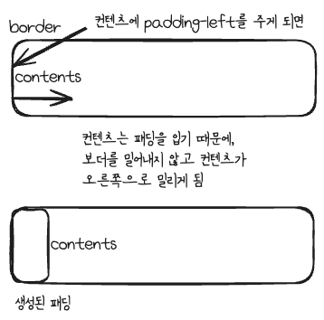
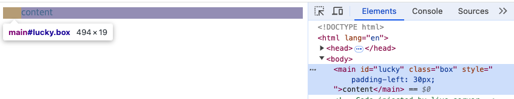

padding-left는 요소의 왼쪽 경계선(border)과 콘텐츠(content) 사이의 공간을 설정하는 속성입니다. 패딩을 적용하면, 콘텐츠는 왼쪽 경계선에서 밀려나게 되고, 그 사이의 공간을 패딩이 차지하게 됩니다. 즉, 경계선(border)을 기준으로 콘텐츠가 밀려나면서 패딩이 그 사이의 빈 공간을 채우게 됩니다.

### 3. 테두리(Border)

**테두리(Border)**는 요소의 콘텐츠와 패딩을 감싸고 있습니다. 이는 요소의 경계를 정의하는 역할을 합니다.
CSS에서 테두리는 요소를 시각적으로 구분하고, 특정 요소를 강조하거나 디자인의 일관성을 유지하는 데 중요한 역할을 합니다.

**테두리의 구성 요소**

테두리는 다음 세 가지 요소로 구성됩니다:

- 두께(Thickness): 테두리의 두께는 border-width 속성으로 정의되며, 1px, 2px, 5px 등 다양한 값으로 설정할 수 있습니다.
- 스타일(Style): 테두리의 스타일은 border-style 속성으로 설정되며, solid, dashed, dotted 등 다양한 스타일을 사용할 수 있습니다.
- 색상(Color): 테두리의 색상은 border-color 속성으로 지정할 수 있으며, red, blue, #333 등 다양한 색상 값으로 설정이 가능합니다.

예를 들어, 다음 코드는 요소에 빨간색, 2px 두께의 실선 테두리를 적용합니다:

```css
div {
  border: 2px solid red;
}
```

이렇게 설정된 테두리는 요소의 외곽선을 그리며, 콘텐츠와 패딩을 감싸게 됩니다.

:::tip박스 크기와 box-sizing

box-sizing 속성은 요소의 크기를 어떻게 계산할지를 결정하는 속성입니다. 기본적으로, 요소의 width와 height는 콘텐츠의 크기를 기준으로 계산되며, 여기에 패딩과 테두리의 크기가 추가됩니다. 그러나 box-sizing 속성을 활용하면 이 계산 방식을 변경할 수 있습니다.

**content-box vs border-box**

content-box (기본값):

요소의 width와 height는 오직 콘텐츠의 크기만을 포함합니다. 패딩과 테두리는 이 크기에 추가되어 요소의 전체 크기를 늘리게 됩니다.
예를 들어, width: 100px으로 설정된 요소에 padding: 10px과 border: 5px이 추가되면, 실제로 요소는 130px의 너비를 가지게 됩니다 (100px + 10px + 10px + 5px + 5px).
border-box:

box-sizing: border-box;로 설정하면, 요소의 width와 height는 콘텐츠, 패딩, 테두리를 모두 포함한 전체 크기를 의미합니다. 이 경우, 패딩과 테두리가 요소의 크기를 늘리지 않으며, 설정한 width와 height에 맞춰 내부 요소들이 조정됩니다.
예를 들어, width: 100px으로 설정된 요소에 padding: 10px과 border: 5px이 추가되어도, 요소의 총 너비는 여전히 100px이 유지됩니다. 이 방식은 레이아웃 작업에서 요소의 크기를 더 쉽게 관리할 수 있게 해줍니다.
왜 box-sizing: border-box;를 사용해야 할까?
box-sizing: border-box;는 요소의 크기를 더 직관적으로 관리할 수 있게 해주기 때문에, 현대 웹 개발에서 자주 사용됩니다. 특히, 반응형 디자인이나 복잡한 레이아웃을 만들 때, 요소의 크기가 예측 가능한 방식으로 조정되도록 도와줍니다.

예를 들어, 여러 요소들이 일정한 너비를 가져야 하는 상황에서 border-box를 사용하면, 패딩과 테두리가 요소의 크기를 증가시키지 않기 때문에, 레이아웃이 깨지지 않고 일정하게 유지됩니다. 이 속성은 특히 복잡한 그리드 레이아웃이나 여러 개의 요소들이 나란히 배치될 때 유용합니다.

```css
div {
  box-sizing: border-box;
  width: 100%;
  padding: 10px;
  border: 5px solid black;
}
```

위 코드에서는 box-sizing: border-box;를 사용하여, 요소의 너비가 100%로 설정되어 있더라도 패딩과 테두리가 추가되어 요소의 크기가 증가하지 않도록 합니다. 이렇게 하면, 요소의 크기를 쉽게 예측하고 조정할 수 있습니다.

테두리(Border)는 요소를 시각적으로 구분하고, 콘텐츠와 패딩을 감싸는 경계를 정의하는 중요한 역할을 합니다. box-sizing: border-box; 속성을 사용하면, 패딩과 테두리가 요소의 크기에 영향을 주지 않도록 설정할 수 있어, 더 직관적이고 예측 가능한 레이아웃을 만들 수 있습니다.
:::

### 4. 마진(margin)

마진은 요소와 요소 사이의 외부 공간을 정의하는 속성입니다. 박스 모델에서 블록 레벨 요소는 기본적으로 부모 요소의 전체 너비를 차지하게 되지만, 요소에 명시적으로 width를 설정하면 해당 너비만큼만 공간을 차지하고 나머지 부분은 여백으로 남게 됩니다. 이때 마진을 설정하면, 이 남은 여백을 사용하여 요소를 원하는 위치에 배치할 수 있습니다.

**마진과 요소 배치 예시**

예를 들어, main 태그에 width: 100px;을 설정하고, 부모 요소의 너비가 1200px인 상황을 가정해봅시다. 이 경우, main 요소는 100px의 너비를 차지하게 되며, 1100px은 사용 가능한 공간으로 남게 됩니다.

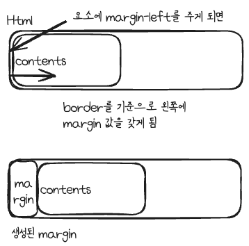
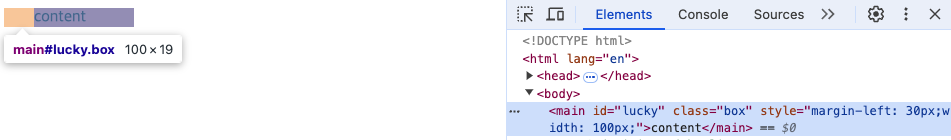

만약 margin-left: 200px;을 설정하면, main 요소는 보더를 기준으로 왼쪽에 200px 만큼의 공간을 주입하게 됩니다. 이로 인해 남은 900px의 공간은 오른쪽에 위치하게 됩니다.

**부모의 100% 너비를 차지하는 요소에 마진을 적용하는 경우**

이번엔 width를 부모의 100%을 갖는 기본 상태를 가정하겠습니다.

이번에는 width를 부모의 100%로 설정한 기본 상태를 가정해보겠습니다.

예제코드

```html
<!DOCTYPE html>
<html lang="en">
  <head>
    <meta charset="UTF-8" />
    <meta name="viewport" content="width=device-width, initial-scale=1.0" />
    <title>Document</title>
  </head>
  <style>
    body {
      margin: 0;
      overflow: auto;
    }
    #lucky {
      background-color: lightcoral;
      margin-left: 30px;
      width: 100%;
    }

    .box {
      background-color: pink;
    }

    main {
      background-color: yellow;
    }
  </style>
  <body>
    <main id="lucky" class="box">contents</main>
  </body>
</html>
```

이 경우, main 태그는 가로 전체의 크기를 차지하게 됩니다. 이 상태에서 margin-left: 30px;을 적용하면 어떻게 될까요?

main 요소는 여전히 부모 요소의 가로 너비 전체(100%)를 차지하려고 합니다. 그러나 margin-left: 30px;이 설정되면, main 요소는 왼쪽에서 30px 떨어지게 됩니다. 이로 인해 main 요소는 오른쪽으로 밀리게 되고, 전체 레이아웃이 변할 수 있습니다.

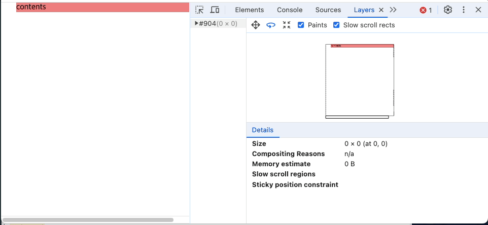

width: 100%가 명시적으로 설정되지 않으면, 자식 요소의 너비는 기본적으로 부모 요소의 너비를 기준으로 동적으로 변하는 부모 요소의 크기에 맞춰 조정됩니다.

따라서 자식 요소는 부모 요소의 가로 공간을 완전히 채우지 않을 수도 있지만, 부모 요소가 가로 방향으로 확장되거나 줄어들면 자식 요소도 그 변화를 따라 동적으로 조정됩니다. 이 경우, 자식 요소는 콘텐츠 크기에 맞춰 자동으로 조정되기 때문에 부모 요소의 너비가 변경될 때 자식 요소가 부모 요소의 크기만큼 넓어지거나 줄어듭니다.

이 동적 조정 덕분에, 자식 요소는 부모 요소의 크기가 변화하더라도 옆으로 밀리거나 레이아웃이 깨지는 문제를 최소화할 수 있습니다.

지금 코드는 main 태그, 즉 자식 요소에 100%가 들어가 있습니다.
따라서, 렌더링 시 부모위치를 기준으로 메인 크기만큼 차지하는 고정적인 벽돌이 하나 만들어 지게 됩니다.
이 상태에서 왼쪽에 빈 공간을 주입하게 되면, 보더를 기준으로 왼편을 밀어버리게 됩니다.

### 총정리 문제

**margin : 0 auto; 의 동작 원리**

```html
<!DOCTYPE html>
<html lang="en">
  <head>
    <meta charset="UTF-8" />
    <meta name="viewport" content="width=device-width, initial-scale=1.0" />
    <title>Document</title>
  </head>
  <style>
    body {
      margin: 0;
    }
    main {
      background-color: lightgreen;
    }
  </style>
  <body>
    <main id="lucky" class="box">contents</main>
  </body>
</html>
```

### margin: 0 auto; 동작

위의 HTML 코드에서 main 요소에 `margin: 0 auto;`를 적용하면 어떻게 될까요?

설명드린 대로, main 요소는 블록 레벨 요소입니다. 블록 레벨 요소는 기본적으로 부모 요소의 전체 너비를 차지하게 됩니다.

`margin: 0 auto;`는 상하 마진을 0으로 설정하고, 좌우 마진을 자동(auto)으로 설정하여, 가용 공간을 양쪽에 균등하게 배치하는 역할을 합니다.
그러나, main 요소가 부모 요소의 전체 너비를 이미 차지하고 있다면, 좌우에 추가적인 여백이 없으므로, `margin: 0 auto;`를 적용해도 시각적으로 아무런 변화가 일어나지 않습니다. 이는 요소가 이미 전체 너비를 차지하고 있기 때문입니다.

**main의 너비를 100px로 줄이면?**

만약 main 요소의 `width`를 100px로 줄이면 어떻게 될까요?

이렇게 되면, main 요소는 더 이상 부모 요소의 전체 너비를 차지하지 않게 됩니다. 대신, main 요소는 너비가 100px로 줄어들어, 부모 요소 내에서 사용 가능한 여백이 생깁니다.

이때 `margin: 0 auto;`가 적용되면, 남은 여백을 좌우로 균등하게 배치하여 main 요소가 부모 요소의 가로 중앙에 위치하게 됩니다. 즉, main 요소는 가로 방향으로 가운데 정렬됩니다.

`margin: 0 auto;`는 좌우 여백을 자동으로 균등하게 배치하여 요소를 중앙에 정렬하는 CSS 속성입니다.
그러나, 요소가 이미 부모 요소의 전체 너비를 차지하고 있다면, 중앙 정렬 효과는 나타나지 않습니다.
요소의 너비를 줄여서 부모 요소 내에 여백이 생기면, `margin: 0 auto;`가 작동하여 요소를 가로 방향으로 중앙에 배치하게 됩니다.

---

## 마무리

지금까지 CSS의 핵심 개념들을 차근차근 살펴보았습니다. CSS는 단순히 웹 페이지의 스타일을 정의하는 것을 넘어, 레이아웃과 디자인을 결정하는 중요한 역할을 합니다.

노멀 플로우에서의 요소 배치, 박스 모델을 이해하는 것, 그리고 마진과 패딩을 활용해 요소 간의 여백을 조절하는 것은 CSS의 기초 중에서도 가장 중요한 부분입니다. 이러한 기초를 이해하면, 좀 더 복잡한 레이아웃이나 스타일링 작업에도 자신감을 가지고 접근할 수 있습니다.

CSS에서 중요한 점은, 원리를 이해하는 것입니다. 단순히 코드만 외우는 것이 아니라, 각 속성이 웹 페이지에서 어떻게 동작하는지, 그리고 이들이 어떻게 상호작용하는지 파악하는 것이 CSS의 진정한 힘을 느낄 수 있는 방법입니다.

CSS를 학습하는 과정은 끊임없이 새로운 기술과 방법들을 탐구하는 여정과 같습니다. 이번 글을 통해 CSS에 대한 기초 개념을 탄탄히 다지고, 더 나아가 다양한 프로젝트에 이를 적용하며 자신만의 스타일을 만들어보시길 바랍니다.

### 학습거리

추가 학습을 위한 참고 자료:

- **박스 모델 중앙 정렬 vs 콘텐츠 중앙 정렬**: 웹 페이지의 요소를 정렬하는 다양한 방법을 이해하는 데 필수적인 개념입니다.
- **Flexbox의 핵심**: 부모와 자식 요소의 속성 차이를 이해하고, 올바르게 속성 값을 주입하는 것이 중요합니다. [네이버 Flexbox 가이드](https://d2.naver.com/helloworld/8540176#ch10)를 참고하세요.
- **노멀 플로우를 벗어난 Position과 Z-index**: 요소가 레이아웃의 기본 흐름에서 벗어나는 상황을 이해하는 것이 중요합니다.
- **Block Formatting Context (BFC)**: BFC는 CSS에서 요소 간의 레이아웃 관계를 이해하는 데 필수적인 개념입니다. [MDN의 BFC 문서](https://developer.mozilla.org/en-US/docs/Web/CSS/CSS_display/Block_formatting_context)를 참고하여 더 깊이 공부해보세요.
- **이미지 크기 미리 지정하기**: 웹 페이지가 렌더링될 때, 브라우저는 이미지의 높이와 너비를 먼저 계산해야 합니다. 이미지의 크기가 명시되지 않으면, 브라우저는 이를 동적으로 계산하기 위해 리소스를 소모하고 렌더링을 지연시킬 수 있습니다.
- **박스를 만들어 레이아웃을 먼저 보여주는 방식**: 이미지가 로드되기 전에 박스(placeholder)를 생성하여, 브라우저가 해당 이미지의 자리 크기를 확보한 상태에서 나머지 페이지를 렌더링할 수 있게 해줍니다. 이렇게 하면, 레이아웃이 Cumulative Layout Shift (CLS) 문제를 일으키지 않고 안정적으로 표시할 수 있습니다.

이제 CSS의 기본을 이해했으니, 더 복잡하고 흥미로운 스타일링 작업에 도전해보세요! CSS는 단순히 웹 페이지의 모양을 꾸미는 것을 넘어, 사용자 경험을 극대화하는 중요한 도구입니다. 지속적인 연습과 학습을 통해 CSS의 매력을 더욱 깊이 느껴보시길 바랍니다.
