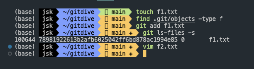

## 목차

- [목차](#목차)
- [단계별 요약](#단계별-요약)
  - [Git 초기화 (`git init`)](#git-초기화-git-init)
  - [파일 생성 (`touch f1.txt`)](#파일-생성-touch-f1txt)
  - [파일 스테이징 (`git add f1.txt`)](#파일-스테이징-git-add-f1txt)
  - [인덱스 상태 확인 (`git ls-files -s`)](#인덱스-상태-확인-git-ls-files-s)
  - [블랍 객체 설명](#블랍-객체-설명)
  - [새 파일 생성 및 스테이징 (`vim f2.txt`, `git add f2.txt`)](#새-파일-생성-및-스테이징-vim-f2txt-git-add-f2txt)
  - [해시 값 기반 폴더 구조 설명](#해시-값-기반-폴더-구조-설명)
  - [동일 내용 파일 처리](#동일-내용-파일-처리)
  - [git commit](#git-commit)
  - [COMMIT_EDITMSG 파일](#commit_editmsg-파일)
  - [logs/HEAD 파일](#logshead-파일)
  - [objects 폴더](#objects-폴더)
  - [Git 객체 저장 구조](#git-객체-저장-구조)
  - [블랍(blob) 객체](#블랍blob-객체)
  - [블랍 객체 생성 과정](#블랍-객체-생성-과정)
  - [인덱스 내용 예시](#인덱스-내용-예시)
  - [블랍 객체의 실제 내용](#블랍-객체의-실제-내용)
  - [객체 라는 말이 자바스크립트 객체가 아니라 그냥 파일 하나를 객체라고 보면 될까요?](#객체-라는-말이-자바스크립트-객체가-아니라-그냥-파일-하나를-객체라고-보면-될까요)
  - [객체 유형을 구분하는 방법](#객체-유형을-구분하는-방법)
  - [2번째 커밋 후의 Git 내부 동작](#2번째-커밋-후의-git-내부-동작)
  - [f2.txt 내용 변경 후 git add](#f2txt-내용-변경-후-git-add)
  - [두 번째 커밋 생성 (`git commit`)](#두-번째-커밋-생성-git-commit)
  - [logs/HEAD 파일 갱신](#logshead-파일-갱신)
  - [Git Status의 동작 과정](#git-status의-동작-과정)
  - [인덱스와 최신 커밋 비교](#인덱스와-최신-커밋-비교)
  - [마무리](#마무리)
- [질문: 객체 라는 말이 자바스크립트 객체가 아니라 그냥 파일 하나를 객체라고 보면 될까요?](#질문-객체-라는-말이-자바스크립트-객체가-아니라-그냥-파일-하나를-객체라고-보면-될까요)
- [답변:](#답변-)
  - [Git 객체 저장 구조](#git-객체-저장-구조)
  - [객체 유형을 구분하는 방법](#객체-유형을-구분하는-방법)
  - [2번째 커밋 후의 Git 내부 동작](#2번째-커밋-후의-git-내부-동작)
  - [Git Status의 동작 과정](#git-status의-동작-과정)
  - [인덱스와 최신 커밋 비교](#인덱스와-최신-커밋-비교)
  - [마무리](#마무리)

<!--truncate-->

<br />

### 단계별 요약

1. **Git 초기화 (`git init`)**
   - `.git` 폴더가 생성되며 기본 디렉토리 구조가 설정됩니다.
   - 이 구조에는 `objects`, `refs`, `HEAD` 파일 등이 포함됩니다.
2. **파일 생성 (`touch f1.txt`)**
   - `f1.txt` 파일이 생성됩니다.
   - 이 시점에서 `.git` 폴더에는 변화가 없습니다.
3. **파일 스테이징 (`git add f1.txt`)**
   - `f1.txt`의 내용이 블랍(blob) 객체로 저장됩니다.
   - `objects` 디렉토리에 해시 값 기반의 폴더 및 파일이 생성됩니다.
   - 인덱스 파일(`.git/index`)에 스테이징된 파일의 메타데이터가 저장됩니다.
4. **인덱스 상태 확인 (`git ls-files -s`)**
   - 인덱스에 저장된 파일 목록과 메타데이터를 확인할 수 있습니다.
   - 출력 결과는 파일 모드, SHA-1 해시, 스테이지 번호, 파일 이름으로 구성됩니다.
5. **블랍 객체 설명**
   - 블랍 객체는 파일의 내용을 바이너리 형식으로 저장하는 Git 객체입니다.
   - SHA-1 해시를 기반으로 파일 이름이 결정되며, 객체는 압축된 형식으로 저장됩니다.
6. **새 파일 생성 및 스테이징 (`vim f2.txt`, `git add f2.txt`)**
   - 새로운 파일을 생성하고 스테이징하면, `objects` 디렉토리에 새로운 블랍 객체가 추가됩니다.
   - 인덱스 파일이 업데이트됩니다.
7. **해시 값 기반 폴더 구조 설명**
   - 성능 향상, 균등 분배, 관리 용이성을 위해 해시 값의 앞 두 자리를 사용하여 폴더를 만듭니다.
8. **동일 내용 파일 처리**
   - 동일한 내용을 가진 파일을 추가하면 새로운 객체를 생성하지 않고, 기존의 블랍 객체를 재사용합니다.


## git init

- .git 폴더 생성 및 폴더 생성


### touch f1.txt

- f1.txt 파일이 생성되고 .git 의 파일은 변화 없음


- objects 폴더 또한 초기 값


### git add f1.txt


git add를 하게 되면 로컬 작업 공간에서 → Staging Area 영역으로 파일이 관리하게 됩니다.

이는 add 한 파일이 .git/index에 sha-1로 변환되어 저장됩니다.


생성된 index

index는 확장자가 없고 blob 형식으로 만들어진 바이너리 파일 입니다.

`index` 파일에는 다음과 같은 정보가 포함됩니다:

- 스테이징된 파일의 경로
- 파일의 SHA-1 해시
- 파일의 권한 및 기타 메타데이터

`git ls-files -s` 명령어를 사용하면 인덱스에 저장된 파일 목록과 관련 메타데이터를 확인할 수 있습니다.

```
git ls-files -s
```


주어진 출력은 `git ls-files -s` 명령어의 결과입니다. 각 필드의 의미를 설명하겠습니다.

### 출력 해석

```
100644 78981922613b2afb6025042ff6bd878ac1994e85 0       f1.txt
```

이 출력은 네 개의 필드로 구성됩니다.

1. **파일 모드 (100644)**
   - 파일 모드를 나타냅니다. `100644`는 일반 파일의 권한을 의미합니다. 여기서 `100644`는 유닉스 파일 시스템에서의 권한을 의미하며, 읽기 및 쓰기 권한을 가지고 있는 일반 파일을 나타냅니다.
   - **644는 유닉스 권한 표현과 같습니다.**
     - 첫 번째 자리는 파일 타입(일반 파일은 1)
     - 나머지 숫자는 소유자, 그룹, 기타 사용자의 읽기/쓰기 권한을 나타냅니다.
   - git 에서 사용하는 파일 모드는 주로 3가지 입니다.
     ### 1. `100644`
     - **설명**: 일반 파일 (읽기 및 쓰기 권한)
     - **상세**: 일반적인 텍스트 파일이나 코드 파일에 사용됩니다. 이 모드는 소유자에게 읽기 및 쓰기 권한을 부여하고, 그룹 및 기타 사용자에게 읽기 권한만 부여합니다.
       - **1**: 일반 파일
       - **00644**: 파일 권한
         - **6**: 소유자에게 읽기 및 쓰기 권한
         - **4**: 그룹에 읽기 권한
         - **4**: 기타 사용자에게 읽기 권한
     ### 2. `100755`
     - **설명**: 실행 파일 (읽기, 쓰기 및 실행 권한)
     - **상세**: 실행 가능한 스크립트나 바이너리 파일에 사용됩니다. 이 모드는 소유자에게 읽기, 쓰기 및 실행 권한을 부여하고, 그룹 및 기타 사용자에게 읽기 및 실행 권한을 부여합니다.
       - **1**: 일반 파일
       - **00755**: 파일 권한
         - **7**: 소유자에게 읽기, 쓰기 및 실행 권한
         - **5**: 그룹에 읽기 및 실행 권한
         - **5**: 기타 사용자에게 읽기 및 실행 권한
     ### 3. `120000`
     - **설명**: 심볼릭 링크 (symbolic link)
     - **상세**: 심볼릭 링크 파일에 사용됩니다. 심볼릭 링크는 다른 파일이나 디렉토리를 가리키는 특별한 파일입니다. 이 모드는 파일 권한이 아닌 링크를 나타내는 값을 사용합니다.
       - **120000**: 심볼릭 링크
     ### 요약
     - **`100644`**: 일반 파일로 읽기 및 쓰기 권한 (`rw-r--r--`)
     - **`100755`**: 실행 파일로 읽기, 쓰기 및 실행 권한 (`rwxr-xr-x`)
     - **`120000`**: 심볼릭 링크
       이 세 가지 파일 모드는 Git이 파일의 유형과 권한을 관리하는 데 사용됩니다. `git ls-files -s` 명령어의 출력에서 파일 모드는 각 파일의 특성과 권한을 나타내는 중요한 정보입니다.
2. **SHA-1 해시 (78981922613b2afb6025042ff6bd878ac1994e85)**
   - 스테이징된 파일의 내용에 대한 SHA-1 해시 값입니다. 이 해시는 파일의 고유한 식별자로 사용되며, 파일의 내용이 변경되면 이 값도 변경됩니다.
3. **Stage 번호 (0)**
   - Git의 병합 과정에서 사용되는 스테이지 번호를 나타냅니다. 여기서 `0`은 파일이 병합 과정에 관여하지 않는다는 것을 의미합니다. Git의 병합 충돌 해결 시 여러 스테이지가 존재할 수 있습니다.
4. **파일 이름 (f1.txt)**
   - 인덱스에 스테이징된 파일의 이름입니다. 여기서는 `f1.txt` 파일이 스테이징 영역에 있다는 것을 나타냅니다.

### Objects에 해당 해시값 폴더 생성

`78` 폴더 내부의 `981922613b2afb6025042ff6bd878ac1994e85` 파일은 블랍 객체로 저장됩니다. 이 객체의 역할과 저장 방식을 설명하겠습니다.


### Git 객체 저장 구조

### 예시: `78/981922613b2afb6025042ff6bd878ac1994e85`

- **78**: SHA-1 해시의 첫 두 자리
- **981922613b2afb6025042ff6bd878ac1994e85**: 나머지 38자리


이 구조는 Git이 수많은 객체를 효과적으로 저장하고 검색할 수 있도록 돕습니다.

### 블랍(blob) 객체

블랍 객체는 파일의 내용 그 자체를 저장합니다. 이 객체는 파일의 메타데이터(파일 이름, 권한 등) 없이 오직 파일의 내용만을 포함합니다. 파일 내용의 해시(SHA-1)를 기반으로 파일 이름이 결정됩니다.

### 블랍 객체 생성 과정

1. **파일 내용 읽기**: 파일의 모든 내용을 읽습니다.
2. **헤더 추가**: "blob {size}\0" 형식의 헤더를 파일 내용 앞에 추가합니다.
   - 예: `blob 3\0a\n` (여기서 `3`은 파일 내용의 바이트 크기)
3. **SHA-1 해시 계산**: 이 헤더와 내용의 조합에 대해 SHA-1 해시를 계산합니다.
4. **객체 저장**: `.git/objects/{첫 두 자리}/{나머지 38자리}` 경로에 객체를 저장합니다.
   - 객체는 압축되어 저장됩니다.

### 예시 설명

```bash
.git/objects/78/981922613b2afb6025042ff6bd878ac1994e85
```

- **폴더 `78`**: 객체의 SHA-1 해시의 첫 두 자리 (`78981922613b2afb6025042ff6bd878ac1994e85`의 `78`)
- **파일 `981922613b2afb6025042ff6bd878ac1994e85`**: 나머지 38자리

이 파일은 블랍 객체로, `f1.txt` 파일의 내용 "a\n"를 저장합니다.

```flow
const crypto = require('crypto');

function generateGitBlobHash(content) {
  // Git blob 헤더 생성
  const header = `blob ${content.length}\0`;
  // 헤더와 파일 내용 결합
  const store = header + content;
  // SHA-1 해시 계산
  const hash = crypto.createHash('sha1');
  return hash.update(store).digest('hex');
}

console.log(generateGitBlobHash('a\n'));
```

### 인덱스 내용 예시

인덱스 파일에는 다음과 같은 정보가 포함됩니다:

- 파일 경로: `f1.txt`
- 파일 모드: `100644`
- 블랍 객체 해시: `78981922613b2afb6025042ff6bd878ac1994e85`

### 블랍 객체의 실제 내용

블랍 객체는 바이너리 형식으로 저장되어 텍스트 에디터로 내용을 보기 어렵습니다.

대신 git 명령어로 블랍 객체의 내용을 확인 할 수 있습니다.

```flow
git cat-file -p 78981922613b2afb6025042ff6bd878ac1994e85
```

- **블랍 객체**는 파일의 내용을 바이너리 형식으로 저장하는 Git 객체입니다.
- 블랍 객체는 파일의 내용과 간단한 헤더를 포함하며, SHA-1 해시를 기반으로 식별됩니다.
- 블랍 객체는 파일의 메타데이터(이름, 권한 등)를 포함하지 않으며, 오직 파일의 내용만을 저장합니다.


실제로 리드미가 담긴 해시 값을 cat-file로 풀어 보면 리드미 전체 내용이 저 한줄에 담겨있음을 알 수 있습니다.

또한 메인 트리에서 확인한 실행 js 파일의 권한은 755, 일반 문서는 664 권한을 확인할 수 있습니다.


### vim f2.txt

- 새로운 작업 파일 생성



### git add f2.txt

- objects에 f2.txt 내부 컨텐츠가 압축된 해시값으로 objects 파일이 생성됩니다.


- 또한 index에 새로 저장된 정보가 들어갑니다.


### 왜 objects는 앞 해시 2자리를 사용하여 폴더를 만들까?

Git이 객체를 저장할 때 앞 해시 2자리를 사용하여 폴더를 만드는 이유는 주로 성능과 관리 용이성을 높이기 위해서입니다. 이를 좀 더 자세히 설명하겠습니다.

### 이유 1: 성능 향상

수천 개, 수백만 개의 파일을 하나의 디렉토리에 저장하면 파일 시스템이 비효율적으로 작동하게 됩니다. 많은 파일을 단일 디렉토리에 저장하면 파일을 검색하고 접근하는 데 시간이 오래 걸릴 수 있습니다. 이를 피하기 위해 Git은 해시 값의 앞 두 자리를 사용하여 디렉토리를 만들고, 나머지 해시 값으로 파일을 저장합니다. 이렇게 하면 각 디렉토리에 저장되는 파일 수가 줄어들어 파일 시스템 성능이 향상됩니다.

### 이유 2: 균등 분배

SHA-1 해시는 매우 균등하게 분포된 해시 값을 생성합니다. 앞 두 자리를 사용하여 디렉토리를 나누면, 각 디렉토리에 저장되는 파일 수가 거의 균등하게 분배됩니다. 이는 디렉토리의 크기를 균형 있게 유지하여 파일 시스템이 효율적으로 작동하도록 합니다.

### 이유 3: 관리 용이성

디렉토리 구조를 계층적으로 나누면 파일 관리를 더 쉽게 할 수 있습니다. 예를 들어, 수백만 개의 객체를 포함하는 단일 디렉토리 대신, 256개의 상위 디렉토리(00부터 ff까지)를 사용하여 객체를 나누면 각 디렉토리 내의 파일 수가 크게 줄어듭니다. 이는 백업, 복구, 검색 등의 관리 작업을 더 효율적으로 할 수 있게 합니다.

## f1.txt와 동일한 내용의 f3.txt 생성 후 add


git은 내부적으로 컨텐츠가 같다면 파일 명에 상관 없이 같은 objects에 있는 해시값을 사용합니다. 새롭게 생성하는 것이 아닌 기존의 blob을 활용합니다.

index에는 추가한 해시값과 파일명을 보관합니다.

## git commit


커밋을 하게 되면 여러 폴더가 생성됩니다.

### 1. COMMIT_EDITMSG 파일

- **역할**: 최근 커밋 메시지를 저장합니다.
- **위치**: `.git/COMMIT_EDITMSG`
- **내용**: 커밋을 생성할 때 입력한 메시지가 저장됩니다. 이 파일은 주로 커밋 편집 세션에서 사용됩니다.
  

### 2. logs/HEAD 파일

- **역할**: HEAD의 변경 기록을 저장합니다.
- **위치**: `.git/logs/HEAD`
- **내용**: 각 커밋, 체크아웃, 병합 등의 작업 시 HEAD가 가리키는 참조가 변경되면 그 기록이 저장됩니다. 예시:
  

HEAD에는 tree 객체의 해시를 가리키고 있습니다.

또한 첫 커밋은 initial이 붙습니다.

### 3. objects 폴더

- **역할**: Git의 핵심 데이터가 저장되는 곳입니다. 블랍(blob), 트리(tree), 커밋(commit) 객체 등이 여기에 저장됩니다.
- **위치**: `.git/objects`

### a40d3e34b5e1da719c9068a893c8ac6ca2856912


- **역할**: 트리 객체(tree object)를 참조합니다. 트리 객체는 특정 시점의 프로젝트 디렉토리 구조와 파일 상태를 저장합니다.
- **내용**: 트리 객체는 파일명과 파일 내용을 참조하는 블랍 객체의 해시 값을 포함합니다.

### tree 객체 96ab3852fa43ca61a55df616ca9ef71521fb2443


objects에 생성된 새로운 객체는 커밋 메시지와 저자의 정보가 담겨 있습니다

첫번째 줄에는 `tree a40d3e34b5e1da719c9068a893c8ac6ca2856912` 를 확인할 수 있습니다.

여기서 a40d3e34b5e1da719c9068a893c8ac6ca2856912 는 커밋된 내용을 참조하고 있음을 알 수 있습니다.

- **역할**: 커밋 객체(commit object)를 참조합니다. 커밋 객체는 커밋 메시지, 저자 정보, 커밋 시각, 부모 커밋 등의 정보를 저장합니다.
- **내용**:
  - `tree a40d3e34b5e1da719c9068a893c8ac6ca2856912`: 이 커밋이 참조하는 트리 객체의 해시 값입니다.
  - 저자(author)와 커밋터(committer)의 정보 및 커밋 메시지가 포함됩니다.

### 커밋 생성 과정

### 1. 블랍 객체 생성

파일이 `git add`로 스테이징 되면 블랍 객체가 생성되고, 해당 객체는 파일의 내용만을 저장합니다.

### 2. 트리 객체 생성

트리 객체는 블랍 객체를 참조하고, 파일의 메타데이터(파일명, 권한 등)를 포함합니다. 트리 객체는 디렉토리 구조를 나타냅니다.

### 3. 커밋 객체 생성

커밋 객체는 트리 객체를 참조하며, 커밋 메시지, 저자 정보, 커밋 시각, 부모 커밋 등의 정보를 포함합니다.

### 질문 : 객체 라는 말이 자바스크립트 객체가 아니라 그냥 파일 하나를 객체라고 보면 될까요?

### 답변 :

Git에서 말하는 "객체"는 자바스크립트나 다른 프로그래밍 언어의 객체와는 다릅니다. Git의 객체는 저장소 내부에서 특정 유형의 데이터를 저장하는 파일로 생각하면 됩니다. Git은 네 가지 주요 객체 유형을 사용합니다: 블랍(blob), 트리(tree), 커밋(commit), 태그(tag). 각 객체는 고유한 SHA-1 해시로 식별되며, Git은 이 해시를 통해 객체를 관리합니다.

실제로 블랍, 트리, 커밋, 태그 형식이 있는게 아니라 내부의 내용으로 그 유형이 결정됩니다.

### 객체 유형을 구분하는 방법

Git은 객체의 유형을 구분하기 위해 각 객체의 내부에 특별한 키워드를 사용합니다. 객체의 내용은 다음과 같은 형식을 따릅니다:

1. **블랍 객체 (Blob Object)**
   - **형식**: `blob {size}\0{content}`
   - **구분**: "blob" 키워드가 객체의 시작 부분에 포함됩니다.
   - **예시**: `blob 13\0Hello, Git!`
2. **트리 객체 (Tree Object)**
   - **형식**: `tree {entries}`
   - **구분**: "tree" 키워드가 객체의 시작 부분에 포함됩니다.
     ```flow
     100644 blob a40d3e34b5e1da719c9068a893c8ac6ca2856912    f1.txt
     100644 blob b53ea4b5e1da719c9068a893c8ac6ca2856912      f2.txt
     ```
   - 트리 객체는 내부적으로 "tree" 단어를 포함하지 않지만, 트리 객체를 참조하는 커밋 객체가 이를 명시적으로 가리키고 있습니다. 트리 객체의 구조는 디렉토리와 파일을 나타내며, 해당 객체 자체의 데이터는 파일 시스템의 구조를 설명합니다.
3. **커밋 객체 (Commit Object)**

   - **형식**: `commit {size}\0{metadata and message}`
   - **구분**: "commit" 키워드가 객체의 시작 부분에 포함됩니다.
   - **예시**:

     ```sql
     tree 96ab3852fa43ca61a55df616ca9ef71521fb2443
     author Your Name <you@example.com> 1595937735 +0900
     committer Your Name <you@example.com> 1595937735 +0900

     Initial commit
     ```

## 2번째 커밋 후의 Git 내부 동작

## f2.txt 내용 변경 후 git add

**파일 내용 변경**

- `f2.txt` 파일의 내용을 변경합니다.
- 변경된 내용을 스테이징 영역에 추가합니다.

```flow
git add f2.txt
```


**새로운 블랍 객체 생성**

- `git add` 명령어를 실행하면 Git은 변경된 파일 내용을 기반으로 새로운 블랍 객체를 생성하고 저장합니다.
- 새로운 블랍 객체는 `.git/objects/` 디렉토리에 저장됩니다.

objects 6b 폴더 생성

index 확인

변경된 후의 `git ls-files -s` 출력


## 두 번째 커밋 생성 (`git commit`)


logs/HEAD 에 40자리 이전 해시, 지금 해시, 저자가 기록된 모습

### logs/HEAD 파일 갱신

- `logs/HEAD` 파일은 커밋, 체크아웃 등의 작업이 수행될 때마다 갱신됩니다.
- 각 커밋은 이전 커밋 해시와 새로운 커밋 해시, 저자 정보가 기록됩니다.

해쉬 앞자리가 같으면 같은 폴더를 공유하고, 내부에는 앞 2자리를 제거한 나머지 해시가 기록됩니다.


**새로운 커밋 객체 생성**

- 커밋 객체는 트리 객체를 참조하며, 커밋 메시지, 저자 정보, 부모 커밋 등을 포함합니다.
- 새로운 커밋 객체는 이전 커밋을 부모로 참조합니다.

2번째 커밋으로 새로 생성된 해시는 tree와 parent를 포함합니다.

### 두 번째 커밋 객체 예시

```
tree cb0bae22a90cf117647a77a33746554594464922
parent 96ab3852fa43ca61a55df616ca9ef71521fb2443
author jisu-kim <kss2460@naver.com> 1722494661 +0900
committer jisu-kim <kss2460@naver.com> 1722494661 +0900

2번째 커밋
```

- **tree** cb0bae22a90cf117647a77a33746554594464922: 트리 객체 해시
- **parent** 96ab3852fa43ca61a55df616ca9ef71521fb2443: 부모 커밋 해시
- **author**, **committer**: 저자 및 커밋터 정보
- **커밋 메시지**: "2번째 커밋"

## git status 동작

`git status` 명령어는 작업 디렉토리와 인덱스(Index), 그리고 마지막 커밋 사이의 차이를 보여줍니다. 이를 통해 사용자는 현재 작업 디렉토리의 변경 사항을 파악하고, 어떤 파일이 스테이징되었는지, 어떤 파일이 변경되었는지를 알 수 있습니다.


현재 아무 작업이 안된 상황.

f2.txt 수정 후 확인


### Git Status의 동작 과정

1. **현재 상태 확인**
   - `git status` 명령어를 실행하면 Git은 인덱스와 최신 커밋, 작업 디렉토리의 상태를 비교합니다.
   - 인덱스에 있는 파일과 작업 디렉토리에 있는 파일의 SHA-1 해시를 비교하여 변경된 파일을 식별합니다.
2. **상태 비교**
   - **작업 디렉토리와 인덱스 비교**: 작업 디렉토리의 파일이 인덱스에 있는 파일과 다른 경우, Git은 이를 "Changes not staged for commit" 섹션에 표시합니다.
   - **인덱스와 최신 커밋 비교**: 인덱스에 있는 파일이 최신 커밋과 다른 경우, Git은 이를 "Changes to be committed" 섹션에 표시합니다.

### 인덱스와 최신 커밋 비교

인덱스는 현재 스테이징된 파일의 상태를 저장하고, 최신 커밋은 마지막으로 저장된 상태를 나타냅니다. `git status`는 이 두 상태를 비교하여 다음과 같은 결과를 제공합니다:

### 상태 비교 방법

- **작업 디렉토리와 인덱스의 파일 해시 비교**: 작업 디렉토리의 파일 해시와 인덱스의 파일 해시를 비교하여 차이점을 파악합니다.
- **인덱스와 최신 커밋의 파일 해시 비교**: 인덱스의 파일 해시와 최신 커밋의 파일 해시를 비교하여 변경 사항을 식별합니다.

### 마무리

Git의 내부 동작 원리와 인덱스, 블랍, 트리, 커밋 객체의 생성 과정을 설명합니다. Git의 각 명령어가 어떻게 작동하는지 이해하면, 더 효율적으로 버전 관리를 할 수 있습니다. Git의 내부 구조를 이해하고 나면, 다양한 상황에서 Git을 효과적으로 활용할 수 있게 될 것입니다.
