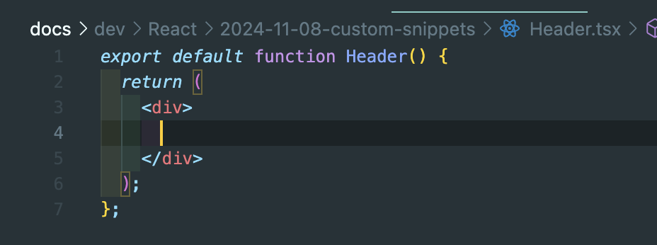

리액트 컴포넌트를 효율적으로 생성하는 방법을 찾고 계신가요?

VSCode의 커스텀 스니펫을 활용하면 불필요한 `import` 문 없이 깔끔하고 일관성 있는 리액트 컴포넌트를 자동으로 생성할 수 있습니다.


이번 포스트에서는 두 가지 스니펫인 `rfck` (프롭스 없는 컴포넌트)과 `rfckp` (프롭스 있는 컴포넌트)를 생성하고 활용하는 방법을 단계별로 소개하겠습니다.

## 목차

1. [스니펫 설정하기](#스니펫-설정하기)
   - [VSCode에서 스니펫 설정 열기](#vscode에서-스니펫-설정-열기)
   - [TypeScript (TSX)용 스니펫 설정](#typescript-tsx용-스니펫-설정)
   - [JavaScript (JSX)용 스니펫 설정](#javascript-jsx용-스니펫-설정)
2. [커스텀 스니펫 생성](#커스텀-스니펫-생성)
   - [프롭스 없는 컴포넌트 스니펫: `rfck`](#프롭스-없는-컴포넌트-스니펫-rfck)
   - [프롭스 있는 컴포넌트 스니펫: `rfckp`](#프롭스-있는-컴포넌트-스니펫-rfckp)
3. [스니펫 사용 방법](#스니펫-사용-방법)
   - [프롭스 없는 컴포넌트 생성 (`rfck`)](#프롭스-없는-컴포넌트-생성-rfck)
   - [프롭스 있는 컴포넌트 생성 (`rfckp`)](#프롭스-있는-컴포넌트-생성-rfckp)
4. [추가 개선 사항](#추가-개선-사항)
   - [CSS 모듈 임포트 추가](#css-모듈-임포트-추가)
   - [기본 Props 설정](#기본-props-설정)
   - [컴포넌트 타입 명시](#컴포넌트-타입-명시)
5. [스니펫 테스트 및 활용](#스니펫-테스트-및-활용)
6. [결론](#결론)
7. [추가 팁](#추가-팁)

<!--truncate-->

<br />

## 스니펫 설정하기

커스텀 스니펫을 설정하기 전에, VSCode에서 스니펫 설정을 여는 방법과 각 파일 유형에 맞는 스니펫 파일을 선택하는 방법을 알아야 합니다.

### VSCode에서 스니펫 설정 열기

1. **VSCode 열기:**
   VSCode를 실행합니다.

2. **명령 팔레트 열기:**

   - **Windows/Linux:** `Ctrl + Shift + P`
   - **macOS:** `Cmd + Shift + P`

3. **스니펫 설정 선택:**
   
   명령 팔레트에 "Preferences: Configure User Snippets"를 입력하고 선택합니다.

4. **언어 선택:**
   사용 중인 파일 유형에 따라 스니펫 파일을 선택합니다.
   - **TypeScript (TSX):** `typescriptreact.json` 선택
   - **JavaScript (JSX):** `javascriptreact.json` 선택

### TypeScript (TSX)용 스니펫 설정

TSX 파일에서 사용할 스니펫을 설정하려면 `typescriptreact.json` 파일을 선택합니다. 이 파일은 TypeScript React 파일에 적용되는 스니펫을 정의합니다.

### JavaScript (JSX)용 스니펫 설정

JSX 파일에서 사용할 스니펫을 설정하려면 `javascriptreact.json` 파일을 선택합니다. 이 파일은 JavaScript React 파일에 적용되는 스니펫을 정의합니다.

## 커스텀 스니펫 생성

VSCode에서 스니펫 설정을 연 후, `rfck`와 `rfckp` 스니펫을 추가하여 프롭스 없는 컴포넌트와 프롭스 있는 컴포넌트를 생성할 수 있습니다.
여기서 스니펫 명칭은 사용자의 원하는 이름을 넣어주시면 됩니다. 저는 제 이니셜 k를 뒤에 사용하였습니다. props가 있을 경우, p를 추가하였습니다.

### 프롭스 없는 컴포넌트 스니펫: `rfck`

프롭스가 없는 기본적인 리액트 컴포넌트를 생성하는 스니펫입니다.

```json
{
  "React Functional Component without Props": {
    "prefix": "rfck",
    "body": [
      "export default function ${TM_FILENAME_BASE}() {",
      "  return (",
      "    <div>",
      "      $0",
      "    </div>",
      "  );",
      "};"
    ],
    "description": "Create a React Functional Component using the filename as the component name without Props"
  }
}
```

**설명:**

- **prefix**: `rfck` - 스니펫을 호출하기 위한 단축키입니다.
- **body**: 컴포넌트의 기본 구조를 정의합니다. `${TM_FILENAME_BASE}`는 현재 파일명을 기반으로 컴포넌트 이름을 설정합니다.
- **$0**: 커서의 최종 위치를 지정합니다.

### 프롭스 있는 컴포넌트 스니펫: `rfckp`

프롭스를 포함한 리액트 컴포넌트를 생성하는 스니펫입니다.

```json
json
코드 복사
{
  "React Functional Component with Props": {
    "prefix": "rfckp",
    "body": [
      "interface ${TM_FILENAME_BASE}Props {",
      "  $2",
      "}",
      "",
      "export default function ${TM_FILENAME_BASE}({ $3 }: ${TM_FILENAME_BASE}Props) {",
      "  return (",
      "    <div>",
      "      $0",
      "    </div>",
      "  );",
      "}"
    ],
    "description": "Create a React Functional Component using the filename as the component name with Props"
  }
}

```

**설명:**

- **prefix**: `rfckp` - 스니펫을 호출하기 위한 단축키입니다.
- **body**: Props 인터페이스와 함께 컴포넌트의 기본 구조를 정의합니다.
  - `interface ${TM_FILENAME_BASE}Props { ... }`: 파일명을 기반으로 Props 인터페이스 이름을 설정합니다.
  - `export default function ${TM_FILENAME_BASE}({ $3 }: ${TM_FILENAME_BASE}Props) { ... }`: Props를 destructuring하여 컴포넌트에 전달합니다.
- **$0**: 커서의 최종 위치를 지정합니다.

## 스니펫 사용 방법

커스텀 스니펫을 설정한 후, 새로운 컴포넌트 파일을 생성하고 스니펫을 적용하는 방법을 알아보겠습니다.

### 프롭스 없는 컴포넌트 생성 (`rfck`)

1. **컴포넌트 파일 생성:**
   - 예: `Header.tsx` 파일을 생성합니다.
2. **스니펫 적용:**
   - 파일 내에서 `rfck`을 입력하고 `Tab` 키를 누릅니다.
3. **자동 생성된 코드:**

   

   ```tsx
   export default function Header() {
     return <div></div>;
   }
   ```

   **설명:**

   - `Header` 컴포넌트가 생성됩니다.
   - 프롭스가 없기 때문에 `Props` 인터페이스나 프롭스 destructuring이 포함되지 않습니다.
   - `<div>` 내부에 커서가 위치하여 즉시 JSX 내용을 작성할 수 있습니다.

### 프롭스 있는 컴포넌트 생성 (`rfckp`)

1. **컴포넌트 파일 생성:**
   - 예: `Header.tsx` 파일을 생성합니다.
2. **스니펫 적용:**
   - 파일 내에서 `rfckp`을 입력하고 `Tab` 키를 누릅니다.
3. **자동 생성된 코드:**


```tsx
interface HeaderProps {
  // 여기에 props를 정의하세요.
}

export default function Header({}: HeaderProps) {
  return <div></div>;
}
```

**설명:**

- `HeaderProps` 인터페이스가 생성되어 프롭스를 정의할 수 있습니다.
- `Header` 컴포넌트가 생성되며, `HeaderProps` 타입의 프롭스를 destructuring하여 받습니다.
- `<div>` 내부에 커서가 위치하여 즉시 JSX 내용을 작성할 수 있습니다.

## 추가 개선 사항

스니펫을 더욱 효율적으로 사용하기 위해 몇 가지 추가적인 개선 사항을 적용할 수 있습니다.

### CSS 모듈 임포트 추가

프롭스가 있는 컴포넌트 스니펫(`rfckp`)에 CSS 모듈을 자동으로 임포트하도록 수정할 수 있습니다.

```json
json
코드 복사
{
  "React Functional Component with Props and CSS Module": {
    "prefix": "rfckp",
    "body": [
      "import styles from './${TM_FILENAME_BASE}.module.css';",
      "",
      "interface ${TM_FILENAME_BASE}Props {",
      "  $2",
      "}",
      "",
      "export default function ${TM_FILENAME_BASE}({ $3 }: ${TM_FILENAME_BASE}Props) {",
      "  return (",
      "    <div className={styles.${TM_FILENAME_BASE}}> // 스타일 클래스 자동 설정",
      "      $0",
      "    </div>",
      "  );",
      "}"
    ],
    "description": "Create a React Functional Component with Props Interface and CSS Module using the filename as the component name"
  }
}

```

**설명:**

- `import styles from './${TM_FILENAME_BASE}.module.css';`: 컴포넌트에 대응하는 CSS 모듈을 자동으로 임포트합니다.
- `className={styles.${TM_FILENAME_BASE}}`: CSS 클래스 이름을 컴포넌트 이름과 동일하게 설정하여 스타일링을 용이하게 합니다.
- **prefix**: 기존 `rfckp` 스니펫과 동일하게 유지하거나, 별도의 prefix (`rfckpcss`)를 사용할 수도 있습니다.

### 기본 Props 설정

프롭스 있는 스니펫에 기본적인 프롭스 구조를 포함시켜 더욱 편리하게 사용할 수 있습니다.

```json
{
  "React Functional Component with Props and Default Props Interface": {
    "prefix": "rfckp",
    "body": [
      "interface ${TM_FILENAME_BASE}Props {",
      "  $2: string;",
      "  // 추가 props를 여기에 정의하세요.",
      "}",
      "",
      "export default function ${TM_FILENAME_BASE}({ $3 }: ${TM_FILENAME_BASE}Props) {",
      "  return (",
      "    <div>",
      "      $0",
      "    </div>",
      "  );",
      "}"
    ],
    "description": "Create a React Functional Component with a default Props Interface named after the filename"
  }
}
```

**설명:**

- `"$2: string;"`: 기본적인 `string` 타입의 프롭스를 추가했습니다. 필요에 따라 수정하거나 추가할 수 있습니다.
- 사용자가 프롭스를 정의할 때 빠르게 시작할 수 있도록 기본 구조를 제공합니다.

### 컴포넌트 타입 명시

TypeScript의 `React.FC` 타입을 사용하여 컴포넌트의 타입을 명시적으로 지정할 수 있습니다.

```json
json
코드 복사
{
  "React Functional Component with Props and React.FC": {
    "prefix": "rfckp",
    "body": [
      "interface ${TM_FILENAME_BASE}Props {",
      "  $2",
      "}",
      "",
      "const ${TM_FILENAME_BASE}: React.FC<${TM_FILENAME_BASE}Props> = ({ $3 }) => {",
      "  return (",
      "    <div>",
      "      $0",
      "    </div>",
      "  );",
      "};",
      "",
      "export default ${TM_FILENAME_BASE};"
    ],
    "description": "Create a React Functional Component with Props Interface using React.FC and the filename as the component name"
  }
}

```

**설명:**

- `React.FC`: 컴포넌트의 타입을 명시적으로 지정하여 더 나은 타입 추론을 제공합니다.
- `const ${TM_FILENAME_BASE}: React.FC<${TM_FILENAME_BASE}Props> = ({ $3 }) => { ... }`: 화살표 함수 방식으로 컴포넌트를 정의합니다.

## 스니펫 테스트 및 활용

설정한 스니펫이 정상적으로 작동하는지 테스트해보겠습니다.

### 프롭스 없는 컴포넌트 테스트 (`rfck`)

1. **컴포넌트 파일 생성:**
   - 예: `Button.tsx` 파일을 생성합니다.
2. **스니펫 적용:**
   - 파일 내에서 `rfck`을 입력하고 `Tab` 키를 누릅니다.
3. **자동 생성된 코드:**

   ```tsx
   export default function Button() {
     return <div></div>;
   }
   ```

   **확인 사항:**

   - `Button` 컴포넌트가 생성되었습니다.
   - 프롭스가 포함되어 있지 않습니다.
   - `<div>` 내부에 커서가 위치하여 즉시 내용을 작성할 수 있습니다.

### 프롭스 있는 컴포넌트 테스트 (`rfckp`)

1. **컴포넌트 파일 생성:**
   - 예: `Navbar.tsx` 파일을 생성합니다.
2. **스니펫 적용:**
   - 파일 내에서 `rfckp`을 입력하고 `Tab` 키를 누릅니다.
3. **자동 생성된 코드:**

   ```tsx
   interface NavbarProps {
     // 여기에 props를 정의하세요.
   }

   export default function Navbar({}: NavbarProps) {
     return <div></div>;
   }
   ```

   **확인 사항:**

   - `NavbarProps` 인터페이스가 생성되었습니다.
   - `Navbar` 컴포넌트가 `NavbarProps` 타입의 프롭스를 받도록 설정되었습니다.
   - `<div>` 내부에 커서가 위치하여 즉시 내용을 작성할 수 있습니다.

## 결론

커스텀 스니펫을 활용하면 리액트 컴포넌트를 더욱 빠르고 일관성 있게 생성할 수 있습니다. 특히, TypeScript의 `interface`를 포함하여 컴포넌트의 Props를 명확하게 정의할 수 있으며, 불필요한 `import` 문을 제거하여 코드의 깔끔함을 유지할 수 있습니다. 두 가지 스니펫인 `rfck`과 `rfckp`를 통해 프롭스의 유무에 따라 적절한 컴포넌트를 손쉽게 생성할 수 있습니다.

## 추가 팁

- **다양한 스니펫 생성:** 프로젝트에 맞게 다양한 스니펫을 생성하여 반복적인 작업을 줄이세요. 예를 들어, 클래스형 컴포넌트, 컨테이너 컴포넌트, HOC 등을 위한 스니펫을 만들 수 있습니다.
- **공유 및 버전 관리:** 팀원들과 스니펫을 공유하거나 Git과 같은 버전 관리 시스템을 사용하여 스니펫을 관리하세요.
- **자동화 도구 활용:** 스니펫 외에도 코드 생성 도구나 템플릿 엔진을 활용하여 더욱 복잡한 구조의 컴포넌트를 자동으로 생성할 수 있습니다.
