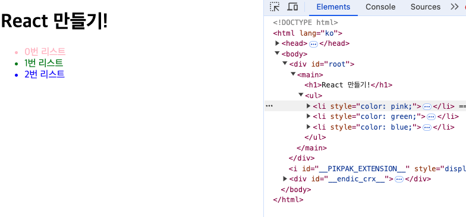
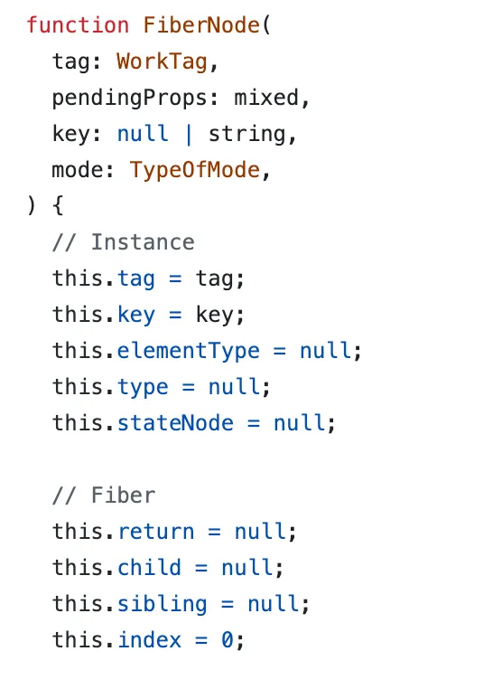
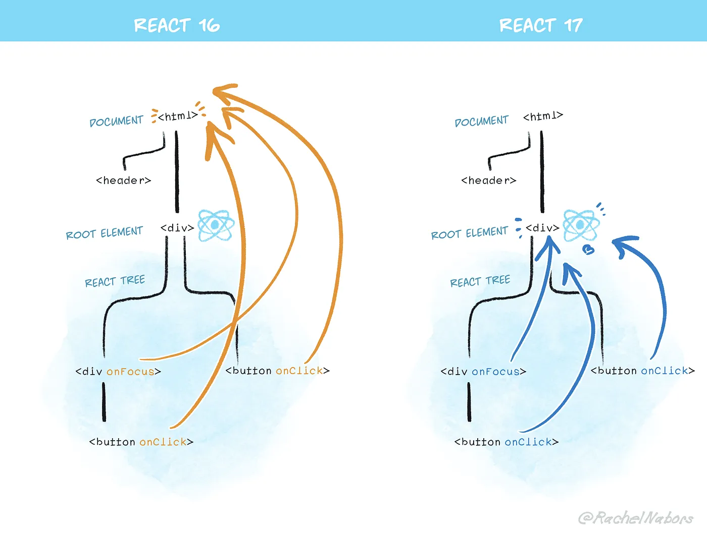
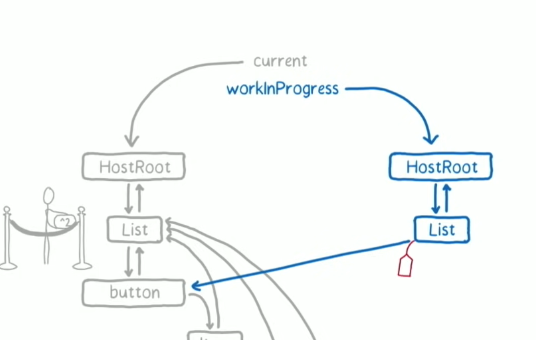
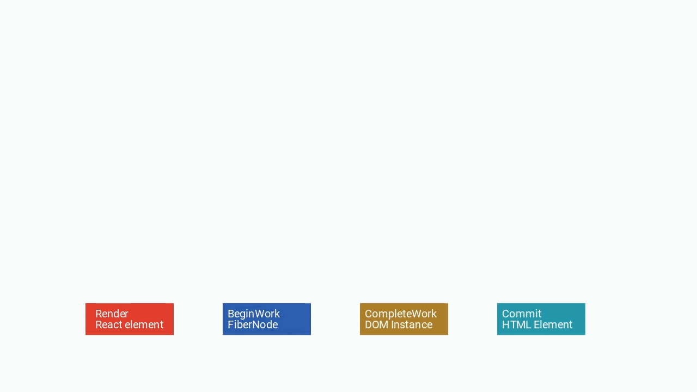

# 제2부: Virtual DOM을 넘어서 - React의 Fiber와 Reconciliation

## 목차

1. [DOM에서 Fiber까지](#1-dom에서-fiber까지)
   - [Virtual DOM이란?](#11-virtual-dom이란)
   - [Virtual DOM의 문제 해결 목적](#12-virtual-dom의-문제-해결-목적)
   - [Virtual DOM의 한계](#13-virtual-dom의-한계)
2. [Fiber 아키텍처의 등장](#2-fiber-아키텍처의-등장)
   - [Fiber 아키텍처의 개선점](#21-fiber-아키텍처의-개선점)
   - [Fiber 아키텍처의 추가적인 개선점](#22-fiber-아키텍처의-추가적인-개선점)
3. [Fiber의 구조와 동작 원리](#3-fiber의-구조와-동작-원리)
   - [Fiber에 추가된 정보와 필요성](#31-fiber에-추가된-정보와-필요성)
   - [`createRoot`의 역할과 중요성](#32-createroot의-역할과-중요성)
   - [Diffing 과정에서의 얕은 복사와 불변 객체](#33-diffing-과정에서의-얕은-복사와-불변-객체)
4. [Fiber에서의 Reconciliation(재조정) 과정](#4-fiber에서의-reconciliation재조정-과정)
   - [Reconciliation의 개념과 중요성](#41-reconciliation의-개념과-중요성)
   - [Reconciliation 과정의 단계](#42-reconciliation-과정의-단계)
   - [초기 마운트 시와 업데이트 시의 Reconciliation](#43-초기-마운트-시와-업데이트-시의-reconciliation)
   - [Reconciliation 단계의 세부 과정](#44-reconciliation-단계의-세부-과정)
   - [Reconciliation과 FiberNode의 역할](#45-reconciliation과-fibernode의-역할)
   - [스케줄링과 Reconciliation의 연계](#46-스케줄링과-reconciliation의-연계)
   - [Reconciliation 과정 요약](#47-reconciliation-과정-요약)
5. [React의 스케줄링과 Lane 모델 심화](#5-react의-스케줄링과-lane-모델-심화)
   - [Task Prioritization과 Task Batching](#51-task-prioritization과-task-batching)
   - [Lane Type과 우선순위 결정](#52-lane-type과-우선순위-결정)
   - [Lane 모델의 장점](#53-lane-모델의-장점)
   - [Lane 모델과 스케줄링의 상호 작용](#54-lane-모델과-스케줄링의-상호-작용)
   - [실제 사례: `useTransition`과 `Suspense`의 Lane 모델 활용](#55-실제-사례-usetransition과-suspense의-lane-모델-활용)
   - [Lane 모델의 핵심: 비동기 동작 취소](#56-lane-모델의-핵심-비동기-동작-취소)
   - [Lane 모델의 한계와 향후 개선점](#57-lane-모델의-한계와-향후-개선점)
6. [Ref와 직접적인 DOM 조작](#6-ref와-직접적인-dom-조작)
   - [Ref의 도입 배경과 필요성](#61-ref의-도입-배경과-필요성)
   - [Ref의 일반적인 사용 사례와 바람직한 활용 방법](#62-ref의-일반적인-사용-사례와-바람직한-활용-방법)
   - [Ref 사용 시 주의사항](#63-ref-사용-시-주의사항)
   - [Ref 사용 시 Fiber와 실제 DOM 간의 차이와 문제점](#64-ref-사용-시-fiber와-실제-dom-간의-차이와-문제점)
   - [Ref 사용 결론](#65-ref-사용-결론)
7. [마치며](#7-마치며)
8. [참고 자료](#8-참고-자료)

<!--truncate-->

# 들어가며

React는 현대 웹 개발에서 가장 널리 사용되는 라이브러리 중 하나로, 효율적인 UI 업데이트와 높은 성능을 제공하기 위해 지속적으로 발전해왔습니다. 이 글에서는 **Virtual DOM**의 개념을 넘어, React의 핵심 아키텍처인 **Fiber**와 **Reconciliation(재조정)** 과정에 대해 심층적으로 알아보겠습니다. 또한 **렌더링 페이즈**와 **커밋 페이즈**, **스케줄링과 Lane 모델** 등 React의 내부 동작 원리를 이해함으로써, 더 나은 React 애플리케이션을 개발하는 데 도움이 되고자 합니다.

## 1. DOM에서 Fiber까지

### 1.1 Virtual DOM이란?

브라우저는 HTML 문자열을 받아 웹 페이지를 렌더링합니다. 이러한 문자열 형태의 HTML을 보다 쉽게 조작할 수 있는 방법으로 **DOM(Document Object Model)** 구조가 개발되었습니다. React 팀은 이러한 브라우저의 렌더링 메커니즘을 차용하여, UI를 효율적으로 관리하고 업데이트하기 위한 **Virtual DOM** 개념을 도입했습니다.

**Virtual DOM**은 실제 DOM과 동일한 트리 구조를 가지지만, 메모리 내에서 가볍게 관리되는 **객체 모델**입니다. React는 상태 변화에 따라 새로운 Virtual DOM을 생성하고, 이전 Virtual DOM과 비교하여 변경된 부분만 실제 DOM에 반영합니다. 이를 통해 불필요한 DOM 조작을 최소화하고, 성능을 최적화할 수 있습니다.

Virtual DOM의 예시


```js
const vdom = {
  tag: 'main',
  props: {},
  children: [
    {
      tag: 'h1',
      props: {
        style: 'color:red',
      },
      children: ['React 만들기'],
    },
    {
      tag: 'ul',
      props: {},
      children: [
        {
          tag: 'li',
          props: {
            style: 'color: pink',
          },
          children: ['0번 리스트'],
        },
        {
          tag: 'li',
          props: {
            style: 'color: green',
          },
          children: ['1번 리스트'],
        },
        {
          tag: 'li',
          props: {
            style: 'color: blue',
          },
          children: ['2번 리스트'],
        },
      ],
    },
  ],
};
```

### 1.2 Virtual DOM의 문제 해결 목적

Virtual DOM의 도입은 다음과 같은 문제들을 해결하기 위해서였습니다:

1. **직접적인 DOM 조작의 복잡성 감소:** 실제 DOM을 직접 조작하는 것은 복잡하고 오류가 발생하기 쉽습니다. Virtual DOM을 사용하면 UI의 상태를 추상화된 객체로 관리하여, 복잡한 DOM 조작을 단순화할 수 있습니다.
2. **효율적인 업데이트 관리:** 상태 변화에 따라 전체 DOM을 다시 렌더링하는 것은 비효율적입니다. Virtual DOM은 변경된 부분만을 찾아 업데이트함으로써 성능을 향상시킵니다.
3. **크로스 플랫폼 렌더링의 가능성:** Virtual DOM은 UI를 값 기반의 객체로 표현하기 때문에, React Native와 같은 다양한 플랫폼에서 동일한 UI 로직을 재사용할 수 있습니다.

### 1.3 Virtual DOM의 한계

Virtual DOM은 많은 장점을 제공하지만, React 16 이전의 **스택 기반 Reconciliation** 방식에서는 다음과 같은 한계가 있었습니다:

1. **복잡한 트리 구조의 처리 비용 증가:** 대규모 애플리케이션에서는 Virtual DOM 트리가 매우 커질 수 있으며, 트리 간의 비교 작업(diffing)이 복잡해지고 계산 비용이 증가할 수 있습니다.
2. **동기적 업데이트의 한계:** Virtual DOM은 기본적으로 동기적으로 업데이트됩니다. 이는 브라우저의 메인 스레드를 블로킹할 수 있으며, 특히 복잡한 업데이트가 빈번하게 발생하는 경우 성능 저하를 초래할 수 있습니다.

사용자가 검색창에 빠르게 텍스트를 입력할 때, 동기적 업데이트로 인해 메인 스레드가 블로킹되어 입력 지연이나 UI 랙이 발생할 수 있습니다.

**동기적 업데이트의 한계 예시 - 구글 검색 입력 시의 동작**


사용자가 구글 검색창에 "김치 칼국수 레시피"를 입력한다고 가정해봅시다. 사용자가 "김치" 까지 입력했을 때, 브라우저는 실시간으로 입력 값을 감지하여 서버에 연관 검색어를 요청하게 됩니다. 이때 중요한 점은:

- **입력 창의 실시간 업데이트:** 사용자가 입력하는 텍스트는 즉시 화면에 반영되어야 합니다.
- **연관 검색어의 서버 요청:** 연관 검색어는 상대적으로 낮은 우선순위로 서버에 요청됩니다.

스택 기반의 동기적 업데이트 방식에서는, 사용자가 "김치" 부터 타이핑 할 때마다 입력 창의 업데이트와 동시에 연관 검색어 요청이 동기적으로 처리됩니다.

이로 인해

- **메인 스레드 블로킹:** 입력이 완료될 때까지 연관 검색어 요청이 완료될 때까지 메인 스레드가 블로킹되어 사용자 인터랙션이 지연될 수 있습니다.
- **불필요한 작업 취소:** 사용자가 "김치 칼국수"를 계속 입력하면서 이전에 요청했던 "김치" 관련 연관 검색어 작업은 불필요한 요청이 되고, 반복적으로 새로운 요청을 하게 됩니다.

이러한 동기적 처리 방식은 사용자 경험에 부정적인 영향을 미치며, 특히 빠른 입력과 빈번한 업데이트가 요구되는 환경에서는 심각한 성능 저하로 이어집니다.

## 2. Fiber 아키텍처의 등장

이러한 한계를 극복하기 위해 React 16에서는 **Fiber 아키텍처**가 도입되었습니다. Fiber는 스택 기반 Reconciliation의 단점을 보완하고, 더 복잡한 트리 구조와 빈번한 업데이트를 효율적으로 처리할 수 있도록 설계되었습니다.

### 2.1 Fiber 아키텍처의 개선점

1. **비동기 렌더링 지원:**
   Fiber 아키텍처는 렌더링 작업을 작은 단위로 분할하여, 비동기적으로 처리할 수 있습니다. 이를 통해 메인 스레드의 블로킹을 방지하고, 사용자 인터랙션에 대한 빠른 응답성을 유지할 수 있습니다. 예를 들어, 구글 검색 입력 시 사용자의 타이핑은 즉시 화면에 반영되며, 연관 검색어 요청은 우선순위가 낮은 작업으로 스케줄링되어 메인 스레드의 부담을 줄입니다.
2. **우선순위 기반 업데이트 처리:**
   Fiber는 업데이트의 우선순위를 지정하여, 중요한 작업을 먼저 처리하고, 덜 중요한 작업은 나중에 처리할 수 있습니다. 사용자 입력과 같은 중요한 업데이트는 높은 우선순위를 가지고, 연관 검색어 요청과 같은 덜 중요한 작업은 낮은 우선순위로 처리됩니다. 이를 통해 중요한 UI 업데이트가 지연되지 않고, 전체적인 사용자 경험이 향상됩니다.
3. **유연한 스케줄링과 배치:** 작업을 효율적으로 스케줄링하고 배치하여 CPU와 I/O 작업 간의 병목을 줄이고, 전체적인 성능을 향상시킵니다.

#### Fiber 아키텍처의 추가적인 개선점

Fiber 아키텍처는 기존 Virtual DOM의 단점을 보완하기 위해 몇 가지 중요한 개선점을 도입하였습니다:

- **가상 DOM의 확장:** Fiber는 Virtual DOM 객체에 더 많은 정보를 담아, 단순한 UI 구조를 넘어 재조정(Reconciliation) 과정을 더 정교하게 관리할 수 있도록 합니다. **Fiber**는 좁은 의미에서 Virtual DOM보다 많은 정보를 담고 있는 객체로, 넓은 의미로는 Reconciliation을 수행하는 하나의 아키텍처로 이해할 수 있습니다.
- **점진적 도입:** Fiber는 React 16부터 도입되어 점진적으로 기존 스택 기반 Reconciliation 방식을 대체하였습니다. 이는 기존 애플리케이션의 호환성을 유지하면서도 Fiber의 이점을 활용할 수 있게 합니다.
- **비동기 관련 훅의 기반:** Fiber 아키텍처는 React 18에서 도입된 다양한 비동기 관련 훅들(`useTransition`, `Suspense` 등)의 기반이 되어, 더욱 강력한 기능을 사용할 수 있게 되었습니다. 이는 비동기 작업을 효율적으로 처리하고, 사용자 경험을 더욱 향상시키는 데 중요한 역할을 합니다.

## 3. Fiber의 구조와 동작 원리

React의 **Fiber 아키텍처**는 기존의 Virtual DOM보다 더 많은 정보를 담고 있는 **Fiber Node**를 도입하여, 효율적인 UI 업데이트와 비동기 렌더링을 가능하게 합니다. 이번 섹션에서는 Fiber Node의 내부 구조를 코드로 살펴보고, 각 구성 요소가 어떤 역할을 하는지 자세히 알아보겠습니다.

### 3.1 Fiber에 추가된 정보와 필요성

**Fiber Node**는 React 컴포넌트의 인스턴스를 나타내며, 다음과 같은 주요 속성들을 포함합니다:

- **타입(Type)**
- **키(Key)**
- **태그(Tag)**
- **요소 유형(Element Type)**
- **상태(State)**
- **업데이트 큐(Update Queue)**
- **효과 목록(Effect List)**
- **우선순위(Priority)**
- **알터네이트(Alternate)**

이러한 추가 정보들은 React가 변경 사항을 효율적으로 추적하고, 필요한 부분만 업데이트할 수 있게 해줍니다. 아래에서는 Fiber Node의 구조를 코드로 표현하고, 각 속성의 역할을 설명하겠습니다.

#### Fiber Node의 구조 코드 예시




```jsx
function FiberNode(tag, key, pendingProps, type) {
  // 인스턴스 및 식별 정보
  this.tag = tag; // 컴포넌트의 타입을 나타냄 (FunctionComponent, ClassComponent 등)
  this.key = key; // 리스트에서 요소의 고유성을 보장하는 키 값
  this.elementType = type; // React 요소의 타입 (예: div, span, 사용자 정의 컴포넌트 등)
  this.type = type; // 작업 중인 요소의 실제 타입 (예: 클래스 또는 함수)
  this.stateNode = null; // 이 Fiber가 표현하는 실제 노드 (예: DOM 노드 또는 클래스 인스턴스)

  // 부모 및 형제 관계
  this.return = null; // 부모 Fiber를 가리킴, 순회 후 돌아갈 위치 정보
  this.child = null; // 첫 번째 자식 Fiber를 가리킴
  this.sibling = null; // 다음 형제 Fiber를 가리킴
  this.index = 0; // 현재 위치를 나타내는 인덱스

  // 상태 및 업데이트
  this.pendingProps = pendingProps; // 새로운 변화가 적용된 props
  this.memoizedProps = null; // 마지막으로 렌더링된 props
  this.memoizedState = null; // 마지막으로 렌더링된 state
  this.updateQueue = null; // 업데이트가 보류 중인 작업들의 큐

  // 효과 및 우선순위
  this.flags = NoFlags; // 이 Fiber에서 발생한 작업 또는 효과의 종류를 나타냄
  this.subtreeFlags = NoFlags; // 하위 트리에서 발생한 작업 또는 효과
  this.deletions = null; // 삭제되어야 할 Fiber들의 목록
  this.lanes = NoLanes; // 이 Fiber의 우선순위 레벨
  this.childLanes = NoLanes; // 하위 트리에서의 우선순위 레벨

  // 이중 버퍼링을 위한 연결
  this.alternate = null; // 현재 Fiber의 이전 또는 다음 상태를 가리킴 (Current <-> WorkInProgress)
}
```

#### 각 속성의 역할 설명

- **tag:** 컴포넌트의 유형을 나타냅니다.
- **key:** 리스트에서 요소의 고유성을 보장하기 위한 값입니다.
- **elementType/type:** React 요소의 타입을 나타냅니다.
- **stateNode:** 실제 DOM 노드나 클래스 인스턴스를 참조합니다.
- **return/child/sibling:** 부모, 자식, 형제 노드를 가리키며, 트리 구조를 형성합니다.
- **pendingProps/memoizedProps/memoizedState:** 새로운 변화가 적용된 props와 이전에 렌더링된 props, state를 보관합니다.
- **updateQueue:** 상태 업데이트와 관련된 작업들이 저장된 큐입니다.
- **flags/subtreeFlags:** 현재 Fiber에서 발생한 작업 또는 효과의 종류를 나타냅니다.
- **lanes/childLanes:** 작업의 우선순위를 관리합니다.
- **alternate:** 현재 Fiber의 이전 또는 다음 상태를 가리키며, 이중 버퍼링을 지원합니다.

#### Fiber Node의 연결 관계

Fiber Node는 다음과 같은 포인터들을 통해 트리 구조를 형성합니다:

- **parent (return)**: 부모 노드를 가리킵니다.
- **first child (child)**: 첫 번째 자식 노드를 가리킵니다.
- **sibling**: 다음 형제 노드를 가리킵니다.

이러한 구조는 **LCRS(Left-Child Right-Sibling)** 트리 형태로, 재귀 호출 없이도 반복문을 통해 트리를 효율적으로 순회할 수 있게 해줍니다.

### 3.2 `createRoot`의 역할과 중요성

React 18에서 도입된 createRoot API는 새로운 Fiber 아키텍처의 기능을 최대한 활용하기 위한 중요한 변화입니다. 기존의 ReactDOM.render 대신 createRoot를 사용함으로써 Concurrent 모드를 활성화할 수 있습니다.

#### 기존 `ReactDOM.render`와의 차이점

1. **동기 vs 비동기 렌더링:**
   - *`ReactDOM.render`*는 동기적으로 동작하여 큰 트리 구조를 렌더링할 때 메인 스레드를 블로킹할 수 있습니다. 이는 특히 복잡한 애플리케이션에서 사용자 인터랙션의 응답성을 저하시킬 수 있습니다.
   - *`createRoot`*는 비동기적으로 동작하여 렌더링 작업을 쪼개어 처리합니다. 이를 통해 메인 스레드의 블로킹을 방지하고, 사용자 상호작용에 대한 응답성을 높일 수 있습니다.
2. **Concurrent 모드 지원:**
   - *`createRoot`*를 사용하면 **Concurrent 모드**가 활성화되어 우선순위 기반의 작업 처리와 유연한 스케줄링이 가능합니다. 이는 Fiber 아키텍처와 함께 작동하여 더욱 효율적인 UI 업데이트를 가능하게 합니다.

#### `createRoot` 사용 예시

```jsx
import React from 'react';
import { createRoot } from 'react-dom/client';
import App from './App';

// 기존의 ReactDOM.render
// ReactDOM.render(<App />, document.getElementById('root'));

// 새로운 createRoot 사용
const container = document.getElementById('root');
const root = createRoot(container);
root.render(<App />);
```

### `createRoot`와 Fiber 아키텍처의 관계

`createRoot`는 Fiber 아키텍처의 **루트 Fiber(HostRoot)**를 생성하고, Concurrent 모드에서의 비동기 렌더링을 가능하게 합니다. 이를 통해 React는 다음과 같은 이점을 제공합니다:

- **우선순위 기반의 작업 처리:**
  - 사용자 입력과 같은 높은 우선순위의 작업은 즉시 처리하고, 데이터 패칭이나 애니메이션과 같은 낮은 우선순위의 작업은 나중에 처리하여 사용자 경험을 향상시킵니다.
  - 예를 들어, 구글 검색 입력 시 사용자의 타이핑은 즉시 화면에 반영되며, 연관 검색어 요청은 우선순위가 낮은 작업으로 스케줄링되어 메인 스레드의 부담을 줄입니다.
- **유연한 스케줄링:**
  - Fiber의 **Lane 모델**을 활용하여 작업을 효율적으로 스케줄링하고 배치할 수 있습니다.
  - 이는 CPU와 I/O 작업 간의 병목을 줄이고, 전체적인 성능을 향상시킵니다.
- **비동기 렌더링:**

  - 렌더링 작업을 작은 단위로 분할하여, 메인 스레드의 블로킹을 방지하고 부드러운 UI 업데이트를 제공합니다.
  - 이를 통해 사용자 인터랙션이 더욱 부드럽고 빠르게 반응하게 됩니다.

#### `createRoot`를 사용하는 이유



1. **이벤트 위임의 개선:**
   - **기존 방식:** React 17 이전에는 이벤트 위임이 `document` 객체에 의해 처리되었습니다. 이는 전체 문서에서 발생하는 이벤트를 관리해야 하므로, 특정 컴포넌트의 이벤트 처리에 비효율적일 수 있습니다.
   - **변경 사항:** React 18에서는 `createRoot`를 사용하는 루트 `div`에 이벤트 위임이 집중됩니다. 이를 통해 이벤트 처리가 더욱 효율적으로 이루어지며, 특정 영역 내에서만 이벤트를 관리할 수 있게 됩니다.
   - **장점:**
     - **렌더링 기준점 변경:** 루트 `div`에 이벤트를 위임함으로써, React는 해당 영역 내에서만 이벤트를 처리하게 되어 성능이 향상됩니다.
     - **유연성 증가:** 특정 루트에서만 이벤트를 처리하므로, 여러 개의 루트를 사용하는 애플리케이션에서도 독립적인 이벤트 관리를 할 수 있습니다.
2. **Fiber 구조 생성:**
   - **루트 Fiber(HostRoot) 생성:** `createRoot`는 새로운 Fiber 트리의 루트 노드를 생성합니다. 이는 기존의 스택 기반 Reconciliation 방식과 달리, Fiber 아키텍처의 효율성을 최대한 활용할 수 있게 합니다.
   - **Concurrent 모드 활성화:** Fiber 아키텍처의 핵심 기능인 Concurrent 모드를 활성화하여, 비동기 렌더링과 우선순위 기반 작업 처리를 지원합니다.
3. **이전 단점과 변화된 장점:**
   - **이전 단점:** `ReactDOM.render`는 전체 문서에 이벤트를 위임하므로, 이벤트 처리의 효율성이 떨어지고, 특정 컴포넌트의 업데이트가 전체 렌더링에 영향을 미칠 수 있었습니다.
   - **변화된 장점:** `createRoot`를 사용하여 루트 `div`에 이벤트를 위임함으로써, 특정 영역 내에서만 이벤트를 처리하게 되어 성능과 효율성이 크게 향상되었습니다. 또한, Fiber 아키텍처의 도입으로 인해 더욱 복잡한 트리 구조와 빈번한 업데이트를 효율적으로 관리할 수 있게 되었습니다.

### 3.3 Fiber 아키텍처의 추가적인 개선점

Fiber 아키텍처는 기존 Virtual DOM의 단점을 보완하고 React의 성능과 확장성을 향상시키기 위해 다음과 같은 개선점을 도입하였습니다:

#### 가상 DOM의 확장

Fiber는 Virtual DOM보다 더 많은 정보를 담고 있는 객체로, 단순한 UI 구조를 넘어 **재조정(Reconciliation)** 과정을 정교하게 관리할 수 있습니다. 이를 통해 React는 변경 사항을 정확히 추적하고, 필요한 부분만 업데이트하여 성능을 최적화합니다.

- **좁은 의미**: Fiber는 Virtual DOM보다 많은 정보를 담고 있는 객체입니다.
- **넓은 의미**: Fiber는 Reconciliation을 수행하는 하나의 아키텍처입니다.

#### 점진적 도입

Fiber 아키텍처는 React 16부터 도입되어 기존의 스택 기반 Reconciliation 방식을 점진적으로 대체하였습니다. 이는 기존 애플리케이션의 호환성을 유지하면서도 Fiber의 이점을 활용할 수 있게 합니다.

#### 비동기 관련 훅의 기반

Fiber 아키텍처는 React 18에서 도입된 다양한 비동기 관련 훅들의 기반이 되었습니다:

- **`useTransition`**: 상태 업데이트의 우선순위를 낮춰, 사용자 인터페이스의 응답성을 유지하면서 비동기 작업을 처리합니다.
- **`Suspense`**: 데이터 로딩과 같은 비동기 작업이 완료될 때까지 컴포넌트의 렌더링을 지연시켜, 로딩 스피너 등을 표시할 수 있게 합니다.

이를 통해 개발자는 더욱 강력한 기능을 활용하여 사용자 경험을 개선할 수 있습니다.

### 3.4 Diffing 과정에서의 얕은 복사와 불변 객체

Fiber 아키텍처에서 **Diffing 과정**은 Virtual DOM의 변경 사항을 실제 DOM에 반영하는 중요한 단계입니다. 이 과정에서 **얕은 복사(shallow copy)**와 **불변 객체**의 개념이 중요한 역할을 합니다.

#### 얕은 복사(shallow copy)를 사용하는 이유

얕은 복사는 객체의 최상위 속성만을 복사하고, 중첩된 객체는 참조를 그대로 유지하는 방법입니다. React는 얕은 복사를 통해 메모리 사용량을 최소화하면서도 변경 사항을 효율적으로 감지할 수 있습니다.

- **메모리 사용량 최소화:** 깊은 복사(deep copy)에 비해 메모리 사용량이 적습니다. 이는 대규모 애플리케이션에서 성능을 향상시키는 데 도움이 됩니다.
- **변경 사항 효율적 감지:** 얕은 복사를 통해 이전 상태와 새로운 상태를 빠르게 비교할 수 있습니다. React는 객체의 참조를 비교하여 변경 여부를 판단하므로, 얕은 복사를 사용하면 불필요한 깊은 비교를 피할 수 있습니다.

#### 불변 객체의 중요성

불변 객체는 한 번 생성된 객체의 상태가 변경되지 않는 객체를 말합니다. React에서는 상태 관리와 효율적인 변경 감지를 위해 불변 객체를 사용하는 것이 중요합니다.

1. **변경 감지를 효율적으로 수행할 수 있습니다:**
   - 불변 객체를 사용하면 이전 상태와 새로운 상태를 단순히 참조 비교로 변경 여부를 판단할 수 있습니다. 이는 성능을 크게 향상시킵니다.
2. **예측 가능하고 안정적인 상태 관리를 가능하게 합니다:**
   - 상태가 변경되지 않으므로, 예기치 않은 부작용을 방지할 수 있습니다. 이는 디버깅과 유지보수를 용이하게 만듭니다.
3. **React는 객체의 참조를 비교하여 변경 여부를 판단하므로, 불변성을 유지하면 성능이 향상됩니다:**
   - 불변 객체는 객체의 참조가 변경될 때만 실제로 객체가 변경된 것으로 간주합니다. 이는 React가 변경된 부분만 효율적으로 업데이트할 수 있게 합니다.

이처럼 **얕은 복사**와 **불변 객체**는 Fiber 아키텍처에서 효율적인 Reconciliation 과정을 가능하게 하는 핵심 요소입니다. 이를 통해 React는 높은 성능과 예측 가능한 상태 관리를 동시에 실현할 수 있습니다.

### 이번 섹션 정리

이번 섹션에서는 React의 핵심 아키텍처인 **Fiber**의 구조와 동작 원리에 대해 깊이 있게 살펴보았습니다. **Fiber Node**의 추가 정보와 그 필요성, **`createRoot`**의 역할과 중요성, 그리고 **Diffing 과정에서의 얕은 복사와 불변 객체**의 개념을 이해함으로써 React가 어떻게 효율적으로 UI를 업데이트하고 관리하는지 알 수 있었습니다.

### 주요 포인트 요약:

1. **Fiber Node의 구조:**
   - Fiber Node는 컴포넌트의 유형, 키, 상태, 업데이트 큐 등 다양한 정보를 포함하여 React가 변경 사항을 효율적으로 추적하고 업데이트할 수 있게 합니다.
2. **`createRoot`의 도입:**
   - `createRoot`는 React 18에서 도입되어 Concurrent 모드를 활성화함으로써 비동기 렌더링과 우선순위 기반 작업 처리를 지원합니다.
   - 이벤트 위임이 루트로 이동하여 이벤트 처리의 효율성이 향상되었습니다.
3. **Diffing 과정의 최적화:**
   - 얕은 복사와 불변 객체의 사용을 통해 변경 감지의 효율성을 높이고, 메모리 사용량을 최소화합니다.
   - 이러한 전략은 Reconciliation 과정을 더욱 빠르고 안정적으로 만들어 줍니다.

다음 섹션에서는 Fiber 아키텍처의 Reconciliation 재조정 과정에 대해 자세히 탐구하겠습니다.

## 4. Fiber에서의 Reconciliation(재조정) 과정

### 4.1 Reconciliation의 개념과 중요성

**Reconciliation(재조정)**은 React가 Virtual DOM의 변경 사항을 Fiber 객체로 변환하고, 이를 기반으로 스케줄링과 이벤트 위임, 배치 처리를 수행하는 과정입니다. 크게 보면 **렌더 페이즈(Render Phase)**에 속하며, 우리가 일반적으로 알고 있는 실제 DOM에 반영하는 과정은 **커밋 페이즈(Commit Phase)**에서 수행됩니다. Fiber 아키텍처는 이 과정을 더욱 세분화하고 효율적으로 수행할 수 있도록 설계되었습니다. 이번 섹션에서는 Fiber 아키텍처를 통한 Reconciliation 과정을 단계별로 상세히 분석하고, 초기 마운트 시와 업데이트 시의 동작 차이를 살펴보겠습니다.

### 4.2 Fiber를 통한 Reconciliation 과정 상세 분석

Reconciliation 과정은 크게 **Render Phase(렌더 페이즈)**와 **Commit Phase(커밋 페이즈)**로 나뉩니다. 각 단계는 더욱 세분화되어 있으며, 초기 마운트 시와 업데이트 시의 동작 차이를 이해하는 것이 중요합니다.

#### 4.2.1 Reconciliation 과정의 단계

1. **Render Phase(렌더 페이즈):**
   - **목적:** 새로운 Fiber 트리를 생성하고 변경 사항을 계산합니다.
   - **동작:** JSX 선언 또는 `React.createElement()`를 통해 새로운 React 엘리먼트를 생성합니다.
   - **특징:** **실제 DOM을 변경하지 않고, 작업을 준비하는 단계입니다.**
   - **세부 단계:**
     - **beginWork:** 각 FiberNode에 대한 작업을 시작합니다. 컴포넌트를 렌더링하고, 자식 FiberNodes를 생성합니다.
     - **completeWork:** 작업이 완료된 FiberNode를 처리하고, 필요한 업데이트 정보를 설정합니다.
2. **Commit Phase(커밋 페이즈):**
   - **목적:** 실제 DOM을 업데이트하고, 부수 효과를 실행합니다.
   - **동작:** 변경된 Fiber 트리를 실제 DOM에 반영합니다.
   - **특징:** 모든 변경 사항이 실제 DOM에 적용되는 단계로, UI가 사용자에게 최종적으로 표시됩니다.
   - **세부 단계:**
     - **Mutation Phase:** DOM 변경 작업을 수행합니다.
     - **Layout Phase:** 레이아웃 관련 작업(예: `useLayoutEffect`)을 실행합니다.
     - **After Commit Phase:** 추가적인 후처리 작업(예: `useEffect`)을 수행합니다.

### 4.2.2 초기 마운트 시와 업데이트 시의 Reconciliation

- **초기 마운트 시:**
  - **트리 생성:** React는 전체 컴포넌트 트리를 탐색하며 FiberNodes를 생성합니다.
  - **렌더링:** 모든 컴포넌트가 처음 렌더링되므로, 모든 FiberNodes의 `alternate`는 `null`입니다.
  - **동작:** `beginWork`와 `completeWork` 단계를 통해 전체 Fiber 트리가 구성되며, `Commit Phase`에서 실제 DOM이 구축됩니다.
  - **완료 트리 할당:** `Commit Phase`가 완료된 후, 생성된 Fiber 트리는 **완료 트리**가 되고, `root.current`에 할당됩니다. 이는 다음 업데이트 시 이전 트리로 사용됩니다.
- **업데이트 시:**
  - **FiberNode 복제:** 기존 Fiber 트리의 각 FiberNode는 새로운 작업 트리에서 복제되며, `alternate` 속성을 통해 현재 Fiber와 연결됩니다.
  - **변경 사항 비교:** 이전 Fiber 트리와 새로운 Fiber 트리를 비교하여 변경점을 찾아냅니다.
  - **효과 적용:** 변경된 FiberNodes만 `flags`를 설정하여, 실제 DOM에 반영될 수 있도록 합니다.
  - **동작:** `beginWork`와 `completeWork` 단계를 통해 변경된 FiberNodes만 처리하며, `Commit Phase`에서 실제 DOM이 업데이트됩니다.
  - **완료 트리 교체:** `Commit Phase` 후, 새로운 Fiber 트리는 완료 트리가 되고, `root.current`에 할당됩니다. 이는 다음 업데이트 시 이전 트리로 사용됩니다.

#### 4.2.3 Reconciliation 단계의 세부 과정

**Reconciliation 단계**는 Fiber 아키텍처 내에서 FiberNode를 하나의 작업 단위인 **unitOfWork**로 취급하여, 효율적으로 작업을 처리합니다. Reconciliation 과정은 **beginWork**와 **completeWork** 두 단계로 나뉘며, 이는 작업을 순차적으로 처리하고, 효율적인 분기를 가능하게 합니다.

1. **beginWork:**
   - 각 FiberNode에 대한 작업을 시작하는 단계입니다.
   - 현재 FiberNode의 props와 state를 기반으로 자식 FiberNodes를 생성하거나 업데이트합니다.
   - 컴포넌트의 렌더 메서드를 호출하여 새로운 React 엘리먼트를 생성합니다.
   - 이 과정에서 필요한 경우 새로운 FiberNodes를 생성하고, 기존 FiberNodes와 비교하여 변경 사항을 식별합니다.
     
2. **completeWork:**
   - `beginWork`에서 처리된 FiberNode의 작업을 완료하는 단계입니다.
   - FiberNode의 `flags`와 `subtreeFlags`를 설정하여, 변경 사항을 추적합니다.
   - 필요한 경우 DOM 업데이트 정보를 준비합니다.
   - 이 단계에서 FiberNode는 `Commit Phase`에서 실제 DOM에 반영될 준비를 마칩니다.

> 왜 두 단계가 필요한가?
>
> Reconciliation 과정을 **beginWork**와 **completeWork**로 분리함으로써, 작업을 순차적으로 처리하고, 각 FiberNode의 작업을 효율적으로 분기할 수 있습니다. 이는 복잡한 트리 구조에서도 최적의 성능을 유지하는 데 중요한 역할을 합니다.

#### 4.2.4 Reconciliation과 FiberNode의 역할

- **Reconciliation 과정의 단위:** Reconciliation은 FiberNode를 단위로 처리됩니다. 각 FiberNode는 자체적으로 렌더링에 필요한 정보를 담고 있는 객체이며, 이를 통해 효율적인 Reconciliation이 가능합니다.
- **HostRoot 컴포넌트:** React 내부에서 루트 FiberNode는 **HostRoot** 컴포넌트라고 불립니다. HostRoot는 애플리케이션의 시작점을 나타내며, Fiber 트리의 루트 역할을 합니다.
- **FiberNode의 생성:** Reconciliation 과정에서는 새로운 FiberNodes가 생성되며, 이들은 기존 FiberNodes와 `alternate` 속성을 통해 연결됩니다. 더블 버퍼링(Double Buffering) 기법을 사용하여 현재 Fiber 트리와 작업 중인 Fiber 트리를 번갈아 가리킵니다.
- **Flag 활용:** FiberNodes는 `flags`를 통해 변경 사항을 추적합니다. 이를 통해 어떤 FiberNode가 실제 DOM에 반영되어야 하는지 식별할 수 있습니다.

#### 4.2.5 스케줄링과 Reconciliation의 연계

Reconciliation 과정은 **스케줄링(Scheduling)**과 밀접하게 연관되어 있습니다. Fiber 아키텍처는 스케줄링을 비동기적으로 처리하여, 메인 스레드의 블로킹을 최소화하고, 사용자 인터랙션에 대한 빠른 응답성을 유지합니다.

- **비동기 스케줄링:** Reconciliation 작업은 비동기적으로 스케줄링되어, 높은 우선순위의 작업이 먼저 처리되고, 낮은 우선순위의 작업은 나중에 처리됩니다.
- **Lane 모델:** Fiber 아키텍처는 **Lane 모델**을 사용하여 작업의 우선순위를 관리합니다. 이를 통해 다양한 작업을 효율적으로 스케줄링하고, 최적의 성능을 유지합니다.
- **Unit of Work:** Reconciliation 과정에서 FiberNode는 하나의 작업 단위인 **unitOfWork**로 처리됩니다. 이는 FiberNode가 자체적으로 렌더링 정보를 담고 있는 객체이자, Reconciliation 작업의 기본 단위입니다.

### 4.3 Reconciliation 과정 요약

Reconciliation 과정은 다음과 같은 주요 단계로 요약할 수 있습니다:

1. **Render Phase:**
   - JSX 선언 또는 `React.createElement()`를 통해 새로운 React 엘리먼트를 생성합니다.
   - 이는 Fiber 아키텍처 내에서 새로운 Fiber 트리를 구성하는 첫 번째 단계입니다.
2. **Reconcile Phase:**
   - 이전에 렌더링된 Fiber 트리와 새로 렌더링할 Fiber 트리를 비교하여 변경점을 적용합니다.
   - 이 과정은 **beginWork**와 **completeWork**로 세분화되어, 효율적인 작업 처리를 가능하게 합니다.
3. **Commit Phase:**
   - 새로운 DOM 엘리먼트를 브라우저 뷰에 커밋합니다.
   - 실제 DOM이 업데이트되며, 부수 효과가 실행됩니다.
   - **Commit Phase 후 완료 트리 할당:** 완료된 Fiber 트리는 `root.current`에 할당되어 다음 업데이트 시 이전 트리로 사용됩니다.
4. **Update Phase:**
   - `props`나 `state`가 변경될 때 해당 컴포넌트와 하위 컴포넌트에 대해 위 과정을 반복합니다.
   - Fiber 아키텍처는 변경된 FiberNodes만을 대상으로 Reconciliation 과정을 수행하여, 전체 트리의 재렌더링을 피합니다.



### 이번 섹션 정리

이번 섹션에서는 React의 핵심 아키텍처인 **Fiber**를 통한 **Reconciliation(재조정)** 과정을 단계별로 상세히 분석하였습니다. Fiber 아키텍처는 Virtual DOM의 변경 사항을 Fiber 객체로 변환하고, 이를 기반으로 스케줄링과 이벤트 위임, 배치 처리를 효율적으로 수행하여 실제 DOM에 반영하는 과정을 최적화합니다.

### 주요 포인트 요약:

1. **Reconciliation 과정의 단계:**
   - **Render Phase:** Virtual DOM의 변경 사항을 Fiber 트리로 변환하고, 변경점을 계산합니다. 이 단계에서는 실제 DOM을 변경하지 않고 작업을 준비합니다.
   - **Commit Phase:** 변경된 Fiber 트리를 실제 DOM에 반영하고, 부수 효과를 실행합니다.
2. **초기 마운트 시와 업데이트 시의 동작 차이:**
   - **초기 마운트 시:** 전체 Fiber 트리를 생성하고, 모든 FiberNodes의 `alternate`는 `null`입니다. `Commit Phase`가 완료되면 생성된 Fiber 트리는 `root.current`에 할당됩니다.
   - **업데이트 시:** 기존 Fiber 트리의 FiberNodes를 복제하고, `alternate` 속성을 통해 이전 Fiber와 연결하여 변경 사항을 비교합니다. `Commit Phase`가 완료되면 새로운 Fiber 트리는 `root.current`에 할당됩니다.
3. **Reconciliation 과정의 최적화:**
   - **FiberNode를 단위로 한 작업 처리:** 각 FiberNode는 Reconciliation의 기본 단위인 `unitOfWork`로 처리됩니다.
   - **HostRoot 컴포넌트:** 루트 FiberNode는 HostRoot 컴포넌트로, 애플리케이션의 시작점을 나타냅니다.
   - **더블 버퍼링(Double Buffering):** `alternate` 속성을 통해 현재 Fiber 트리와 작업 중인 Fiber 트리를 번갈아 가리키며 안정적인 업데이트를 지원합니다.
   - **Flags와 Subtree Flags:** 변경 사항을 추적하여 어떤 FiberNode가 실제 DOM에 반영되어야 하는지 식별합니다.

## 5. React의 스케줄링과 Lane 모델 심화

React의 Fiber 아키텍처는 **Lane 모델**을 도입하여 작업의 우선순위를 세밀하게 관리하고, 성능을 극대화합니다. 이번 섹션에서는 React Fiber 아키텍처에서의 스케줄링과 Lane 모델의 개념, 구현 방식, 그리고 이를 활용한 실제 사용 사례에 대해 심화적으로 살펴보겠습니다.

### 5.1 Task Prioritization과 Task Batching

Fiber 아키텍처에서는 다양한 작업을 효율적으로 처리하기 위해 작업의 **우선순위 결정(Task Prioritization)**과 **작업 배치(Task Batching)**를 중요한 개념으로 도입했습니다. 이를 통해 React는 사용자 경험을 저해하지 않으면서도 복잡한 UI를 효율적으로 관리할 수 있습니다.

#### 작업 우선순위 결정 기준

작업의 우선순위를 결정하는 것은 사용자 경험과 애플리케이션의 성능에 직접적인 영향을 미칩니다. Fiber 아키텍처에서는 다음과 같은 기준에 따라 작업의 우선순위를 결정합니다:

1. **높은 우선순위 작업 (High-Priority Tasks):**

   - **사용자 입력(User Input):** 클릭, 키보드 입력, 스크롤 등 사용자와의 직접적인 상호작용.
   - **응답성 유지:** 사용자 인터랙션이 즉각적으로 반응해야 할 때, 높은 우선순위로 처리하여 UI가 빠르게 반응하도록 합니다.

   ```jsx
   function App() {
     const [count, setCount] = useState(0);

     const handleClick = () => {
       setCount(count + 1); // 사용자 입력에 의한 업데이트
     };

     return (
       <div>
         <button onClick={handleClick}>Increase</button>
         <p>Count: {count}</p>
       </div>
     );
   }
   ```

2. **중간 우선순위 작업 (Normal-Priority Tasks):**

   - **데이터 패칭(Data Fetching):** API 요청, 데이터 로딩 등.
   - **애니메이션(Animation):** UI 애니메이션, 전환 효과 등.

   ```jsx
   function DataFetchingComponent() {
     const [data, setData] = useState(null);

     useEffect(() => {
       fetchData().then(response => setData(response));
     }, []);

     return (
       <div>
         {data ? <DisplayData data={data} /> : <LoadingSpinner />}
       </div>
     );

   ```

3. **낮은 우선순위 작업 (Low-Priority Tasks):**

   - **비동기 작업(Asynchronous Tasks):** 백그라운드 업데이트, 로그 기록 등.
   - **부수 효과(Side Effects):** 상태 업데이트 이외의 작업.

   ```jsx
   function BackgroundUpdater() {
     useEffect(() => {
       const interval = setInterval(() => {
         // 낮은 우선순위의 작업
         console.log('Background task running');
       }, 1000);

       return () => clearInterval(interval);
     }, []);

     return null;
   }
   ```

#### Task Batching의 개념

- \*Task Batching(작업 배치)\*\*은 동일한 우선순위를 가진 작업들을 그룹화하여 한 번에 처리함으로써, 작업 간의 컨텍스트 스위칭을 줄이고 성능을 향상시키는 기법입니다. Fiber 아키텍처는 이를 통해 CPU와 메모리 자원을 효율적으로 활용할 수 있습니다.
- **작업 배치의 장점:**
  - **성능 향상:** 비슷한 우선순위의 작업을 한 번에 처리하여, 렌더링 사이클을 최적화합니다.
  - **부드러운 사용자 경험:** 불필요한 작업 간 전환을 줄여, UI가 더 부드럽게 동작하도록 합니다.

### 5.2 Lane Type과 우선순위 결정

**Lane 모델**은 Fiber 아키텍처에서 작업의 우선순위를 효율적으로 관리하기 위해 도입된 개념으로, **비트마스크(Bitmask)**를 사용하여 빠른 연산과 우선순위 결정을 가능하게 합니다. 이를 통해 다양한 유형의 작업을 세밀하게 구분하고 처리할 수 있습니다.


#### Lane 모델의 개념

Lane 모델은 여러 개의 **Lane**으로 작업을 분류하여, 각 Lane이 특정 우선순위를 나타내도록 설계되었습니다. 각 Lane은 비트 단위로 표현되며, 이를 통해 동시에 여러 Lane의 우선순위를 처리할 수 있습니다.

- **Lane의 특징:**
  - **비트마스크 기반:** 빠른 연산과 비교를 가능하게 합니다.
  - **동시성 지원:** 여러 Lane을 동시에 처리하여, 복잡한 애플리케이션에서도 높은 성능을 유지합니다.

#### Prioritization Lane Type

Lane 모델에서는 작업의 우선순위를 여러 Lane으로 분류합니다. 주요 Lane 타입과 그 우선순위는 다음과 같습니다:

1. **1순위 Lane: 기한이 지난 작업 또는 동기화 작업**
   - 긴급하게 처리해야 하는 작업으로, 사용자 인터랙션과 직접적으로 관련된 작업.
   - 예: 입력 필드에서의 텍스트 입력.
2. **2순위 Lane: 사용자 상호작용에 의한 업데이트**
   - 사용자 액션에 의해 발생하는 업데이트로, UI의 응답성을 유지하기 위해 높은 우선순위를 가집니다.
   - 예: 버튼 클릭 후 상태 업데이트.
3. **3순위 Lane: 네트워크 요청에 의해 생성된 업데이트**
   - 데이터 패칭과 같은 비동기 작업으로, 중간 우선순위를 가집니다.
   - 예: API 호출 후 데이터 업데이트.
4. **최하위 순위 Lane: Suspense 관련 작업**
   - 데이터 로딩이나 코드 스플리팅과 관련된 작업으로, 낮은 우선순위를 가집니다.
   - 예: Suspense 컴포넌트의 fallback 렌더링.

#### Batching Lane Type

Lane 모델에서는 작업을 **Batching Lane**으로 분류하여, 비슷한 유형의 작업을 효율적으로 처리합니다. 주요 Batching Lane 타입은 다음과 같습니다:

1. **InputDiscreteLanes: 사용자 상호 작용**
   - 사용자 입력과 같은 즉각적인 상호작용을 처리하는 Lane.
   - 예: 클릭, 키보드 입력 등.
2. **DefaultLanes: 데이터 요청에 의한 업데이트**
   - 일반적인 데이터 패칭과 상태 업데이트를 처리하는 Lane.
   - 예: API 호출 후 상태 업데이트.
3. **TransitionLanes: Suspense, `useTransition`, `useDeferredValue`**
   - UI의 전환과 관련된 작업을 처리하는 Lane.
   - 예: `useTransition`을 사용한 상태 업데이트, Suspense 컴포넌트의 로딩 상태 관리.

#### Lane Type의 우선순위 결정

Lane 모델은 각 Lane의 우선순위를 비트마스크로 관리하여, 우선순위가 높은 Lane부터 처리할 수 있도록 합니다. 이는 Fiber 아키텍처가 다양한 작업을 효율적으로 스케줄링하고 처리하는 데 중요한 역할을 합니다.

```jsx
// 예시: Lane 모델에서의 우선순위 비트마스크
const SyncLane = 0b0001; // 1순위
const InputDiscreteLane = 0b0010; // 2순위
const DefaultLane = 0b0100; // 3순위
const TransitionLane = 0b1000; // 최하위 순위
```

#### Lane 모델의 장점

- **빠른 연산:** 비트마스크를 사용하여 Lane의 우선순위를 빠르게 결정할 수 있습니다.
- **효율적인 스케줄링:** Lane별로 작업을 효율적으로 스케줄링하여, 높은 우선순위의 작업이 먼저 처리되도록 보장합니다.
- **동시성 지원:** 여러 Lane을 동시에 관리할 수 있어, 복잡한 애플리케이션에서도 높은 성능을 유지할 수 있습니다.

### 5.3 Lane 모델과 스케줄링의 상호 작용

Lane 모델과 스케줄링 시스템은 밀접하게 연관되어 있으며, 함께 작동하여 React가 다양한 우선순위의 작업을 효율적으로 처리할 수 있도록 합니다.

1. **Lane 선택:**
   - Fiber 아키텍처는 현재 처리할 Lane을 선택합니다. 이는 우선순위가 높은 Lane부터 선택됩니다.
   - 선택된 Lane에 속한 FiberNodes는 스케줄링 큐에 추가됩니다.
2. **스케줄링 큐 처리:**
   - React는 스케줄링 큐에 있는 작업들을 순차적으로 처리합니다.
   - 높은 우선순위의 작업이 먼저 처리되며, 낮은 우선순위의 작업은 나중에 처리됩니다.
3. **비동기 처리:**
   - 스케줄링은 비동기적으로 이루어지며, 이는 메인 스레드의 블로킹을 방지하고, 사용자 인터랙션에 대한 빠른 응답성을 유지합니다.
   - React는 작업을 작은 단위로 분할하여 처리함으로써, 긴 작업이 메인 스레드를 블로킹하지 않도록 합니다.

### 5.4 실제 사례: `useTransition`과 `Suspense`의 Lane 모델 활용

`useTransition`과 `Suspense`는 Lane 모델과 스케줄링 시스템을 활용하여, React 애플리케이션에서 비동기 작업을 효율적으로 처리하고, 사용자 경험을 향상시키는 중요한 기능들입니다.

#### `useTransition`의 Lane 모델 활용

- **낮은 우선순위 Lane 할당:** `useTransition`을 통해 시작된 상태 업데이트는 `TransitionLane`에 할당됩니다. 이는 높은 우선순위 작업을 방해하지 않도록 낮은 우선순위로 처리됩니다.
- **스케줄링:** TransitionLane에 속한 작업은 높은 우선순위의 작업이 먼저 처리된 후에 처리됩니다. 이를 통해 사용자 인터랙션의 응답성을 유지합니다.

```jsx
import React, { useState, useTransition } from 'react';

function App() {
  const [isPending, startTransition] = useTransition();
  const [inputValue, setInputValue] = useState('');
  const [filteredList, setFilteredList] = useState([]);

  const handleChange = (e) => {
    const value = e.target.value;
    setInputValue(value);
    startTransition(() => {
      const newFilteredList = filterList(value);
      setFilteredList(newFilteredList);
    });
  };

  return (
    <div>
      <input type="text" value={inputValue} onChange={handleChange} />
      {isPending && <p>Loading...</p>}
      <FilteredList items={filteredList} />
    </div>
  );
}

function filterList(input) {
  // 대규모 데이터 집합에서 필터링 작업
  const allItems = [...Array(100000).keys()].map((i) => `Item ${i}`);
  return allItems.filter((item) => item.includes(input));
}

function FilteredList({ items }) {
  return (
    <ul>
      {items.map((item, index) => (
        <li key={index}>{item}</li>
      ))}
    </ul>
  );
}

export default App;
```

- **설명:**
  - `useTransition` 훅을 사용하여, `startTransition` 함수 내에서 상태 업데이트를 시작합니다.
  - `isPending` 값은 전환 작업이 진행 중인지 여부를 나타내며, 로딩 스피너 등의 UI를 표시하는 데 사용할 수 있습니다.
  - `filterList` 함수는 시간이 많이 소요되는 작업으로, `startTransition`을 통해 비동기적으로 처리되어 UI의 응답성을 유지합니다.

#### `Suspense`의 Lane 모델 활용

- **데이터 로딩 관리:** `Suspense`는 데이터 로딩과 같은 비동기 작업을 처리할 때, 해당 작업을 `SuspenseLane`에 할당하여 관리합니다.
- **Fallback UI 표시:** 데이터 로딩 중, `Suspense`는 fallback UI를 표시하여 사용자에게 로딩 상태를 시각적으로 제공합니다.
- **Lane 모델의 연계:** `Suspense`는 `TransitionLane`과 연계되어, 데이터 로딩 작업이 낮은 우선순위로 처리되도록 합니다. 이를 통해 주요 UI 업데이트가 방해받지 않도록 합니다.

```jsx
import React, { Suspense } from 'react';
import ReactDOM from 'react-dom/client';

const DataFetchingComponent = React.lazy(() => import('./DataFetchingComponent'));

function App() {
  return (
    <div>
      <h1>My App</h1>
      <Suspense fallback={<LoadingSpinner />}>
        <DataFetchingComponent />
      </Suspense>
    </div>
  );
}

function LoadingSpinner() {
  return <div>Loading...</div>;
}

export default App;

// DataFetchingComponent.js
import React, { useEffect, useState } from 'react';

function DataFetchingComponent() {
  const [data, setData] = useState(null);

  useEffect(() => {
    fetchData().then(response => setData(response));
  }, []);

  if (!data) {
    throw fetchData(); // Suspense를 통해 로딩 상태 관리
  }

  return <div>Data: {data}</div>;
}

function fetchData() {
  return new Promise(resolve => {
    setTimeout(() => {
      resolve('Fetched Data');
    }, 2000);
  });
}

export default DataFetchingComponent;

```

- **설명:**
  - `Suspense` 컴포넌트를 사용하여, `DataFetchingComponent`가 로딩 중일 때 `LoadingSpinner`를 표시합니다.
  - `DataFetchingComponent` 내에서 데이터 로딩 작업은 `SuspenseLane`에 할당되어, 다른 높은 우선순위 작업의 방해 없이 처리됩니다.
  - 데이터 로딩이 완료되면, 실제 데이터가 표시되며, 사용자에게 부드러운 로딩 경험을 제공합니다.

#### Lane 모델의 핵심: 비동기 동작 취소

Lane 모델의 핵심 기능 중 하나는 **비동기 동작을 취소할 수 있는 능력**입니다. 이는 사용자 인터랙션이 빠르게 변할 때, 이전에 시작된 비동기 작업을 효과적으로 취소하여 불필요한 리소스 소모를 줄이고, 최신 상태만을 반영할 수 있게 합니다.

- **비동기 동작 취소의 필요성:**
  - 예를 들어, 사용자가 "김치"를 입력한 후 "김치 칼국수"로 입력을 빠르게 변경하면, "김치"에 대한 API 호출을 취소하고 "김치 칼국수"에 대한 새로운 API 호출을 시작해야 합니다.
  - 전통적인 `setTimeout`을 사용한 경우, 이미 시작된 비동기 작업을 취소할 수 없기 때문에, 불필요한 작업이 계속 진행될 수 있습니다.
- **Lane 모델을 활용한 비동기 동작 취소:**
  - Lane 모델은 Fiber 아키텍처 내에서 작업의 우선순위를 관리하면서, 특정 Lane에 속한 작업을 취소할 수 있는 메커니즘을 제공합니다.
  - 이를 통해 이전에 예약된 낮은 우선순위 작업을 취소하고, 최신 작업만을 유지할 수 있습니다.

### 5.5 Lane 모델의 한계와 향후 개선점

Lane 모델은 React의 Fiber 아키텍처에서 작업의 우선순위를 효율적으로 관리하는 데 큰 도움을 주지만, 여전히 몇 가지 한계와 향후 개선점이 존재합니다.

#### 한계점

1. **복잡성 증가:**
   - Lane 모델의 비트마스크 기반 관리 방식은 높은 효율성을 제공하지만, 내부 구현이 복잡하여 React 개발자들이 직접 다루기 어렵습니다.
   - 이는 React의 내부 최적화 작업에 집중할 수 있게 하지만, 사용자 수준에서는 다소 추상적일 수 있습니다.
2. **스케줄링 오버헤드:**
   - 많은 Lane과 다양한 우선순위의 작업이 동시에 처리될 경우, 스케줄링 오버헤드가 발생할 수 있습니다.
   - 이는 특히 매우 복잡한 애플리케이션에서 성능 저하를 초래할 수 있습니다.
3. **Lane 제한:**
   - 현재 Lane 모델은 제한된 수의 Lane을 지원하며, 이는 특정 시나리오에서 유연성을 제한할 수 있습니다.
   - 더 많은 Lane이 필요한 경우, 기존 모델의 확장이 어려울 수 있습니다.

### 5.6 결론

React의 Fiber 아키텍처에서 도입된 **Lane 모델**과 **스케줄링 시스템**은 작업의 우선순위를 세밀하게 관리하고, 효율적인 작업 처리를 가능하게 합니다. 이를 통해 React는 사용자 경험을 저해하지 않으면서도 복잡한 애플리케이션을 고성능으로 유지할 수 있습니다. `useTransition`과 `Suspense`와 같은 기능은 Lane 모델의 장점을 최대한 활용하여, 비동기 작업을 효율적으로 처리하고, 부드러운 사용자 경험을 제공합니다.

Fiber 아키텍처의 Lane 모델과 스케줄링 시스템을 이해함으로써, 개발자는 React 애플리케이션에서 성능을 최적화하고, 사용자 인터랙션의 응답성을 높이는 방법을 더욱 효과적으로 구현할 수 있습니다. 향후 React의 Fiber 아키텍처는 더 많은 최적화와 개선을 통해, 더욱 강력하고 유연한 UI 업데이트를 지원할 것으로 기대됩니다.

## 6. Ref와 직접적인 DOM 조작

React는 선언적인 UI 업데이트 방식을 채택하고 있지만, 특정 상황에서는 개발자가 직접적으로 DOM을 조작해야 할 필요가 있습니다. 이러한 필요성을 충족시키기 위해 React는 **Ref**를 제공합니다. 이 섹션에서는 Ref가 도입된 이유, 일반적인 사용 사례, Ref 사용 시 발생할 수 있는 문제점, 그리고 이를 안전하게 활용하기 위한 주의사항에 대해 다루겠습니다.

### 6.1 Ref의 도입 배경과 필요성

#### Ref가 나온 이유

React의 주요 철학 중 하나는 **선언적인 UI 업데이트**입니다. 상태(state)나 속성(props)의 변경에 따라 React가 자동으로 UI를 업데이트해 주기 때문에, 개발자는 직접적으로 DOM을 조작할 필요가 줄어듭니다. 그러나 몇몇 상황에서는 여전히 직접 DOM에 접근하여 조작해야 할 필요가 있습니다. 이러한 필요성을 충족시키기 위해 React는 **Ref**를 도입했습니다.

"Ref"는 "Reference"의 약어로, **참조**를 의미합니다. 참조는 특정 요소나 값에 대한 직접적인 접근을 가능하게 하는 방법입니다. React에서 `useRef` 훅은 이러한 참조를 생성하고 관리하는 역할을 합니다.

#### 직접적인 DOM 조작이 필요한 경우

다음과 같은 상황에서는 개발자가 직접 DOM을 조작해야 할 필요가 있습니다:

- **포커스 설정**: 특정 입력 필드에 자동으로 포커스를 맞추어 사용자 경험을 향상시킵니다.
- **텍스트 선택**: 사용자에게 텍스트를 자동으로 선택된 상태로 제공하여 복사 기능을 용이하게 합니다.
- **미디어 재생 관리**: 비디오나 오디오 요소의 재생을 제어하여 사용자 인터랙션에 맞춰 미디어를 재생하거나 일시 중지합니다.
- **값의 저장 및 유지:** 렌더링 간에 값이 유지되도록 하기 위해 사용됩니다. 이는 상태(state)와 유사하지만, 상태 변경 시 컴포넌트가 리렌더링되지 않는다는 점에서 차이가 있습니다.

### 6.2 Ref의 일반적인 사용 사례와 바람직한 활용 방법

#### Ref의 일반적인 사용

1. **포커스 설정**

   ```jsx
   import React, { useRef, useEffect } from 'react';

   function FocusInput() {
     const inputRef = useRef(null);

     useEffect(() => {
       inputRef.current.focus();
     }, []);

     return <input ref={inputRef} type="text" placeholder="자동 포커스" />;
   }

   export default FocusInput;
   ```

2. **텍스트 선택**

   ```jsx
   import React, { useRef } from 'react';

   function SelectText() {
     const textRef = useRef(null);

     const handleSelect = () => {
       textRef.current.select();
     };

     return (
       <div>
         <input ref={textRef} type="text" defaultValue="선택할 텍스트" />
         <button onClick={handleSelect}>텍스트 선택</button>
       </div>
     );
   }

   export default SelectText;
   ```

3. **미디어 재생 관리**

   ```jsx
   import React, { useRef } from 'react';

   function MediaPlayer() {
     const videoRef = useRef(null);

     const handlePlay = () => {
       videoRef.current.play();
     };

     const handlePause = () => {
       videoRef.current.pause();
     };

     return (
       <div>
         <video ref={videoRef} width="300" src="video.mp4" />
         <button onClick={handlePlay}>재생</button>
         <button onClick={handlePause}>일시 중지</button>
       </div>
     );
   }

   export default MediaPlayer;
   ```

#### 바람직한 Ref 활용 방법

- **필요한 경우에만 사용**: Ref는 꼭 필요한 상황에서만 사용하고, 가능한 한 상태(state)를 통해 UI를 업데이트합니다.
- **비동기 작업 관리**: Lane 모델과 같은 스케줄링 시스템을 활용하여, Ref를 통한 비동기 작업의 취소와 관리를 효율적으로 수행합니다.
- **일관성 유지**: Ref를 사용하여 직접 DOM을 조작한 후에는 상태와 동기화하여, Virtual DOM과 실제 DOM 간의 일관성을 유지합니다.

### 6.3 Ref 사용 시 주의사항

Ref를 사용할 때는 React의 선언적인 UI 업데이트 방식을 해치지 않도록 주의해야 합니다. 잘못된 사용은 버그를 유발하거나 성능 저하를 초래할 수 있습니다.

#### 1. 직접적인 DOM 조작 최소화

- **React의 선언적인 접근 방식 유지**: 상태(state)나 속성(props)을 통해 UI를 업데이트하는 것이 가장 바람직합니다. Ref는 예외적인 상황에서만 사용해야 합니다.

  ```jsx
  // 좋은 예: 상태를 통한 업데이트
  function ToggleVisibility() {
    const [isVisible, setIsVisible] = useState(false);

    return (
      <div>
        <button onClick={() => setIsVisible(!isVisible)}>{isVisible ? '숨기기' : '보이기'}</button>
        {isVisible && <div>보이는 요소</div>}
      </div>
    );
  }
  ```

  ```jsx
  // 나쁜 예: Ref를 통한 직접 DOM 조작
  function ToggleVisibilityBad() {
    const divRef = useRef(null);

    const toggle = () => {
      if (divRef.current.style.display === 'none') {
        divRef.current.style.display = 'block';
      } else {
        divRef.current.style.display = 'none';
      }
    };

    return (
      <div>
        <button onClick={toggle}>토글</button>
        <div ref={divRef} style={{ display: 'none' }}>
          숨겨진 요소
        </div>
      </div>
    );
  }
  ```

#### 2. 일관성 유지 방법

- **상태와 Ref의 동기화**: Ref를 사용하여 DOM을 조작한 후에는 관련 상태를 업데이트하여 Virtual DOM과 실제 DOM 간의 일관성을 유지합니다.

  ```jsx
  import React, { useRef, useState } from 'react';

  function SynchronizedInput() {
    const inputRef = useRef(null);
    const [value, setValue] = useState('');

    const handleUpdate = () => {
      inputRef.current.value = '새로운 값';
      setValue('새로운 값'); // 상태 업데이트를 통해 일관성 유지
    };

    return (
      <div>
        <input ref={inputRef} type="text" value={value} readOnly />
        <button onClick={handleUpdate}>값 업데이트</button>
      </div>
    );
  }

  export default SynchronizedInput;
  ```

### 6.4 Ref 사용 시 Fiber와 실제 DOM 간의 차이와 문제점

Ref를 통해 직접 DOM을 조작하면 React의 **Virtual DOM**과 실제 **DOM** 간에 불일치가 발생할 수 있습니다. 이는 React의 상태 관리 및 업데이트 흐름에 혼란을 초래할 수 있으며, 예기치 않은 버그를 유발할 수 있습니다.

#### Ref 사용 시 발생할 수 있는 문제점

1. **Virtual DOM과 실제 DOM의 불일치**:
   - React는 Virtual DOM을 기반으로 효율적인 업데이트를 수행합니다. 그러나 Ref를 사용하여 직접 DOM을 조작하면, React는 이러한 변경 사항을 인식하지 못합니다.
   - 결과적으로, Virtual DOM과 실제 DOM 간의 상태가 일치하지 않아 예기치 않은 동작이나 버그가 발생할 수 있습니다.
2. **상태 관리와의 충돌**:
   - Ref를 통해 상태와 무관하게 DOM을 직접 변경하면, React의 상태 기반 렌더링 로직과 충돌할 수 있습니다.
   - 이는 상태 업데이트가 예상대로 작동하지 않거나, UI가 일관성을 잃는 원인이 될 수 있습니다.

#### 문제 해결을 위한 권장 사항

- **Ref 사용을 최소화**:
  - 가능한 한 상태(state)를 통해 UI를 업데이트하고, Ref는 꼭 필요한 경우에만 사용합니다.
- **상태와 Ref의 동기화 유지**:
  - Ref를 사용하여 DOM을 조작한 후에는 관련 상태를 업데이트하여 Virtual DOM과 실제 DOM 간의 일관성을 유지합니다.
- **명확한 책임 분리**:
  - Ref는 주로 외부 라이브러리와의 통합이나, 직접적인 DOM 제어가 필요한 특정 기능에만 사용하고, 일반적인 UI 업데이트는 상태 기반으로 처리합니다.

### 6.5 Ref 사용 결론

Ref는 React에서 강력한 도구로, 특정 상황에서 DOM 요소나 컴포넌트 인스턴스에 직접 접근할 수 있게 해줍니다. 하지만, Ref를 남용하거나 부적절하게 사용할 경우 React의 선언적 접근 방식을 해치고 예기치 않은 버그를 유발할 수 있습니다. 따라서 Ref 사용 시 다음과 같은 점을 유의해야 합니다:

- **필요한 경우에만 사용**: Ref는 꼭 필요한 상황에서만 사용하고, 가능한 한 상태(state)를 통해 UI를 업데이트합니다.
- **일관성 유지**: Ref를 사용하여 직접 DOM을 조작한 후에는 상태와 동기화하여, Virtual DOM과 실제 DOM 간의 일관성을 유지합니다.

Ref는 React의 선언적인 UI 업데이트를 보완하는 도구로, 적절히 활용하면 더욱 유연하고 강력한 컴포넌트를 구현할 수 있습니다. 그러나, Ref의 사용은 신중하게 결정하고, 가능한 한 React의 상태 관리와 선언적 업데이트 방식을 따르는 것이 바람직합니다.

## 7. 마치며

React의 Fiber 아키텍처는 React 18로의 진화를 위한 핵심적인 기초 개념으로서, 현대 웹 개발에서 중요한 역할을 합니다. 이번 글에서는 Virtual DOM의 한계를 극복하고자 도입된 Fiber 아키텍처의 구조와 동작 원리, 그리고 이를 통한 Reconciliation 과정과 스케줄링 시스템의 중요성에 대해 다루었습니다.

Fiber 아키텍처는 비동기 렌더링과 우선순위 기반의 작업 처리를 가능하게 하여, 복잡한 UI에서도 높은 성능과 부드러운 사용자 경험을 제공합니다. 특히, Fiber를 기반으로 한 **스케줄링**과 **배치 처리**는 React 18에서 더욱 강화되어 개발자가 애플리케이션의 성능을 최적화하는 데 큰 도움을 줍니다.

이러한 기능들을 활용하기 위해서는 Fiber 아키텍처에 대한 깊은 이해가 필요합니다. Fiber는 단순한 Virtual DOM의 개선이 아니라, React의 내부 동작 방식을 근본적으로 재설계한 것이기 때문에, 이를 두고두고 익혀두면 앞으로의 React 개발에 큰 자산이 될 것입니다.

**감사의 말**

긴 글을 끝까지 읽어주셔서 감사합니다. 이 글을 통해 React의 Fiber 아키텍처와 Reconciliation 과정에 대한 이해가 깊어지길 바랍니다. Fiber를 기반으로 한 스케줄링과 배치 처리 기능을 충분히 활용하여, 더욱 효율적이고 사용자 친화적인 애플리케이션을 개발하시길 기대합니다.

## 8. 참고 자료

### Fiber 아키텍처 관련 자료

- [React 파이버 아키텍처 분석](https://d2.naver.com/helloworld/2690975)
- [DOM 에서 React Fiber 까지](https://www.blog.kcd.co.kr/dom-에서-react-fiber-까지-99de8b9c6236)
- [A Closer Look at React Fiber](https://www.alibabacloud.com/blog/a-closer-look-at-react-fiber_598138)
- [Introduction to React Fiber](https://blog.kiprosh.com/react-fiber/)
- [React 효율 개선을 위한 Fiber Reconciler - Blog by Jason Kang](https://jasonkang14.github.io/react/what-is-fiber-architecture)
- [React Fiber Architecture](https://github.com/acdlite/react-fiber-architecture)
- [React Fiber vs Stack Demo](https://github.com/claudiopro/react-fiber-vs-stack-demo)
- [react/packages/react-reconciler at main · facebook/react](https://github.com/facebook/react/tree/main/packages/react-reconciler)
- [React Core Contributors | How React Fiber Works | Facebook](https://www.facebook.com/groups/2003630259862046/permalink/2054053404819731/)

### 스케줄링과 Lane 모델

- [useTransition – React](https://ko.react.dev/reference/react/useTransition)
- [React 18 분석을 시작해보려합니다. | Deep Dive Magic Code](https://goidle.github.io/react/react-18/)
- [requestIdleCallback으로 최적화하기](https://yceffort.kr/2021/08/requestIdlecallback)
- [React Deep Dive — React Event System (2)](https://blog.mathpresso.com/react-deep-dive-react-event-system-2-1d0ad028308b)

### `createRoot`와 이벤트 시스템

- [createRoot – React](https://ko.react.dev/reference/react-dom/client/createRoot)
- [createRoot()에 render()를 호출하면 어떤 일이 일어날까? - Blog by Jason Kang](https://jasonkang14.github.io/react/how-react-renders-jsx)

### Key 속성과 리스트 렌더링

- [Index as a key is an anti-pattern](https://robinpokorny.medium.com/index-as-a-key-is-an-anti-pattern-e0349aece318)

### 영상 자료

- [Andrew Clark: What's Next for React — ReactNext 2016](https://www.youtube.com/watch?v=aV1271hd9ew)
- [Lin Clark - A Cartoon Intro to Fiber - React Conf 2017](https://www.youtube.com/watch?v=ZCuYPiUIONs&t=1485s)
- [How Does React Actually Work? React.js Deep Dive #1](https://www.youtube.com/watch?v=7YhdqIR2Yzo&list=PLxRVWC-K96b0ktvhd16l3xA6gncuGP7gJ)
- [React Fiber Architecture Explained](https://www.youtube.com/watch?v=8pDqJVdNa44)
- [NAVER D2 - React Fiber 심화 분석](https://tv.naver.com/v/23652451)
- [How A Small Team of Developers Created React at Facebook | React.js: The Documentary](https://www.youtube.com/watch?v=8pDqJVdNa44&t=3208s)
