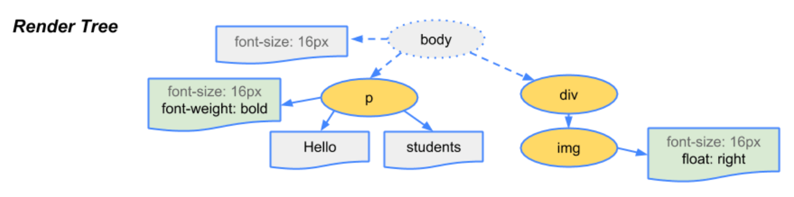
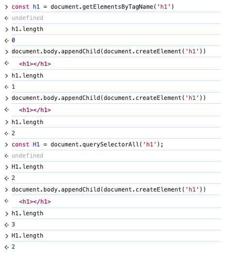
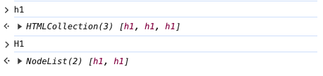
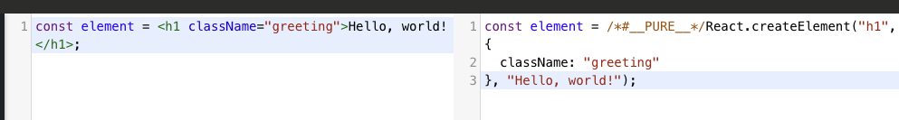

# 제1부: 브라우저 렌더링 방식과 JSX

## 목차

- [들어가며](#들어가며)
- [1. 브라우저 렌더링 방식 이해하기](#1-브라우저-렌더링-방식-이해하기)
  - [1.1 HTML 파싱과 DOM 생성](#11-html-파싱과-dom-생성)
  - [1.2 CSSOM과 렌더 트리 구성](#12-cssom과-렌더-트리-구성)
  - [1.3 렌더링과 페인팅](#13-렌더링과-페인팅)
- [2. 바닐라 JavaScript의 DOM 조작 한계](#2-바닐라-javascript의-dom-조작-한계)
  - [2.1 직접적인 DOM 조작의 복잡성](#21-직접적인-dom-조작의-복잡성)
  - [2.2 성능 문제](#22-성능-문제)
  - [2.3 복잡성 감소를 위한 시도와 한계](#23-복잡성-감소를-위한-시도와-한계)
  - [2.4 해결책: DOM 조작을 라이브러리에 위임](#24-해결책-dom-조작을-라이브러리에-위임)
- [3. React의 등장 배경과 DOM 조작 위임](#3-react의-등장-배경과-dom-조작-위임)
  - [3.1 React의 철학과 목표](#31-react의-철학과-목표)
  - [3.2 DOM 조작의 추상화](#32-dom-조작의-추상화)
- [4. JSX의 등장](#4-jsx의-등장)
  - [4.1 JSX란 무엇인가](#41-jsx란-무엇인가)
  - [4.2 Babel 등의 컴파일러 역할](#42-babel-등의-컴파일러-역할)
  - [4.3 React 17 버전 이하에서의 이슈](#43-react-17-버전-이하에서의-이슈)
  - [4.4 React 17 버전 이후의 변화](#44-react-17-버전-이후의-변화)
  - [4.5 JSX의 장점 요약](#45-jsx의-장점-요약)
- [마치며](#마치며)
- [참고 자료](#참고-자료)

<!--truncate-->

<br />

## 들어가며

현대 웹 개발에서 **React**는 사용자 인터페이스를 구축하는 데 필수적인 라이브러리로 자리매김했습니다. 프론트엔드 개발에 앞서 React가 왜 등장하게 되었고, 어떤 문제를 해결하려 했는지 이해하기 위해서는 먼저 **브라우저의 렌더링 방식**과 기존의 **JavaScript를 사용한 DOM 조작의 한계**를 살펴볼 필요가 있습니다.

이번 글에서는 브라우저가 어떻게 웹 페이지를 렌더링하는지, 그리고 React의 핵심 개념인 **JSX**가 어떤 역할을 하는지 알아보겠습니다.

## 1. 브라우저 렌더링 방식 이해하기


### 1.1 HTML 파싱과 DOM 생성

브라우저는 사용자가 요청한 HTML 문서를 받아들여 화면에 표시하기까지 여러 단계를 거칩니다. 첫 번째 단계는 **HTML 파싱**입니다.

- **HTML 파싱**: 브라우저는 HTML 문서를 위에서부터 아래로 읽어들이며, 각 태그와 콘텐츠를 해석하여 **DOM(Document Object Model)** 트리를 생성합니다.
- **DOM 트리**: 이 트리는 문서의 구조와 내용을 트리 형태의 객체로 표현한 것입니다. 각 노드는 HTML의 요소를 나타내며, 부모-자식 관계로 연결됩니다.

#### DOM 트리는 어디에 저장될까요?

**DOM 트리**는 브라우저의 **메모리**에 저장됩니다. 이는 브라우저가 웹 페이지의 구조와 콘텐츠를 관리하기 위해 메모리 내에 생성한 데이터 구조입니다. 개발자는 직접 이 메모리에 접근할 수는 없지만, **`document`** 객체를 통해 DOM 트리에 접근하고 조작할 수 있습니다.

- **`document` 객체**: `document`는 현재 웹 페이지의 DOM 트리에 대한 진입점 역할을 합니다. JavaScript에서 `document`를 사용하여 요소를 선택하거나 생성, 삭제할 수 있습니다.

```javascript
// 예시: 'root'라는 ID를 가진 요소 선택
const rootElement = document.getElementById('root');
```

- **개발자 도구의 Elements 탭**: 브라우저의 개발자 도구에서 볼 수 있는 **Elements(요소)** 탭은 이미 렌더링된 DOM 요소들을 보여줍니다. 이는 실제로 브라우저가 화면에 표시하고 있는 요소들로, DOM 트리의 현재 상태를 시각적으로 확인할 수 있습니다.

**렌더링 엔진에 따른 차이점**

브라우저마다 사용하는 **렌더링 엔진**이 다르며, 각 엔진은 렌더링 과정에서 사용되는 용어나 처리 방식에 차이가 있습니다. 이 글에서는 **Blink** 엔진을 기준으로 설명합니다.

- **Blink**: 구글 크롬과 같은 Chromium 기반 브라우저에서 사용하는 렌더링 엔진입니다. Blink에서는 DOM 트리와 CSSOM 트리를 결합하여 **렌더 트리(Render Tree)**를 생성합니다. 이 렌더 트리는 화면에 표시될 요소와 스타일 정보를 포함하고 있습니다.

다른 렌더링 엔진 비교:

- **Gecko (Firefox)**:
  - **형상 트리(Frame Tree)**: Gecko는 렌더 트리를 이렇게 부르며, 각 요소를 **형상(Frame)**이라고 합니다.
  - **Reflow**: 레이아웃 계산 과정을 **Reflow**라고 부릅니다.
- **WebKit (Safari)**:
  - **렌더 오브젝트(Render Object)**: WebKit에서는 렌더 트리가 **렌더 오브젝트**로 구성됩니다.
  - **Layout**: 레이아웃 계산 과정을 **Layout**이라고 합니다.
  - **Attachment**: DOM 노드와 시각 정보를 연결하여 렌더 트리를 생성하는 과정을 **Attachment**라고 부릅니다.

각 렌더링 엔진은 용어와 세부 처리 방식에서 차이가 있지만, 전체적인 흐름은 유사합니다. 이러한 차이점을 이해하면 다양한 브라우저 환경에서의 렌더링 과정을 더 깊이 이해할 수 있습니다.

### 1.2 CSSOM과 렌더 트리 구성

동시에 브라우저는 CSS를 파싱하여 **CSSOM(CSS Object Model)** 트리를 생성합니다.

- **CSS 파싱**: CSS 파일이나 `<style>` 태그 내의 스타일 정보를 해석하여 스타일 규칙을 객체로 표현합니다.

#### DOM과 CSSOM의 결합: 렌더 트리 생성



브라우저는 **DOM 트리**와 **CSSOM 트리**를 결합하여 **렌더 트리(Render Tree)**를 생성합니다.

- **스타일 매칭 과정**: DOM 트리의 각 요소는 CSSOM 트리의 스타일 규칙과 매칭되어 시각적 속성을 갖게 됩니다.
- **렌더 트리 생성**: 렌더 트리는 페이지를 렌더링하는 데 필요한 노드만 포함합니다. 즉, 실제 화면에 표시될 요소들로 구성됩니다.

**렌더 트리에 포함되지 않는 요소**

- `display: none`으로 설정된 요소는 렌더 트리에 포함되지 않습니다. 이 요소들은 레이아웃에 영향을 주지 않으며, 화면에 표시되지 않습니다.
- 반면, `visibility: hidden`으로 설정된 요소는 렌더 트리에 포함되지만, 화면에 보이지 않을 뿐입니다. 이들은 레이아웃에서 공간을 차지합니다.

:::tip

- visibility: hidden

  요소를 보이지 않게 만듭니다.
  여전히 레이아웃에서 공간을 차지합니다.
  렌더 트리에 포함되어 위치와 크기 정보가 유지됩니다.

- display: none

  요소를 화면에 표시하지 않습니다.
  레이아웃에 포함되지 않으며, 공간을 차지하지 않습니다.
  렌더 트리에서 해당 요소가 완전히 제거됩니다.

:::

### 1.3 렌더링과 페인팅

렌더 트리가 생성되면 브라우저는 이를 기반으로 화면에 콘텐츠를 표시하기 위한 과정을 거칩니다.

#### 레이아웃(Layout) 또는 리플로우(Reflow)

- **레이아웃 계산**: 렌더 트리의 각 노드에 대해 정확한 위치와 크기를 계산합니다.
- **리플로우**: 레이아웃 정보가 변경될 때마다 발생하는 과정으로, DOM 또는 스타일의 변경으로 인해 노드의 위치나 크기가 변경되면 브라우저는 다시 레이아웃을 계산해야 합니다.
- **성능 영향**: 리플로우는 비용이 많이 드는 작업으로, 빈번하게 발생하면 성능 저하를 초래할 수 있습니다.

#### 페인팅(Painting) 또는 리페인트(Repaint)

- **페인팅 과정**: 계산된 레이아웃 정보를 기반으로 각 노드를 화면에 그립니다.
- **리페인트**: 노드의 시각적 속성(색상, 배경 등)이 변경될 때 발생하며, 레이아웃은 변경되지 않습니다.
- **성능 영향**: 리페인트는 리플로우보다 비용이 적지만, 많은 요소에 대해 발생하면 역시 성능에 영향을 줄 수 있습니다.

#### 컴포지팅(Compositing)

- **컴포지팅 단계**: 페인팅된 요소들을 레이어로 구성하여 최종적으로 화면에 표시합니다.
- **레이어 구성**: 복잡한 애니메이션이나 3D 변환 등이 사용될 때 브라우저는 별도의 합성 레이어(Composite Layer)를 생성합니다.
- **GPU 가속 활용**: 컴포지팅 단계에서는 GPU를 활용하여 성능을 향상시킵니다.

### 정리

이렇게 렌더링 과정은 크게 **렌더 트리 생성**, **레이아웃 계산(리플로우)**, **페인팅(리페인트)**, 그리고 **컴포지팅**의 단계를 거칩니다. 이러한 과정에서 DOM이나 스타일의 변경은 리플로우와 리페인트를 발생시켜 성능에 영향을 줄 수 있으므로, 효율적인 웹 애플리케이션 개발을 위해서는 이러한 과정에 대한 이해가 필요합니다.

## 2. 바닐라 JavaScript의 DOM 조작 한계

### 2.1 직접적인 DOM 조작의 복잡성

전통적인 방법으로 동적인 웹 페이지를 만들기 위해서는 JavaScript로 직접 DOM을 조작해야 합니다.

- **요소 선택과 조작**: `document.getElementById`나 `document.querySelector` 등을 사용하여 요소를 선택하고, `innerHTML`이나 `appendChild` 등을 사용하여 내용을 변경합니다.
- **이벤트 처리**: 각 요소에 이벤트 리스너를 등록하여 사용자 인터랙션에 대응합니다.

이러한 방식은 간단한 작업에는 효과적이지만, 애플리케이션이 복잡해질수록 여러 문제가 발생합니다.

#### 증가하는 복잡성

- **현대 웹사이트의 기능 확장**: 웹 애플리케이션은 점점 더 복잡해지고, 사용자와의 상호작용이 많아지면서 DOM과 관련된 조작도 복잡해집니다.
- **유지보수 어려움**: DOM 조작 코드가 산발적으로 흩어져 있으면 디버깅과 유지보수가 어려워집니다.
- **상태 관리의 복잡성**: 여러 요소의 상태를 관리하고 동기화하는 것은 매우 까다로운 작업이 될 수 있습니다.

#### 브라우저 호환성 문제

- **다양한 브라우저 환경**: 사용자들은 다양한 브라우저와 버전을 사용하므로, 모든 브라우저에서 동일하게 동작하도록 코드를 작성해야 합니다.
- **호환성 확인의 어려움**: 새로운 기능이나 API를 사용할 때마다 [Can I Use](https://caniuse.com/)와 같은 사이트를 통해 브라우저 지원 여부를 확인해야 합니다.
- **폴리필과 대체 코드 필요**: 지원하지 않는 브라우저를 위해 추가적인 코드나 라이브러리를 도입해야 할 수 있습니다.

#### HTMLCollection과 NodeList의 혼란

DOM API를 사용할 때, **HTMLCollection**과 **NodeList**의 차이를 이해하는 것이 중요하지만, 이는 종종 혼란을 야기합니다.

```javascript
// HTMLCollection 예시
const h1Elements = document.getElementsByTagName('h1');

// NodeList 예시
const h1NodeList = document.querySelectorAll('h1');
```

- **HTMLCollection**
  - **라이브(Live) 컬렉션**: DOM에 변경이 발생하면 자동으로 업데이트됩니다.
  - **예시**: `getElementsByTagName`, `getElementsByClassName` 등이 반환합니다.
- **NodeList**
  - **정적인(Static) 리스트**: 생성 시점의 상태를 유지하며, 이후 DOM 변경에 따라 업데이트되지 않습니다.
  - **예시**: `querySelectorAll`이 반환합니다.

**예시 코드**




```javascript
// 초기 상태에서 h1 요소 수 확인
const h1Collection = document.getElementsByTagName('h1');
console.log(h1Collection.length); // 예: 0

const h1NodeList = document.querySelectorAll('h1');
console.log(h1NodeList.length); // 예: 0

// 새로운 h1 요소 추가
document.body.appendChild(document.createElement('h1'));

console.log(h1Collection.length); // 업데이트됨: 1 (라이브 컬렉션)
console.log(h1NodeList.length); // 그대로임: 0 (정적 리스트)

// NodeList를 다시 가져와야 업데이트된 상태 확인 가능
const updatedH1NodeList = document.querySelectorAll('h1');
console.log(updatedH1NodeList.length); // 1
```

이처럼 라이브 객체와 정적 객체를 다루는 것은 개발자에게 추가적인 복잡성을 가져옵니다.

### 2.2 성능 문제

직접적인 DOM 조작은 성능 저하를 가져올 수 있습니다.

#### 빈번한 DOM 업데이트

- **DOM 조작의 비용**: DOM은 브라우저가 최적화된 자료구조로 관리하고 있으므로, 조작 시 상당한 비용이 발생합니다.
- **잦은 업데이트로 인한 성능 저하**: 작은 변경이라도 DOM 조작이 빈번하면 렌더링 엔진이 지속적으로 작업해야 하므로 성능이 저하됩니다.

#### Reflow와 Repaint의 부담

- **Reflow(레이아웃 재계산)**: 요소의 크기나 위치가 변경되면 레이아웃을 다시 계산해야 합니다.
- **Repaint(재페인트)**: 요소의 시각적 속성(색상, 투명도 등)이 변경되면 다시 그려야 합니다.
- **성능 영향**: Reflow는 Repaint보다 더 많은 비용이 들며, 전체 DOM 트리에 영향을 줄 수 있습니다.

#### 예시: 성능 문제를 일으키는 코드

```js
// 성능이 좋지 않은 방식: 매번 DOM에 접근하여 스타일 변경
for (let i = 0; i < 1000; i++) {
  const element = document.getElementById('item-' + i);
  element.style.width = element.offsetWidth + 10 + 'px';
}
```

- 위 코드는 각 반복마다 DOM에 접근하고, 레이아웃을 재계산하게 되어 성능이 저하됩니다.

#### 해결 방법의 한계

- **DocumentFragment 사용**: 여러 노드를 한 번에 추가하거나 조작하기 위해 `DocumentFragment`를 사용할 수 있지만, 코드가 복잡해집니다.
- **배치 업데이트**: 변경 사항을 모아서 한 번에 적용하는 방법도 있으나, 수동으로 관리해야 합니다.

### 2.3 복잡성 감소를 위한 시도와 한계

#### MVC와 MVVM 패턴의 도입

- **MVC(Model-View-Controller)**: 애플리케이션을 모델, 뷰, 컨트롤러로 분리하여 관리합니다.
- **MVVM(Model-View-ViewModel)**: 뷰와 모델 사이에 ViewModel을 두어 양방향 데이터 바인딩을 구현합니다.
- 이러한 패턴들은 코드 구조를 개선하고자 했지만, **DOM 조작 자체를 완전히 추상화하지는 못했습니다**.

#### 여전히 남아있는 DOM 조작

- **직접적인 DOM 접근**: 여전히 이벤트 처리나 특정 상황에서 DOM에 직접 접근해야 했습니다.
- **복잡성의 전이**: 패턴을 적용함으로써 구조는 개선되었지만, 패턴 자체의 복잡성을 이해하고 유지해야 하는 부담이 생겼습니다.

## 3. React의 등장 배경과 DOM 조작 위임

### 3.1 React의 철학과 목표

React는 Facebook에서 개발한 라이브러리로, 다음과 같은 세 가지 핵심 특징을 갖고 있습니다:

- **Declarative (선언적)**: React는 선언형 패러다임을 사용하여 애플리케이션을 더 쉽게 이해하고 예측할 수 있게 합니다.
- **Efficient (효율적)**: React는 가상 DOM(Virtual DOM)을 사용하여 실제 DOM과의 상호작용을 최소화합니다.
- **Flexible (유연한)**: React는 이미 알고 있는 라이브러리나 프레임워크와 함께 동작합니다.

### Declarative: 선언형 프로그래밍

- **UI 상태의 선언**: 개발자는 UI가 특정 상태에서 어떻게 보여야 하는지를 선언적으로 기술합니다.
- **React의 역할**: React는 선언된 상태에 따라 필요한 DOM 변경을 수행합니다.
- **장점**: 코드의 가독성이 높아지고, 사이드 이펙트가 줄어들어 디버깅이 용이해집니다.

### Efficient: 효율적인 렌더링

- **가상 DOM(Virtual DOM)**: React는 메모리 내에 가상 DOM을 유지하여 상태 변경 시 전체 UI를 다시 렌더링하지 않고, 필요한 부분만 업데이트합니다.
- **최소한의 DOM 조작**: 변경 사항을 계산하여 실제 DOM 조작을 최소화함으로써 성능을 향상시킵니다.

### Flexible: 유연한 통합

- **다양한 라이브러리와의 호환성**: React는 특정 스택에 종속되지 않으며, 기존의 라이브러리나 프레임워크와 함께 사용할 수 있습니다.
- **점진적 도입 가능**: 프로젝트의 일부에만 React를 도입하여 점진적으로 이전할 수 있습니다.

### 3.2 DOM 조작의 추상화

React는 DOM 조작을 추상화하여 개발자가 직접 DOM에 접근하지 않고도 애플리케이션을 개발할 수 있게 합니다.

- **컴포넌트 기반 아키텍처**: UI를 작은 컴포넌트로 분리하여 재사용성과 관리성을 높입니다.
- **상태 관리의 단순화**: 컴포넌트의 상태 변화에 따라 UI가 자동으로 업데이트됩니다.
- **선언적 이벤트 처리**: 이벤트 핸들러를 JSX에 직접 지정하여 이벤트 처리를 단순화합니다.

## 4. JSX의 등장

### 4.1 JSX란 무엇인가

**JSX**는 JavaScript 내에서 HTML과 유사한 문법을 사용하여 UI 구조를 정의할 수 있게 해주는 문법 확장입니다.

- **가독성 향상**: UI의 구조를 직관적으로 표현할 수 있어 코드의 가독성이 높아집니다.
- **표현력 강화**: JavaScript의 모든 기능을 활용하면서도, HTML 태그를 사용하여 UI를 구성할 수 있습니다.

### 왜 JSX가 필요한가?

초기의 React 팀은 UI를 구성하는 계층 구조를 표현하기 위해 고민했습니다. **`React.createElement`**를 사용하여 요소를 생성하고 중첩 구조를 표현하는 것은 코드가 복잡해지고 읽기 어려워지는 문제가 있었습니다.

예를 들어, 다음과 같이 **`React.createElement`**를 사용하면 코드의 깊이가 깊어지고 이해하기 어려워집니다.

```jsx
<div class="container">
  <h1>Hello, world!</h1>
  <p>This is a sample paragraph.</p>
</div>;

const element = React.createElement(
  'div',
  { className: 'container' },
  React.createElement('h1', null, 'Hello, world!'),
  React.createElement('p', null, 'This is a sample paragraph.'),
);
```

이러한 문제를 해결하고 개발자들에게 익숙한 HTML 구조를 제공하기 위해 **JSX**를 도입하게 되었습니다.

JSX를 사용하면 위의 코드를 다음과 같이 간단하고 직관적으로 표현할 수 있습니다.

```jsx
const element = (
  <div className="container">
    <h1>Hello, world!</h1>
    <p>This is a sample paragraph.</p>
  </div>
);
```

#### 요소명에 대문자를 사용하는 이유

JSX에서 **요소명을 대문자로 시작**하는 것은 중요한 규칙이며, 이는 기본 HTML 태그와 사용자 정의 컴포넌트를 구분하기 위한 내부적인 규칙입니다.

- **소문자로 시작하는 요소명**: 표준 HTML 태그를 나타냅니다.
  - 예: `<div>`, `<span>`, `<h1>` 등
- **대문자로 시작하는 요소명**: 사용자 정의 컴포넌트(커스텀 컴포넌트)를 나타냅니다.
  - 예: `<MyComponent />`, `<Header />`, `<Button />` 등

이러한 규칙을 따르는 이유는 다음과 같습니다.

- **미래의 HTML 태그와의 충돌 방지**: HTML 표준은 지속적으로 발전하며 새로운 태그가 추가될 수 있습니다. 요소명을 대문자로 시작하면 향후 추가될 수 있는 HTML 태그와 커스텀 컴포넌트를 명확하게 구분할 수 있습니다.
- **컴파일러의 올바른 변환 지원**: Babel과 같은 트랜스파일러는 요소명의 첫 글자를 기반으로 해당 요소를 문자열(HTML 태그)로 처리할지, 변수(컴포넌트)로 처리할지 결정합니다.

예시:

```jsx
// 소문자로 시작하는 요소명은 문자열로 처리되어 HTML 태그로 변환됩니다.
const element = <div className="container"></div>;

// 대문자로 시작하는 요소명은 변수로 처리되어 해당 컴포넌트를 참조합니다.
const element = <MyComponent />;
```

### 4.2 Babel 등의 컴파일러 역할

브라우저는 JSX 문법을 이해하지 못하므로, 이를 순수한 JavaScript로 변환하는 과정이 필요합니다.

- **Babel**: 가장 널리 사용되는 JavaScript 컴파일러로, JSX를 JavaScript로 변환합니다.
- **컴파일 과정**: JSX 코드를 **AST(추상 구문 트리)**로 파싱한 후, **`React.createElement`** 호출로 변환합니다.

예시

```jsx
const element = <h1 className="greeting">Hello, world!</h1>;
```

컴파일된 JavaScript 코드

```jsx
const element = React.createElement('h1', { className: 'greeting' }, 'Hello, world!');
```

### React 17 버전 이하에서의 이슈

React 17 이전 버전에서는 JSX를 컴파일하면 **`React.createElement`** 함수를 사용하기 때문에, 반드시 코드 상단에 **`import React from 'react';`** 구문을 포함해야 했습니다. 이는 컴파일된 코드에서 React 객체를 참조하기 때문입니다.

예시



```jsx
import React from 'react';

const element = <h1 className="greeting">Hello, world!</h1>;
```

만약 import React 구문이 없다면, 컴파일된 코드에서 **React.createElement**를 호출할 때 **React**가 정의되어 있지 않아 오류가 발생합니다.

```js
const element = /*#__PURE__*/ React.createElement(
  'h1',
  {
    className: 'greeting',
  },
  'Hello, world!',
);
```

- **React 객체 필요성**: 컴파일된 코드에서 **`React`** 객체를 사용하므로, 반드시 import해야 했습니다.
- **사용하지 않는 듯 보이는 import React**: 코드 상단에 **`import React`** 구문이 있지만, JSX를 컴파일한 결과를 위해 필요한 것이므로 개발자가 직접 \**`React`*를 사용하지 않아도 반드시 포함해야 했습니다.

### React 17 버전 이후의 변화

React 17부터는 새로운 JSX 변환 방식이 도입되어, **React를 명시적으로 import하지 않아도** JSX를 사용할 수 있게 되었습니다. 이는 Babel에서 **`@babel/preset-react`**의 옵션을 설정하여 활성화할 수 있습니다.

React 17 이후의 컴파일된 코드:

```jsx
import { jsx as _jsx } from 'react/jsx-runtime';

const element = _jsx('h1', { className: 'greeting', children: 'Hello, world!' });
```

이러한 변화로 인해 개발자는 **React를 import하지 않고도** JSX를 사용할 수 있으며, 불필요한 import 구문을 제거하여 코드의 간결성을 높일 수 있습니다.

### 4.3 Babel 트랜스파일링 과정 자세히 살펴보기

Babel은 JSX 코드를 **`React.createElement`** 또는 새로운 JSX 변환 방식에 따라 JavaScript로 변환합니다.

### `React.createElement` 방식

JSX 코드

```jsx
const element = (
  <div>
    <h1>Hello, world!</h1>
    <p>This is a sample paragraph.</p>
  </div>
);
```

컴파일된 JavaScript 코드

```jsx
const element = React.createElement(
  'div',
  null,
  React.createElement('h1', null, 'Hello, world!'),
  React.createElement('p', null, 'This is a sample paragraph.'),
);
```

### 새로운 JSX 변환 방식

React 17 이후의 새로운 JSX 변환 방식은 코드의 효율성과 최적화를 위해 도입되었습니다.

컴파일된 JavaScript 코드

```jsx
import { jsxs as _jsxs } from 'react/jsx-runtime';

const element = _jsxs('div', {
  children: [_jsx('h1', { children: 'Hello, world!' }), _jsx('p', { children: 'This is a sample paragraph.' })],
});
```

여기서 **`_jsx`**와 **`_jsxs`**는 각각 단일 및 복수의 자식을 처리하기 위한 헬퍼 함수입니다.

### 4.4 JSX의 장점

- **개발 생산성 향상**: HTML과 유사한 문법을 사용하여 UI를 구성하므로 개발자가 빠르게 작성할 수 있습니다.
- **가독성 개선**: 계층 구조를 직관적으로 표현하여 코드의 이해도를 높입니다.
- **React 팀의 의도 반영**: 개발자 경험을 개선하고 유지보수성을 높이기 위한 React 팀의 노력의 결과입니다.

:::tip

Babel은 React뿐만 아니라 순수 JavaScript 프로젝트에서도 유용하게 사용될 수 있습니다. 최신 JavaScript 문법(예: ES6, ES7 등)을 구형 브라우저에서도 동작하도록 변환해주므로, 개발 편의성과 호환성을 모두 잡을 수 있습니다.

예시:

TypeScript 사용 시: Babel을 사용하여 TypeScript 코드를 빠르게 트랜스파일할 수 있습니다.
Polyfill 적용: 필요한 경우 Babel의 **@babel/polyfill**을 사용하여 새로운 기능을 구형 브라우저에서도 사용할 수 있게 합니다.

:::

### 정리

JSX의 도입은 React 개발에 큰 전환점이 되었으며, 개발자들에게 익숙한 문법으로 복잡한 UI를 쉽게 표현할 수 있게 해주었습니다. Babel 등의 도구를 통해 JSX는 브라우저에서 실행 가능한 JavaScript로 변환되며, React 17 이후로는 더욱 간결하고 효율적인 코드 작성이 가능해졌습니다.

## 마치며

이번 글에서는 **브라우저의 렌더링 방식**과 전통적인 **DOM 조작의 한계**를 살펴보고, 이러한 문제를 해결하기 위해 **React**가 어떻게 등장하게 되었는지 알아보았습니다. 특히 JSX의 필요성과 역할에 대해 자세히 다루어, React가 개발자 경험을 개선하고 효율적인 UI 개발을 가능하게 하는 과정을 이해할 수 있었습니다.

요약하자면:

- **브라우저 렌더링 과정**: HTML과 CSS를 파싱하여 **DOM**과 **CSSOM**을 생성하고, 이를 결합하여 **렌더 트리**를 만들고 화면에 렌더링합니다.
- **DOM 조작의 복잡성**: 직접적인 DOM 조작은 복잡성과 성능 저하를 야기하며, 유지보수에도 어려움을 줍니다.
- **React의 등장**: 선언형 프로그래밍과 가상 DOM(Virtual DOM)을 통해 효율적인 UI 업데이트와 코드의 가독성을 향상시켰습니다.
- **JSX의 역할**: HTML과 유사한 문법으로 UI를 정의할 수 있게 하여 개발 생산성과 코드의 가독성을 높였습니다.

---

다음 글에서는 **React의 핵심 개념인 Virtual DOM을 직접 구현**해보며, 가상 DOM이 실제로 어떻게 동작하고 어떻게 성능을 향상시키는지에 대해 깊이 있게 알아보겠습니다. 이를 통해 React의 내부 동작 원리를 이해하고, 더욱 효율적인 React 애플리케이션을 개발하는 데 도움이 되길 바랍니다.

## 참고 자료

- [브라우저는 어떻게 동작하는가?](https://d2.naver.com/helloworld/59361)
- [Blink (Rendering Engine)](https://www.chromium.org/blink/)
- [Blink - MDN Web Docs 용어 사전: 웹 용어 정의 | MDN](https://developer.mozilla.org/ko/docs/Glossary/Blink)
- [웹페이지를 표시한다는 것: 브라우저는 어떻게 동작하는가 - 웹 성능 | MDN](https://developer.mozilla.org/ko/docs/Web/Performance/How_browsers_work)
- ["async" | Can I use... Support tables for HTML5, CSS3, etc](https://caniuse.com/?search=async)
- [Model-View-ViewModel - .NET](https://learn.microsoft.com/ko-kr/dotnet/architecture/maui/mvvm)
- [초기 리액트 0.3.0 버전](https://github.com/facebook/react/releases/tag/v0.3.0)
- [JSX 소개 – React](https://ko.legacy.reactjs.org/docs/introducing-jsx.html)
- [Introducing the New JSX Transform – React Blog](https://ko.legacy.reactjs.org/blog/2020/09/22/introducing-the-new-jsx-transform.html#whats-a-jsx-transform)
- [리액트 원년 멤버의 리액트 사용법](https://github.com/petehunt/react-howto/blob/master/README-ko.md)
- [babel jsx 실제 트렌스파일 과정](https://babeljs.io/repl#?browsers=defaults%2C%20not%20ie%2011%2C%20not%20ie_mob%2011&build=&builtIns=false&corejs=3.21&spec=false&loose=false&code_lz=MYewdgzgLgBApgGzgWzmWBeGAeAFgRhmAQEMIIA5E1DAIgHMAnOOKASzHtoD4AJRBCAA0MAO4hGCACYBCbAHoC3ANxA&debug=false&forceAllTransforms=false&modules=false&shippedProposals=false&evaluate=false&fileSize=false&timeTravel=false&sourceType=script&lineWrap=true&presets=env%2Creact&prettier=false&targets=&version=7.25.6&externalPlugins=&assumptions=%7B%7D)
- [JSX로 마크업 작성하기 – React](https://ko.react.dev/learn/writing-markup-with-jsx)
- [OSCON 2014: How Instagram.com Works; Pete Hunt](https://www.youtube.com/watch?v=VkTCL6Nqm6Y)
- [Interactivity and Dynamic UIs | React](https://shripadk.github.io/react/docs/interactivity-and-dynamic-uis.html)
- [Exploring ES6](https://exploringjs.com/es6/index.html)
- [React Starter Projects](https://www.javascriptstuff.com/react-starter-projects/)
- [Front-End 개발의 괜찮은 선택 ES6 & React](https://www.slideshare.net/slideshow/frontend-es6-reactjs/54676252)
- [SK플래닛 @tech판교 FE개발의 괜찮은 선택 ES6 & ReactJS](https://www.youtube.com/watch?v=vPdUdQlhWfM&t=906s)
