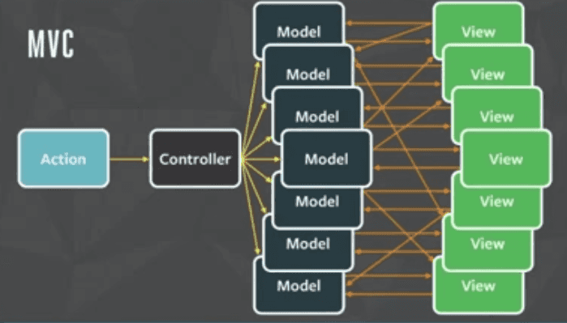
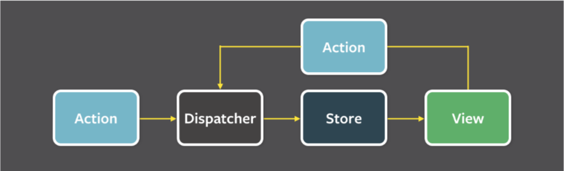
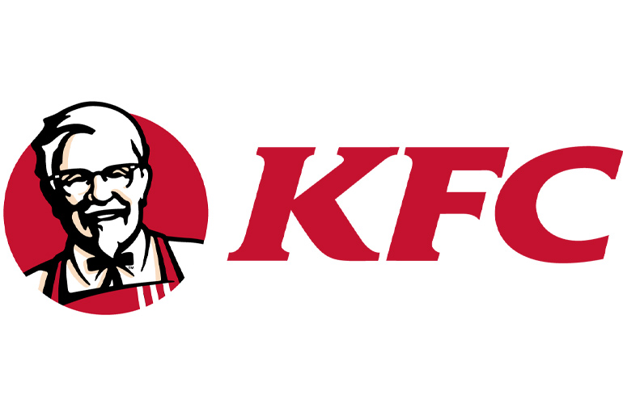
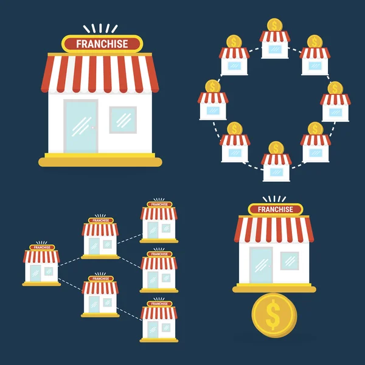
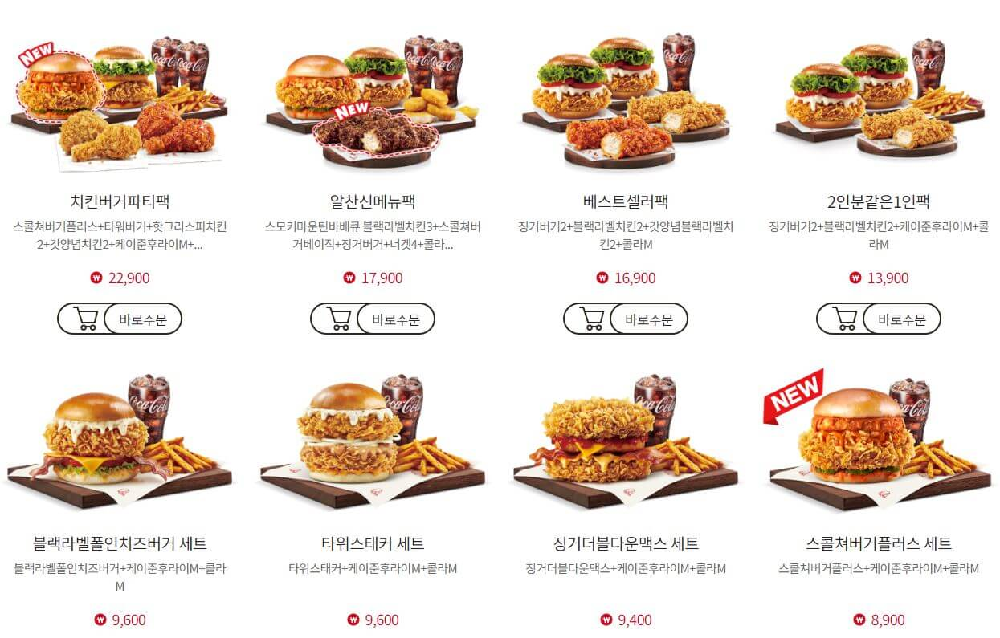
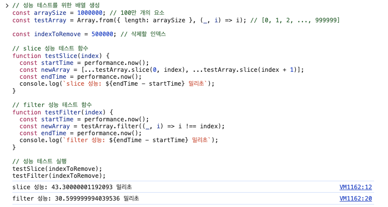

import TOCInline from '@theme/TOCInline';

import { Scrollycoding } from '/src/components/scrollycoding';

# Redux Deep Dive

<TOCInline toc={toc} />

## 1. 상태관리

### 1.1 상태 관리의 중요성

현대 웹 애플리케이션과 모바일 애플리케이션은 점점 더 복잡해지고 있습니다. 사용자 경험을 향상시키기 위해서는 다양한 기능과 상호작용을 제공해야 하며, 이는 곧 관리해야 할 **상태**가 많아진다는 것을 의미합니다.



#### 현대 애플리케이션에서 상태 관리의 필요성

- **복잡한 사용자 인터페이스**: 동적인 UI 구성 요소와 실시간 데이터 업데이트로 인해 효과적인 상태 관리가 필수적입니다.
- **데이터 일관성 유지**: 여러 컴포넌트 간의 데이터 공유와 동기화가 필요하며, 이를 효과적으로 관리하지 못하면 버그와 예기치 않은 동작이 발생할 수 있습니다.
- **예측 가능한 상태 변화**: 상태 변경의 원인과 결과를 명확히 이해함으로써 디버깅과 유지보수가 용이해집니다.

### 1.2 Redux란 무엇인가?

**Redux**는 JavaScript 애플리케이션의 예측 가능한 상태 관리를 위한 라이브러리입니다. 2015년 Dan Abramov와 Andrew Clark에 의해 개발되었으며, React뿐만 아니라 Angular, Vue 등 다양한 프레임워크와 함께 사용할 수 있습니다.

#### Redux의 정의와 목적

- **단일 상태 트리**: 애플리케이션의 모든 상태를 하나의 객체로 관리합니다.
- **예측 가능한 상태 변화**: 상태 변화가 명확한 패턴에 따라 이루어지므로 디버깅이 용이합니다.
- **중앙 집중식 상태 관리**: 모든 상태 변경은 중앙에서 관리되어 데이터 일관성을 유지합니다.

브라우저는 HTML 문서를 DOM 트리로 만들어 하나의 객체로 관리합니다. 리액트는 UI 값을 Fiber 객체에 저장하여 관리합니다. 이와 비슷한 아이디어를 착안하여, Redux는 복잡한 상태를 **단일 객체**로 관리한다는 점이 핵심입니다.

### 1.3 Redux 이름의 유래

**Redux**라는 이름은 **Reduce**와 **Flux**의 합성어입니다. Redux는 Facebook에서 개발한 애플리케이션 아키텍처인 **Flux**에서 영감을 받았으며, JavaScript의 배열 메서드인 **reduce** 함수의 개념을 상태 관리에 적용했습니다.

#### Flux란 무엇인가?



- **Flux**는 Facebook에서 개발한 아키텍처로, 단방향 데이터 흐름을 강조합니다.
- 데이터의 흐름을 명확하게 관리하여 상태 변화의 추적을 용이하게 합니다.

Flux 아키텍처에서 사용하는 액션(Action)과 디스패처(Dispatcher)에 대해 조금 더 알아보겠습니다.

### 1.4 액션과 디스패처 이해하기

#### 액션(Action)의 이해

- **정의**: 액션(Action)은 **애플리케이션에서 상태(state) 변화를 일으키기 위한 의도를 담은 객체**입니다. Redux에서 상태를 변경하는 유일한 방법은 **액션을 디스패치(dispatch)** 하는 것입니다.
- **역할**: 액션은 `type` 속성을 통해 수행할 작업의 종류를 명시하며, 필요에 따라 추가 데이터를 포함할 수 있습니다.

#### 디스패처(Dispatcher)의 이해


- **영어 단어로서의 의미**: **Dispatcher**는 영어에서 **"보내는 사람"** 또는 "배차원"을 의미합니다. 일반적으로 **업무, 작업, 메시지 등을 특정 장소나 사람에게 전달하는 역할**을 하는 사람이나 시스템을 가리킵니다.
  - 예를 들어, 택시 디스패처(택시 상담원)는 승객의 요청을 받아 적절한 택시에 전달하는 역할을 합니다.
  - 마찬가지로, Redux에서 `dispatch` 함수는 액션을 스토어(Store)에 전달하여 상태 변경을 유발합니다.

### 1.5 Redux와 Reduce 함수의 관계

Redux의 리듀서(Reducer)는 JavaScript의 `reduce` 함수에서 영감을 받았습니다. `reduce` 함수는 배열의 각 요소를 순회하면서 하나의 최종 결과값을 도출하는 함수입니다. Redux는 이 개념을 상태 관리에 적용하여, 현재 상태(state)와 액션(action)을 받아 새로운 상태를 반환하는 리듀서(Reducer)를 중심으로 설계되었습니다.

<Scrollycoding>

### !!steps JavaScript의 Reduce 함수 예제

예제에서 reduce 함수는 배열 numbers의 모든 요소를 하나의 값으로 축약합니다. 초기값을 0으로 설정하여, 배열의 첫 번째 요소부터 시작하여 모든 요소를 더해 최종 합계인 10을 도출합니다.

{/* prettier-ignore */}
```js ! george.js
// 배열의 reduce 예제
const numbers = [1, 2, 3, 4];
const sum = numbers.reduce((accumulator, currentValue) => accumulator + currentValue, 0);
console.log(sum); // 출력: 10
```

### !!steps 복합 객체를 하나의 객체로 축약하는 Reduce 함수 예제

이 예제에서 reduce 함수는 users 배열의 각 객체를 순회하면서, 사용자 ID를 키(key)로 하고 사용자 이름을 값(value)으로 하는 새로운 객체 usersMap을 생성합니다. 초기값을 빈 객체 {}로 설정하여, 각 사용자 객체를 하나의 단일 객체로 축약합니다.

{/* prettier-ignore */}
```js ! george.js
// 여러 객체를 하나의 객체로 축약하는 reduce 예제
const users = [
  { id: 1, name: 'Jisu' },
  { id: 2, name: 'Bob' },
  { id: 3, name: 'Alice' }
];

const usersMap = users.reduce((accumulator, user) => {
  accumulator[user.id] = user.name;
  return accumulator;
}, {});

console.log(usersMap);
// 출력: { '1': 'Jisu', '2': 'Bob', '3': 'Alice' }
```

### !!steps Redux의 리듀서(Reducer) 예제

- **`INCREMENT` 액션**: `count` 값을 1 증가시켜 새로운 상태 객체를 반환합니다.
- **`ADD_USER` 액션**: 새로운 사용자를 `users` 객체에 추가하여 업데이트된 `users` 객체를 포함한 새로운 상태를 반환합니다.

이와 같이, 리듀서는 **현재 상태와 액션을 결합**하여 **새로운 상태**를 생성하는 역할을 하며, 이는 `reduce` 함수가 여러 객체를 하나의 객체로 결합하는 방식과 유사합니다.

{/* prettier-ignore */}
```js ! george.js
const initialState = {
  count: 0,
  users: {}
};

const reducer = (state = initialState, action) => {
  switch (action.type) {
    case 'INCREMENT':
      return {
        ...state,
        count: state.count + 1
      };
    case 'ADD_USER':
      return {
        ...state,
        users: {
          ...state.users,
          [action.payload.id]: action.payload.name
        }
      };
    default:
      return state;
  }
};
```

</Scrollycoding>

#### Redux의 리듀서와 `reduce` 함수의 핵심 유사점

- **입력과 출력**: 둘 다 입력을 받아서 출력을 생성합니다. `reduce` 함수는 배열과 누적기를 받아 하나의 결과를 도출하고, 리듀서는 현재 상태와 액션을 받아 새로운 상태를 반환합니다.
- **순수 함수**: `reduce` 함수와 리듀서는 모두 **순수 함수**로, 동일한 입력에 대해 항상 동일한 출력을 반환하며, 부작용이 없습니다.
- **축약(Aggregation)**: `reduce`는 배열의 모든 요소를 하나의 값으로 축약하고, 리듀서는 상태의 모든 변경을 하나의 새로운 상태 객체로 축약합니다.

이러한 유사성 덕분에 Redux는 `reduce` 함수의 개념을 효과적으로 상태 관리에 적용할 수 있었으며, 이를 통해 **예측 가능하고 관리하기 쉬운 상태 관리 패턴**을 제공하게 되었습니다.

### 1.6 단일 상태 트리

**Redux의 단일 상태 트리**는 애플리케이션의 모든 상태를 하나의 객체, 즉 스토어(Store)\*\*에서 관리하는 개념입니다. 이를 통해 모든 컴포넌트는 이 상태 트리를 구독하고 필요한 데이터를 가져갑니다.

#### 단일 상태 트리의 장점

- **데이터 일관성**: 모든 상태가 한 곳에서 관리되므로 데이터의 일관성을 유지할 수 있습니다.
- **상태 검사 용이성**: 단일 상태 객체를 통해 애플리케이션의 전체 상태를 언제든지 쉽게 검사할 수 있습니다.
- **예측 가능한 상태 변화**: 중앙 집중식 상태 관리로 인해 상태 변화의 원인을 쉽게 추적하고 예측할 수 있습니다.

#### 성능적인 우려와 해결 방법

> 질문: 모든 컴포넌트가 하나의 트리를 참조하게 된다면, 새로운 트리를 생성하거나 깊이 있는 트리를 탐색할 때 성능적인 문제가 발생하는 것이 아닌가?

**답변:**

단일 상태 트리는 강력한 개념이지만, 성능 최적화를 위해 Redux는 몇 가지 중요한 메커니즘과 패턴을 함께 사용합니다. 다음은 Redux가 이러한 성능 문제를 어떻게 해결하는지에 대한 설명입니다.

#### 불변성(Immutability)과 얕은 비교(Shallow Comparison)

- **불변성**: 리듀서는 상태를 직접 변경하지 않고, 새로운 객체를 반환합니다. 이는 **불변성을 유지**함으로써 React 컴포넌트가 상태 변경을 효율적으로 감지할 수 있게 합니다.
- **얕은 비교**: Redux는 이전 상태과 새로운 상태을 얕은 비교(shallow comparison)하여 실제로 변경된 부분만 업데이트합니다. 이는 깊은 트리를 탐색하지 않고도 변경 여부를 빠르게 판단할 수 있게 합니다.

#### 불변성 유지 라이브러리 사용

- **효율적인 불변 데이터 구조**: Immutable.js와 같은 라이브러리를 사용하여 효율적인 불변 데이터 구조를 활용할 수 있습니다. 이는 불변성을 보다 쉽게 유지하고 성능을 최적화하는 데 도움을 줍니다.

### 1.7 결론

Redux의 핵심은 **모든 애플리케이션 상태를 단일, 불변의 상태 트리로 관리**하는 데 있습니다. 이러한 접근 방식은 예측 가능성, 유지보수성, 디버깅 용이성 측면에서 큰 이점을 제공합니다. Flux와 JavaScript의 `reduce` 함수에서 영감을 받은 Redux는 복잡한 상태 관리를 체계적으로 처리할 수 있는 강력한 프레임워크를 제공하여, 현대 애플리케이션 개발에 필수적인 도구로 자리잡았습니다.

## 2. Redux와 KFC 프랜차이즈


Redux를 공부하면서 KFC에서 점심을 먹던 중, Redux와 프랜차이즈 매장이 유사하다는 생각이 들었습니다. 이 섹션에서는 KFC 프랜차이즈를 비유로 사용하여 Redux의 개념을 재미있고 쉽게 풀어보겠습니다.

### 2.1 본사와 Redux

먼저, **Redux는 애플리케이션의 본사**와 같습니다. KFC 본사는 전 세계 매장에 공통된 기준과 지침을 제공합니다. 마찬가지로 Redux는 애플리케이션 전체에서 상태 관리를 위한 일관된 패턴과 구조를 제공합니다.

- **본사의 역할**:
  - 메뉴 개발, 레시피 제공, 브랜드 관리 등 전체적인 방향성을 제시합니다.
- **Redux의 역할**:
  - 애플리케이션의 상태 관리에 대한 중앙 집중식 시스템을 제공합니다.
  - 일관된 데이터 흐름과 상태 변경 방식을 제공합니다.

### 2.2 프랜차이즈 매장과 Redux 스토어



각각의 KFC 프랜차이즈 매장은 Redux의 스토어(Store)와 유사합니다. 매장을 열 때, 본사의 지침에 따라 매장(스토어)을 생성합니다.

- **프랜차이즈 매장 생성**:
  - 새로운 지역에 매장을 열 때, 본사의 지침과 규격에 따라 매장을 세팅합니다.
  - 매장은 본사의 레시피와 운영 방침을 따릅니다.
- **Redux에서의 스토어 생성**:
  - `createStore` 함수를 사용하여 새로운 스토어를 생성합니다.
  - 스토어는 애플리케이션의 상태를 보관하고 관리하는 역할을 합니다.

### 2.3 레시피와 리듀서의 역할

매장에서 사용하는 **레시피**는 Redux의 리듀서(Reducer)와 같습니다. 레시피는 요리를 만드는 방법을 정의하고, 리듀서는 상태를 어떻게 업데이트할지 정의합니다.

- **레시피의 역할**:
  - 각 메뉴를 만드는 구체적인 방법과 재료를 명시합니다.
  - 모든 매장은 이 레시피를 따라 동일한 품질의 음식을 제공합니다.
- **리듀서의 역할**:
  - 액션에 따라 상태가 어떻게 변해야 하는지 정의합니다.
  - 상태 변경의 로직을 포함하고 있으며, 순수 함수로 작성됩니다.

### 2.4 메뉴와 액션의 관계



고객이 보는 **메뉴**는 Redux에서의 액션(Action)과 비슷합니다. 메뉴는 주문할 수 있는 항목들을 나열하고, 액션은 상태 변경의 의도를 나타냅니다.

- **메뉴의 역할**:
  - 고객에게 제공되는 선택지로, 주문 가능한 모든 항목을 포함합니다.
  - 각 메뉴 아이템은 특정한 요리(상태 변경)를 유발합니다.
- **액션의 역할**:
  - 애플리케이션에서 발생할 수 있는 모든 상태 변경을 나타냅니다.
  - 액션 객체는 `type` 속성을 통해 어떤 변화가 일어날지 명시합니다.

### 2.5 주문과 디스패처의 역할

고객이 메뉴를 보고 **주문**을 하면, 종업원은 그 주문을 주방에 전달합니다. 이때 종업원은 **디스패처(Dispatcher)**의 역할을 합니다.

- **주문의 과정**:
  - 고객이 메뉴에서 원하는 항목을 선택하고 주문합니다.
  - 종업원은 이 주문을 받아 주방에 전달합니다.
- **디스패처의 역할**:
  - 액션을 스토어에 전달하는 함수인 `dispatch`를 통해 액션을 전달합니다.
  - Redux에서는 별도의 디스패처 개념이 없으며, `dispatch` 함수가 그 역할을 수행합니다.

### 2.6 주방과 리듀서의 상호작용

**주방**은 스토어(Store)이며, 주방에서 일어나는 요리 과정은 **리듀서**를 통해 이루어집니다. 주방은 주문(액션)을 받아 레시피(리듀서)에 따라 요리(상태 변경)를 만듭니다.

- **주방의 역할**:
  - 주문을 받아 레시피에 따라 음식을 만듭니다.
  - 최종 결과물인 요리를 고객에게 제공합니다.
- **스토어와 리듀서의 상호작용**:
  - 스토어는 액션을 받으면 해당 액션과 현재 상태를 리듀서에 전달합니다.
  - 리듀서는 새로운 상태를 계산하여 스토어에 반환합니다.

### 2.7 매장별 고유 메뉴와 리듀서의 유연성

특정 KFC 매장에서만 판매하는 **한정 메뉴**가 있듯이, Redux에서도 특정 스토어에만 적용되는 **커스텀 리듀서**를 추가할 수 있습니다.

- **매장별 고유 메뉴**:
  - 이는 본사의 기본 레시피에 추가되는 형태로 운영됩니다.
- **리듀서의 유연성**:
  - 애플리케이션의 요구사항에 따라 리듀서를 추가하거나 수정할 수 있습니다.
  - `combineReducers` 함수를 사용하여 여러 리듀서를 결합할 수 있습니다.

이제 전체적인 흐름을 하나의 예시로 정리해 보겠습니다.

1. **고객이 메뉴판을 봅니다**: 애플리케이션에서 어떤 액션을 취할지 결정하는 단계입니다.
2. **고객이 주문을 합니다**: 액션 객체가 생성됩니다.
3. **종업원이 주문을 주방에 전달합니다**: `dispatch` 함수를 통해 액션이 스토어로 전달됩니다.
4. **주방에서 레시피를 참고하여 요리를 만듭니다**: 스토어는 리듀서를 가지고 있습니다. 리듀서가 현재 상태와 액션을 기반으로 새로운 상태를 생성합니다.
5. **완성된 요리가 고객에게 제공됩니다**: 새로운 상태가 애플리케이션에 반영되어 UI가 업데이트됩니다.

---

## 3. Redux 직접 구현하기

하단 링크를 통해 코드를 직접 구현해보세요

[실습하기](https://embed.plnkr.co/github/eggheadio-projects/getting-started-with-redux/master/06-react-redux-store-methods-getstate-dispatch-and-subscribe?show=script,preview)

Redux의 핵심 원리를 이해하기 위해, 간단한 카운터(counter) 애플리케이션을 만들면서 Redux를 스크래치부터 직접 구현해보겠습니다.

### 3.1 리듀서(Reducer) 만들기

먼저, 상태를 어떻게 업데이트할지 정의하는 리듀서(Reducer)를 만들어보겠습니다. 리듀서는 현재 상태와 액션을 받아 새로운 상태를 반환하는 순수 함수입니다. 위에서 설명한 비유로 각 매장에 제공할 레시피를 만드는 과정 입니다.

{/* prettier-ignore */}
```js 
const counter = (state = 0, action) => {
  switch (action.type) {
    case 'INCREMENT':
      return state + 1;
    case 'DECREMENT':
      return state - 1;
    default:
      return state;
  }
}
```

**설명:**

- **초기 상태**: `state = 0`으로 설정하여 카운터의 초기 값을 0으로 지정합니다.
- **액션 타입에 따른 상태 변경**:
  - `'INCREMENT'`: 상태 값을 1 증가시킵니다.
  - `'DECREMENT'`: 상태 값을 1 감소시킵니다.
  - `default`: 해당하는 액션이 없을 경우 현재 상태를 그대로 반환합니다.

**비유:**

- **레시피(리듀서)**: 이 함수는 매장에서 요리를 만드는 레시피와 같습니다. 어떤 주문(액션)이 들어오느냐에 따라 요리(상태)가 어떻게 변경되어야 하는지 정의합니다.

### 3.2 스토어(Store)의 메서드와 역할

스토어(Store)는 애플리케이션의 상태를 보관하고 관리하는 중심적인 객체입니다. Redux의 스토어는 다음과 같은 핵심 메서드를 제공합니다:

- **`getState()`**: 현재 저장된 상태(state)를 반환합니다.
- **`dispatch(action)`**: 액션(action)을 스토어에 전달하여 상태를 업데이트합니다.
- **`subscribe(listener)`**: 상태 변경을 구독하고, 상태가 변경될 때마다 호출될 리스너(listener)를 등록합니다.

### `getState()` 메서드

- **역할**: 스토어에 저장된 현재 상태를 반환합니다.
- **사용 예시**: 애플리케이션의 특정 부분에서 최신 상태 값을 읽어와야 할 때 사용합니다.
- **비유**: 매장의 현재 재고를 확인하는 것과 같습니다. 종업원이 현재 재고(상태)를 확인하여 고객에게 안내할 수 있습니다.

### `dispatch(action)` 메서드

- **역할**: 액션을 스토어에 전달하여 상태 변경을 일으킵니다.
- **동작 과정**:
  1. 스토어는 전달된 액션과 현재 상태를 리듀서에 전달합니다.
  2. 리듀서는 새로운 상태를 계산하여 반환합니다.
  3. 스토어는 상태를 업데이트하고, 등록된 리스너들에게 알립니다.
- **사용 예시**: 사용자 인터랙션(버튼 클릭 등)이나 비동기 작업 후 상태를 변경해야 할 때 액션을 디스패치합니다.
- **비유**: 고객의 주문을 주방에 전달하는 종업원의 역할입니다. 주문서(액션)를 받아 주방(리듀서)에 전달하여 요리(상태 변경)를 진행합니다.

### `subscribe(listener)` 메서드

- **역할**: 상태 변경을 구독하는 리스너를 등록합니다.
- **동작 과정**:
  - 상태가 변경될 때마다 등록된 리스너 함수들이 호출됩니다.
- **사용 예시**: 상태 변경 시 UI를 업데이트하거나, 특정 로직을 실행해야 할 때 사용합니다.
- **비유**: 새로운 요리가 완성될 때마다 알림을 받는 종업원이나 디스플레이와 같습니다. 요리가 준비되면 고객에게 전달하거나 화면에 표시합니다.

---

**정리:**

스토어는 애플리케이션 상태 관리의 핵심이며, 다음과 같은 흐름으로 동작합니다.

1. **현재 상태 조회**: `getState()`를 통해 현재 상태를 가져올 수 있습니다.
2. **액션 디스패치**: `dispatch(action)`을 호출하여 액션을 스토어에 전달합니다.
3. **상태 업데이트**: 스토어는 리듀서를 사용하여 새로운 상태를 계산하고 업데이트합니다.
4. **리스너 호출**: `subscribe(listener)`로 등록된 모든 리스너를 호출하여 상태 변경을 알립니다.

---

### 3.3 스토어(Store) 생성하기

이제 우리가 직접 createStore 함수를 구현하여 스토어를 생성해보겠습니다. 단계별로 하나씩 함수를 완성해 나가며 각 단계에서 어떤 역할을 하는지 알아보겠습니다.

<Scrollycoding>

### !!steps 1단계: 기본 구조 설정

**설명:**

- **`state` 변수 선언**: 상태를 저장할 변수를 선언합니다.
- **`listeners` 배열 선언**: 구독된 리스너들을 저장할 배열을 초기화합니다.
- **기본 메서드들**: `getState`, `dispatch`, `subscribe` 메서드를 선언합니다.

  {/* prettier-ignore */}

```js ! george.js
const createStore = (reducer) => {
  let state;
  const listeners = [];

  const getState = () => state;

  const dispatch = () => {};

  const subscribe = () => {};

  return { getState, dispatch, subscribe };
};

export default createStore;
```

### !!steps 2단계: 초기 상태 설정

state 초기화: 리듀서를 호출하여 초기 상태를 설정합니다. undefined와 `type: 'INIT'` 액션을 전달하여 초기 상태를 가져옵니다.

{/* prettier-ignore */}
```js ! george.js
const createStore = (reducer) => {
  let state = reducer(undefined, { type: '__INIT__' });
  const listeners = [];

  const getState = () => state;

  const dispatch = () => {};

  const subscribe = () => {};

  return { getState, dispatch, subscribe };
};

```

### !!steps 3단계: dispatch 메서드 구현

**설명:**

- **`dispatch` 구현**: 액션을 받아 리듀서를 호출하여 상태를 업데이트합니다.

**비유:**

- **주문 처리**: 고객의 주문(액션)을 받아 주방(리듀서)에 전달하여 요리(상태)를 업데이트합니다.

{/* prettier-ignore */}
```js ! george.js
const createStore = (reducer) => {
  let state = reducer(undefined, { type: '__INIT__' });
  const listeners = [];

  const getState = () => state;

  const dispatch = (action) => {
    state = reducer(state, action);
  };

  const subscribe = () => {};

  return { getState, dispatch, subscribe };
};

```

### !!steps 4단계: subscribe 메서드 구현

**설명:**

- **`dispatch` 수정**: 상태가 업데이트된 후 모든 리스너를 호출하여 변경 사항을 알립니다.
- **`subscribe` 구현**: 리스너를 등록하고, 구독 해제 함수를 반환합니다.

**비유:**

- **알림 시스템 구축**: 요리가 완료되면 종업원이나 디스플레이에 알림을 보내도록 합니다

{/* prettier-ignore */}
```js ! george.js
const createStore = (reducer) => {
  let state = reducer(undefined, { type: '__INIT__' });
  const listeners = [];

  const getState = () => state;

  const dispatch = (action) => {
    state = reducer(state, action);
    listeners.forEach(listener => listener());
  };

  const subscribe = (listener) => {
    listeners.push(listener);
    return () => {
      listeners.filter(l => l !== listener);
    };
  };

  return { getState, dispatch, subscribe };
};
```

### !!steps 5단계: 전체 코드 정리

모든 메서드와 변수를 완성하여 createStore 함수를 완성합니다.

{/* prettier-ignore */}
```js ! george.js
const createStore = (reducer) => {
  let state = reducer(undefined, { type: '__INIT__' });
  const listeners = [];

  const getState = () => state;

  const dispatch = (action) => {
    state = reducer(state, action);
    listeners.forEach(listener => listener());
  };

  const subscribe = (listener) => {
    listeners.push(listener);
    return () => {
      listeners.filter(l => l !== listener);
    };
  };

  return { getState, dispatch, subscribe };
};

export default createStore;
```

### !!steps 6단계: 스토어 사용하기

**설명:**

- **스토어 생성**: `counter` 리듀서를 주입하여 스토어를 생성합니다.
- **`render` 함수**: 현재 상태를 화면에 표시합니다.
- **구독 설정**: 상태가 변경될 때마다 `render` 함수가 실행되도록 구독합니다.
- **초기 렌더링**: 페이지 로드 시 현재 상태를 표시합니다.
- **클릭 이벤트**: 페이지를 클릭하면 `'INCREMENT'` 액션을 디스패치하여 상태를 증가시킵니다.

**비유:**

- **스토어 생성**: 매장에(스토어) 리듀서(레시피)를 주입하여 스토어를 생성합니다.
- **고객과 상호작용**: 고객이 매장에서 주문을 하는 것과 같습니다. 클릭을 통해 `'INCREMENT'` 주문을 합니다.
- **주문 처리 흐름**:
  1. **고객이 클릭하여 주문합니다**: 액션이 생성됩니다.
  2. **`dispatch`를 통해 주문이 전달됩니다**: 액션이 스토어로 전달됩니다.
  3. **리듀서가 상태를 업데이트합니다**: 새로운 상태를 계산합니다.
  4. **구독된 `render` 함수가 호출됩니다**: UI가 업데이트되어 새로운 상태를 표시합니다

{/* prettier-ignore */}
```js ! george.js
// 스토어 생성
const store = createStore(counter);

// 상태 변경 시 UI 업데이트 함수
const render = () => {
  document.body.innerText = store.getState();
}

// 상태 변경 구독 설정
store.subscribe(render);
render();

// 클릭 시 상태 증가 액션 디스패치
document.addEventListener('click', () => {
  store.dispatch({ type: 'INCREMENT' });
});
```

</Scrollycoding>

### 전체 코드 정리

지금까지 작성한 코드를 하나로 모아서 전체 흐름을 살펴보겠습니다.

{/* prettier-ignore */}
```js 
// 리듀서 정의
const counter = (state = 0, action) => {
  switch (action.type) {
    case 'INCREMENT':
      return state + 1;
    case 'DECREMENT':
      return state - 1;
    default:
      return state;
  }
};

// 스토어 생성 함수 정의, reducer 주입
const createStore = (reducer) => {
  let state = reducer(undefined, { type: '__INIT__' });
  const listeners = [];

  const getState = () => state;

  const dispatch = (action) => {
    //reducer를 실행하여 상태를 변경
    state = reducer(state, action);
    //구독한 콜백 함수 실행
    listeners.forEach(listener => listener());
  };

  //구독 함수는 구독 해지 함수를 반환
  const subscribe = (listener) => {
    listeners.push(listener);
    return () => {
      listeners.filter(l => l !== listener);
    };
  };

  return { getState, dispatch, subscribe };
};

// 스토어에 리듀서를 주입하여 생성
const store = createStore(counter);

// 상태 변경 시 UI 업데이트 함수
const render = () => {
  document.body.innerText = store.getState();
};

// 상태 변경 구독 설정
store.subscribe(render);
render();

// 클릭 시 상태 증가 액션 디스패치
document.addEventListener('click', () => {
  store.dispatch({ type: 'INCREMENT' });
});

```


**실행 흐름:**

1. **스토어 생성**: `createStore` 함수를 사용하여 `counter` 리듀서를 가진 스토어를 생성합니다.
2. **초기 상태 설정 및 렌더링**:
   - `state`는 리듀서의 초기 상태로 설정됩니다.
   - `render` 함수가 호출되어 현재 상태를 화면에 표시합니다.
3. **상태 변경 구독**: `store.subscribe(render)`를 호출하여 상태가 변경될 때마다 `render` 함수가 실행되도록 설정합니다.
4. **이벤트 리스너 설정**:
   - `document.addEventListener('click', ...)`를 통해 클릭 이벤트가 발생하면 `'INCREMENT'` 액션이 디스패치되도록 합니다.
5. **액션 디스패치 및 상태 업데이트**:
   - 클릭 시 `dispatch` 함수가 호출되어 액션을 리듀서에 전달합니다.
   - 리듀서는 현재 상태와 액션을 기반으로 새로운 상태를 반환합니다.
   - 스토어는 상태를 업데이트하고, 구독된 리스너(`render`)를 호출하여 UI를 갱신합니다.

**KFC 비유를 통한 이해:**

- **스토어 생성은 매장 오픈**과 같습니다. 매장은 본사의 레시피(리듀서)를 받아 요리를 준비합니다.
- **고객의 클릭은 주문**을 의미합니다. 고객이 특정 메뉴(액션 타입)를 주문하면, 종업원(디스패치)이 그 주문을 주방(리듀서)에 전달합니다.
- **주방은 리듀서를 통해 요리**를 만듭니다. 주문서(액션)와 현재 재고(상태)를 확인하여 새로운 요리(업데이트된 상태)를 만들어냅니다.
- **완성된 요리는 고객에게 제공되고, UI는 새로운 상태로 업데이트**됩니다.

## 결론

이번 장에서는 `createStore` 함수를 단계별로 구현하면서 Redux의 핵심 개념을 깊이 있게 이해해보았습니다. 각 단계마다 코드와 함께 자세한 설명을 제공하여 `createStore` 함수의 내부 동작 방식을 명확히 파악할 수 있었습니다. 또한 KFC 프랜차이즈의 비유를 통해 복잡한 개념을 보다 쉽게 이해할 수 있었습니다.

---

### 부록: 추가 팁 - `slice` vs `filter`

Redux에서 상태를 불변성(Immutability)을 유지하면서 업데이트할 때 배열을 다루는 경우가 많습니다. 이때 배열에서 특정 요소를 제거하거나 추출할 때 `slice`와 `filter`를 사용할 수 있습니다. 두 메서드의 차이점과 성능을 알아보겠습니다.

### `slice`와 `filter`의 차이점

- **`slice`**:
  - **용도**: 배열의 특정 부분을 추출하여 새로운 배열을 생성합니다.
  - **특징**: 인덱스를 알고 있을 때 사용하며, 잘라낸 배열의 길이를 알고 있습니다.
  - **예시**: 배열에서 특정 인덱스의 요소를 제외하고 새로운 배열을 만들 때.
- **`filter`**:
  - **용도**: 조건에 따라 배열의 요소를 걸러내어 새로운 배열을 생성합니다.
  - **특징**: 조건에 따라 배열의 크기가 가변적이며, 조건을 만족하는 요소들로 배열을 만듭니다.
  - **예시**: 배열에서 특정 조건을 만족하지 않는 요소를 제거할 때.

### 성능 테스트 코드

아래 코드는 대용량 배열에서 `slice`와 `filter`를 사용하여 특정 요소를 제거할 때의 성능을 비교합니다.

```jsx
// 성능 테스트를 위한 배열 생성
const arraySize = 1000000; // 100만 개의 요소
const testArray = Array.from({ length: arraySize }, (_, i) => i); // [0, 1, 2, ..., 999999]

const indexToRemove = 500000; // 삭제할 인덱스

// slice 성능 테스트 함수
function testSlice(index) {
  const startTime = performance.now();
  const newArray = [...testArray.slice(0, index), ...testArray.slice(index + 1)];
  const endTime = performance.now();
  console.log(`slice 성능: ${endTime - startTime} 밀리초`);
}

// filter 성능 테스트 함수
function testFilter(index) {
  const startTime = performance.now();
  const newArray = testArray.filter((_, i) => i !== index);
  const endTime = performance.now();
  console.log(`filter 성능: ${endTime - startTime} 밀리초`);
}

// 성능 테스트 실행
testSlice(indexToRemove);
testFilter(indexToRemove);
```



### 결과 분석

- **`slice` 사용 시**:
  - 인덱스를 기반으로 배열을 두 부분으로 나눈 후, 이를 병합하여 새로운 배열을 생성합니다.
  - 요소를 직접적으로 제거하지 않고 필요한 부분만 추출합니다.
  - 대용량 배열에서 중간 인덱스의 요소를 제거할 때 효율적입니다.
- **`filter` 사용 시**:
  - 전체 배열을 순회하면서 조건에 맞는 요소를 걸러냅니다.
  - 조건에 따라 배열의 크기가 가변적이므로, 모든 요소를 검사해야 합니다.
  - 배열의 크기가 크면 성능이 저하될 수 있습니다.

**정리**

- 배열에서 요소를 제거할 때 **상황에 맞는 메서드 선택이 중요**합니다.
- 성능이 중요한 대용량 데이터 처리에서는 **`slice`와 `filter`의 동작 방식을 이해**하고 최적화해야 합니다.
- Redux에서 상태를 업데이트할 때 불변성을 유지하면서 성능을 고려해야 합니다.

# 맺음말

이번 글에서는 Redux의 핵심 개념부터 직접 구현까지 깊이 있게 살펴보았습니다. 또한 KFC 비유를 통해 복잡한 개념을 쉽게 이해할 수 있었습니다. 마지막으로 배열 처리에 대한 팁을 통해 성능 최적화의 중요성도 알아보았습니다.

Redux를 제대로 이해하고 활용하면 애플리케이션의 상태 관리를 효과적으로 할 수 있으며, 유지보수성과 확장성이 향상됩니다. 앞으로의 개발 여정에 Redux가 큰 도움이 되길 바랍니다.

---

## 참고 자료

### 공식 문서

- [Redux 시작하기 | Redux](https://ko.redux.js.org/introduction/getting-started/)
  - Redux의 공식 한국어 문서로, 기본 개념과 사용 방법을 자세히 설명하고 있습니다.

### 튜토리얼

- [A Complete React Redux Tutorial for Beginners (2019)](https://daveceddia.com/redux-tutorial/)
  - 초보자를 위한 완전한 React Redux 튜토리얼로, Redux의 기본 개념부터 실제 적용까지 단계별로 안내합니다.
- [Redux: Implementing Store from Scratch](https://egghead.io/lessons/react-redux-implementing-store-from-scratch)
  - Redux 스토어를 처음부터 구현해보는 과정을 다루는 상세한 튜토리얼입니다.

### 블로그 및 추가 자료

- [redux 오픈소스 코드를 뜯어서 createStore 직접 구현해보기](https://choiblog.tistory.com/123)
  - Redux의 오픈소스 코드를 분석하여 `createStore` 함수를 직접 구현하는 과정을 설명하는 블로그 글입니다.
- [Idiomatic Redux: The Tao of Redux, Part 1 - Implementation and Intent](https://blog.isquaredsoftware.com/2017/05/idiomatic-redux-tao-of-redux-part-1/)
  - Redux의 구현과 의도에 대해 심층적으로 다루는 블로그 시리즈의 첫 번째 파트입니다.

### 코드 레퍼런스

- [createStore.ts - Redux GitHub Repository](https://github.com/reduxjs/redux/blob/master/src/createStore.ts)
  - Redux의 `createStore` 함수 구현을 포함한 공식 GitHub 리포지토리의 소스 코드입니다.
- [eggheadio-projects/getting-started-with-redux: null](https://embed.plnkr.co/github/eggheadio-projects/getting-started-with-redux/master/07-react-redux-implementing-store-from-scratch?show=script,preview)
  - Egghead.io의 Redux 시작하기 프로젝트에서 제공하는 `createStore` 구현 예제 코드입니다.
