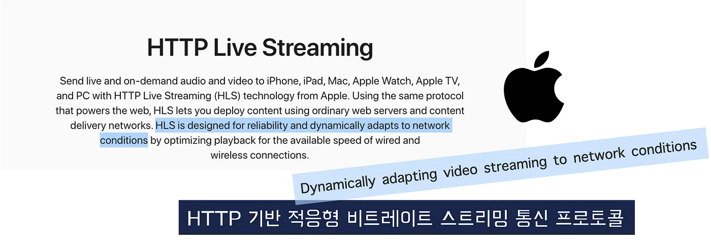
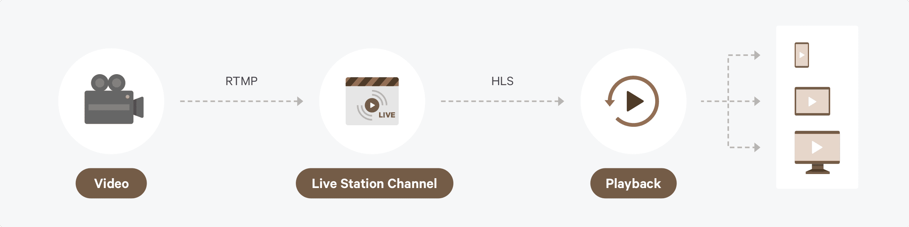
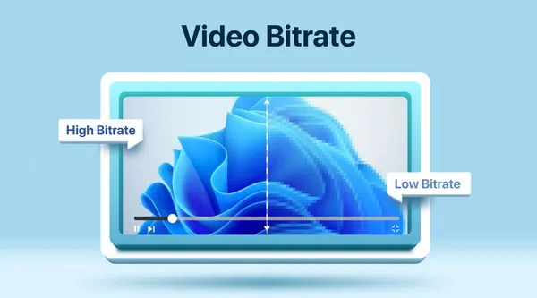
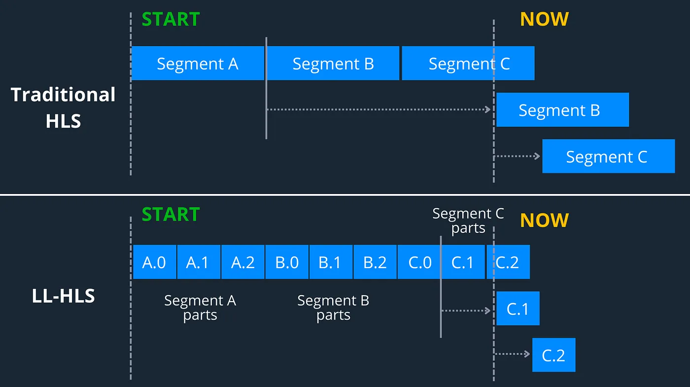
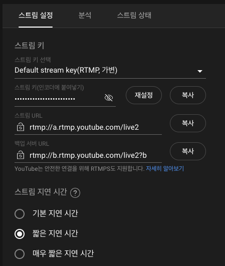
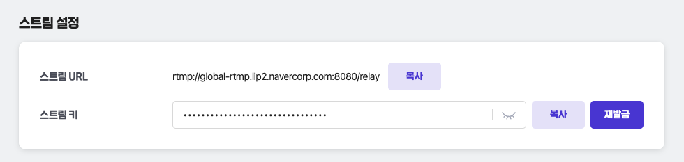

<!--truncate-->

 

# 실시간 스트리밍 이해하기

## 목차

1. [전체적인 흐름 : 기자의 생중계를 집에서 보기까지](#전체적인-흐름--기자의-생중계를-집에서-보기-까지)
2. [1대1 관계: 호스트에서 서버로의 신속한 전송](#1대1-관계-호스트에서-서버로의-신속한-전송)
3. [1대N 관계: 서버에서 클라이언트로의 효율적인 대량 전송](#1대N-관계-서버에서-클라이언트로의-효율적인-대량-전송)
4. [화질과 레이턴시: 스트리밍 품질의 두 가지 핵심 요소](#화질과-레이턴시-스트리밍-품질의-두-가지-핵심-요소)
   - [비트레이트와 해상도의 관계](#비트레이트와-해상도의-관계)
   - [스트리밍 시 화질을 유지하는 방법](#스트리밍-시-화질을-유지하는-방법)
   - [레이턴시의 원인과 발생 지점](#레이턴시의-원인과-발생-지점)
   - [저지연 스트리밍](#저지연-스트리밍)
5. [화질과 레이턴시 전략](#화질과-레이턴시-전략)
   - [화질의 중요성](#화질의-중요성)
   - [레이턴시의 중요성](#레이턴시의-중요성)
   - [상황에 따른 우선순위 결정](#상황에-따른-우선순위-결정)
   - [적응형 스트리밍(Adaptive Streaming) 기술](#적응형-스트리밍adaptive-streaming-기술)
   - [저지연 스트리밍 기술](#저지연-스트리밍-기술)
6. [실제 서비스들의 적용 사례](#실제-서비스들의-적용-사례)
   - [유튜브](#유튜브)
     - [RTMP + HLS 조합을 사용하는 이유](#rtmp--hls-조합을-사용하는-이유)
     - [유튜브의 적응형 스트리밍과 레이턴시 관리 전략](#유튜브의-적응형-스트리밍과-레이턴시-관리-전략)
   - [트위치](#트위치)
     - [실시간 상호작용을 위한 저지연 스트리밍 기술](#실시간-상호작용을-위한-저지연-스트리밍-기술)
     - [RTMP와 저지연 HLS의 활용](#rtmp와-저지연-hls의-활용)
7. [마무리: 실시간 스트리밍의 핵심과 우리의 선택](#마무리-실시간-스트리밍의-핵심과-우리의-선택)

<!--truncate-->

 

**유튜브나 치지직, 트위치 같은 라이브 스트리밍 서비스를 사용해 보신 적이 있나요?**

오늘날 우리는 스마트폰을 통해 뉴스나 드라마를 실시간으로 시청하는 시대에 살고 있습니다.

이번 글에서는 실시간 영상 스트리밍의 전체적인 흐름을 소개하고자 합니다.

- 호스트와 서버 간의 1대1 관계, 서버와 클라이언트 간의 1대N 관계에서 사용되는 다양한 프로토콜
- 화질과 레이턴시, 두 가지 핵심 요소
- 유튜브와 트위치 같은 실제 서비스의 전략

실시간 스트리밍의 세계로 함께 떠나보실까요?

### 전체적인 흐름 : 기자의 생중계를 집에서 보기 까지

뉴스 현장에서 기자의 생중계를 진행하는 장면을 보신 적이 있나요? 현장에 나가 있는 기자들은 스마트폰이나 카메라를 통해 실시간으로 상황을 촬영하고 있습니다. 이때 촬영한 영상은 방송국으로 직접 전송되는데, 이 과정은 **호스트(카메라맨)와 서버(방송국) 간의 1대1 관계**에 해당합니다.

방송국은 이 영상을 받아 즉시 편집하거나 추가적인 처리 없이 그대로 송출할 수 있어야 합니다. 이는 신속하고 원본 화질의 손실 없이 영상을 전달해야 하기 때문에 **최적화된 전송 방식**이 필요합니다. 이러한 전송 방식을 **프로토콜**이라고 합니다.

### 1대1 관계: 호스트에서 서버로의 신속한 전송

호스트와 서버 간의 1대1 전송은 **퀵 배송 서비스**에 비유할 수 있습니다. 기자가 현장에서 촬영한 영상을 방송국으로 보내는 과정은 긴급한 패키지를 신속하게 보내는 것과 유사합니다. 이때 사용하는 프로토콜은 다음과 같습니다:

- **RTSP (Real Time Streaming Protocol)**: 가장 먼저 개발된 스트리밍 프로토콜로 안정적이지만 최신 기술에 비해 유연성이 떨어집니다. 현재는 주로 CCTV 영상 전송에 사용됩니다.
- **RTMP (Real-Time Messaging Protocol)**: 퀵으로 물건을 전송하는 빠른 프로토콜로, 지연 시간을 최소화하여 실시간 전송을 가능하게 합니다.
- **SRT (Secure Reliable Transport)**: 위의 프로토콜들의 장점만을 모아 만든 최신 프로토콜로, 보안과 신뢰성을 강화하여 중요한 데이터를 안전하게 전송합니다.

카메라맨이 촬영한 원본 영상은 방송국으로 **지연 시간 없이**, **원본에 최대한 가까운 상태로** 전달되어야 합니다. 이를 위해 최소한의 포장, 즉 **최소한의 압축**과 **빠른 전송**이 필요합니다. 이러한 이유로 1대1 관계에서는 RTSP, RTMP, SRT와 같은 프로토콜이 사용됩니다.

### 1대N 관계: 서버에서 클라이언트로의 효율적인 대량 전송

반면, 방송국에서 수많은 가정으로 영상을 전달하는 과정은 **택배사가 전국 각지로 상품을 배송**하는 것과 비슷합니다. 이때 사용하는 프로토콜은 HLS (HTTP Live Streaming)와 MPEG-DASH (Dynamic Adaptive Streaming over HTTP)입니다.

- **HLS (HTTP Live Streaming)**: 애플에서 개발한 프로토콜로, 영상을 작은 조각(세그먼트)으로 나누어 HTTP를 통해 전달합니다. 이는 각 지역의 물류 센터를 통해 효율적으로 상품을 배송하는 것과 유사합니다.
- **MPEG-DASH (Dynamic Adaptive Streaming over HTTP)**: 국제 표준을 따르는 프로토콜로, 다양한 기기와 플랫폼에서 호환되며 유연하게 적응형 스트리밍을 지원합니다.

서버는 대량의 시청자에게 영상을 안정적으로 전달해야 하므로, 효율적이고 확장 가능한 전송 방식이 필요합니다. HLS와 MPEG-DASH는 **HTTP 기반**이기 때문에 기존의 캐시 서버나 CDN(Content Delivery Network)을 활용하여 전송 효율을 높일 수 있습니다.

### 다시 정리해보면

1. **호스트는 서버로 원본 화질의 손실 없이, 실시간으로 영상을 전달합니다.** 빠르게 보내야 하기 때문에 원본에 손상이 없고, 1대1로 전송되기 때문에 레이턴시(지연 시간)가 거의 발생하지 않습니다.
2. **서버는 수신한 RTMP 등의 스트림을 클라이언트로 전송하기 위해 파일 형식을 변환합니다.** 즉, RTMP → HLS로 변환합니다.
3. **서버는 HLS 방식으로 클라이언트에게 영상을 전송합니다.** 이 과정에서 파일 형식 변환과 전송으로 인해 레이턴시가 발생할 수 있습니다. 이를 최소화하기 위해 서버는 CDN을 활용하여 영상을 효율적으로 서빙합니다.

---

## 화질과 레이턴시: 스트리밍 품질의 두 가지 핵심 요소

실시간 영상 스트리밍에서 **화질**과 레이턴시(지연 시간)는 사용자 경험을 결정짓는 두 가지 핵심 요소입니다. 이 두 가지는 서로 밀접하게 연관되어 있지만, 때로는 상충되기도 합니다. 각 요소의 중요성과 최적화하는 방법에 대해 자세히 알아보겠습니다.

### 비트레이트와 해상도의 관계

- **비트레이트**: 초당 전송되는 데이터의 양을 의미하며, 화질에 직접적인 영향을 미칩니다.
- **해상도**: 영상의 가로와 세로 픽셀 수로 표현되며, 화면의 선명도를 결정합니다.

일반적으로 해상도가 높을수록 더 높은 비트레이트가 필요합니다. 예를 들어, 4K 해상도의 영상을 전송하려면 Full HD보다 몇 배의 비트레이트가 필요합니다. 그러나 비트레이트가 높아지면 네트워크 부하가 증가하고, 시청자의 인터넷 속도가 이를 감당하지 못하면 버퍼링이 발생할 수 있습니다.

### 스트리밍 시 화질을 유지하는 방법

- **효율적인 인코딩 기술 사용**: 최신 비디오 코덱(H.265/HEVC, AV1 등)은 동일한 화질을 더 낮은 비트레이트로 전송할 수 있게 해줍니다.
- **적응형 스트리밍(Adaptive Streaming)**: 시청자의 네트워크 상태에 따라 실시간으로 화질을 조절하여 버퍼링을 최소화하고 최상의 화질을 제공합니다.

## 레이턴시

레이턴시는 영상이 촬영된 시점부터 시청자가 재생하기까지의 시간 지연을 의미합니다. 레이턴시가 높으면 실시간성이 떨어져 라이브 채팅, 실시간 게임 스트리밍 등 즉각적인 상호작용이 필요한 콘텐츠에서 부정적인 영향을 미칩니다.

### 레이턴시의 원인과 발생 지점

1. **인코딩 지연**: 영상을 압축하는 과정에서 발생하는 지연.
2. **네트워크 전송 지연**: 데이터가 인터넷을 통해 전송되는 동안 발생하는 지연.
3. **디코딩 및 재생 지연**: 수신된 영상을 디코딩하고 재생하는 과정에서의 지연.

### 저지연 스트리밍

- **RTMP, SRT**: 빠른 전송을 위한 프로토콜로, 지연 시간을 최소화합니다.
- **저지연 HLS (Low-Latency HLS)**: 기존 HLS의 지연 시간을 개선하여 실시간성을 높입니다.
- **WebRTC**: 브라우저 간 P2P 통신을 통해 초저지연 스트리밍을 가능하게 합니다.

---

## 화질과 레이턴시 전략

### 화질의 중요성

- **시각적 몰입감**: 고화질 영상은 시청자에게 더 선명하고 생생한 시각적 경험을 제공합니다. 이는 영화, 드라마, 자연 다큐멘터리 등에서 특히 중요합니다.
- **디테일 전달**: 제품 리뷰나 미술 작품 감상과 같은 콘텐츠에서는 작은 디테일까지도 정확히 전달되어야 합니다.

### 레이턴시의 중요성

- **실시간 상호작용**: 라이브 채팅, 온라인 게임, 라이브 커머스 등에서는 지연 시간이 짧아야 원활한 상호작용이 가능합니다.
- **정보의 시급성**: 스포츠 경기나 뉴스 속보에서는 지연 시간이 길면 정보의 가치가 떨어집니다. 예를 들어, 골이 들어가는 순간을 실시간으로 보지 못한다면 감동이 반감될 수 있습니다.

### 상황에 따른 우선순위 결정

서비스 제공자는 콘텐츠의 특성과 사용자 니즈에 따라 화질과 레이턴시의 우선순위를 결정해야 합니다.

- **게임 스트리밍 플랫폼**: 레이턴시 최소화가 최우선입니다. 시청자들은 스트리머의 플레이를 실시간으로 보고 즉각적으로 반응하기를 원합니다.
- **영화 및 드라마 스트리밍 서비스**: 최고 화질이 중요합니다. 시네마틱한 경험을 제공하기 위해서는 4K 또는 HDR 화질이 필요하며, 몇 초의 지연은 큰 문제가 되지 않습니다.
- **라이브 커머스 플랫폼**: 레이턴시와 화질 모두 중요합니다. 제품의 디테일을 선명하게 보여주면서도 실시간으로 질문하고 답변할 수 있어야 합니다.

### 적응형 스트리밍(Adaptive Streaming) 기술

### 네트워크 상태에 따라 화질을 조절하는 방법

적응형 스트리밍은 시청자의 네트워크 상태를 실시간으로 모니터링하여 최적의 화질을 제공합니다. 네트워크가 원활하면 고화질로, 불안정하면 화질을 낮춰 버퍼링을 방지합니다.

### HLS와 MPEG-DASH의 적응형 스트리밍 구현 방식

- **HLS**: 여러 품질의 세그먼트를 생성하고, m3u8 플레이리스트로 관리합니다.
- **MPEG-DASH**: MPD(Manifest) 파일을 통해 다양한 품질의 미디어 정보를 제공합니다.

### 저지연 스트리밍 기술

### 저지연 HLS (Low-Latency HLS)

- **특징**: 세그먼트 크기를 줄이고, 부분 세그먼트를 사용하여 레이턴시를 줄입니다.
- **장점**: 기존 인프라를 활용하면서도 지연 시간을 크게 개선할 수 있습니다.

### WebRTC를 활용한 초저지연 스트리밍

- **특징**: 브라우저 간 P2P 통신을 통해 실시간 전송이 가능합니다.
- **장점**: 지연 시간이 매우 낮아 실시간 상호작용에 적합합니다.
- **단점**: 대규모 시청자에게 동시에 전송하기에는 한계가 있습니다.

## 실제 서비스들의 적용 사례

### 유튜브

### RTMP + HLS 조합을 사용하는 이유

- **RTMP**: 호스트에서 서버로의 빠른 업로드를 위해 사용합니다.
- **HLS**: 서버에서 시청자에게 안정적으로 전달하기 위해 사용합니다.
- **장점**: 대규모 시청자에게 효율적으로 전송하면서도 다양한 기기에서 호환됩니다.

### 유튜브의 적응형 스트리밍과 레이턴시 관리 전략

- **적응형 스트리밍**: 네트워크 상태에 따라 자동으로 화질을 조절합니다.
- **레이턴시 모드 선택**: 일반, 저지연, 초저지연 모드를 제공하여 크리에이터가 원하는 레이턴시 수준을 선택할 수 있습니다.

### 트위치

### 실시간 상호작용을 위한 저지연 스트리밍 기술

- **저지연 HLS와 WebRTC의 활용**: 실시간 채팅과 상호작용을 위해 지연 시간을 최소화합니다.
- **RTMP 사용**: 스트리머로부터 빠르게 영상을 수집합니다.

### RTMP와 저지연 HLS의 활용

- **RTMP 업로드**: 스트리머가 보내는 영상을 빠르게 수집합니다.
- **저지연 HLS 전송**: 시청자들에게 낮은 지연 시간으로 영상을 전달합니다.

## 마무리

실시간 영상 스트리밍은 현대 사회에서 필수적인 기술로 자리 잡았습니다. 이 글을 통해 **호스트에서 서버, 서버에서 클라이언트로 이어지는 전체적인 흐름**과 **각 단계에서 사용되는 다양한 프로토콜의 역할**을 살펴보았습니다.

**화질**과 **레이턴시**는 사용자 경험을 결정짓는 핵심입니다. 그러나 이 두 가지를 동시에 최적화하는 것은 기술적 도전 과제이며, 상황과 콘텐츠의 특성에 따라 우선순위를 정해야 합니다. 적응형 스트리밍, 저지연 스트리밍 기술, 효율적인 인코딩 등은 이러한 도전을 해결하기 위한 중요한 도구입니다.

이 글을 통해 실시간 스트리밍의 복잡한 흐름과 핵심을 쉽게 이해하셨기를 바랍니다.

참고자료

- [Bmobmo - RTMP 프로토콜 이해](https://bmobmo.tistory.com/16)
- [네이버 클라우드 플랫폼 블로그](https://blog.naver.com/n_cloudplatform/222493527661)
- [Medium - RTMP: Real-Time Messaging Protocol](https://medium.com/@delivalue100/rtmp-realtime-messaging-protocol-c4474e464ffd)
- [Twitch State of Engineering 2023](https://blog.twitch.tv/en/2023/09/28/twitch-state-of-engineering-2023/)
- [Twitch Ingesting Live Video Streams at Global Scale](https://blog.twitch.tv/en/2022/04/26/ingesting-live-video-streams-at-global-scale/)
- [Twitch Low Latency & High Reach](https://blog.twitch.tv/en/2021/10/25/low-latency-high-reach-creating-an-unparalleled-live-video-streaming-network-at-twitch/)
- [Google Developers - YouTube Ingestion Protocol Comparison](https://developers.google.com/youtube/v3/live/guides/ingestion-protocol-comparison?hl=ko)
- [Google Developers - YouTube HLS Ingestion](https://developers.google.com/youtube/v3/live/guides/hls-ingestion?hl=ko)
- [Moritz Steiner - Netflix and Hulu Streaming](https://www.moritzsteiner.de/papers/netflix-hulu.pdf)
- [Bitmovin - MPEG-DASH, YouTube, Netflix, HTML5](https://bitmovin.com/blog/mpeg-dash-youtube-netflix-html5/)
- [Twitch Transmuxing & Transcoding with FFmpeg vs Twitch Transcoder Part I](https://blog.twitch.tv/en/2017/10/10/live-video-transmuxing-transcoding-f-fmpeg-vs-twitch-transcoder-part-i-489c1c125f28/)
- [Digital Today - 실시간 스트리밍 관련 뉴스](https://www.digitaltoday.co.kr/news/articleView.html?idxno=109417)
- [Naver Cloud - Live Station Overview](https://www.ncloud.com/product/media/liveStation#overview)
- [Apple Developer - HTTP Live Streaming](https://developer.apple.com/documentation/http-live-streaming)
- [DASH Industry Forum](https://dashif.org/)
- [YouTube - Ingestion Protocols Explained](https://www.youtube.com/watch?v=_kUDrod080I&t=1245s)
- [YouTube - HLS vs MPEG-DASH](https://www.youtube.com/watch?v=6t6Si0BWCOo)
- [Medium - 동영상 안정기고 보는 법 feat LL HLS](https://medium.com/@cwh./%EB%8F%99%EC%98%81%EC%83%81-%EC%95%88%EB%81%8A%EA%B8%B0%EA%B3%A0-%EB%B3%B4%EB%8A%94%EB%B2%95-feat-ll-hls-a6a0c453b21f)
- [Medium - HLS HTTP Live Streaming](https://medium.com/@delivalue100/hls-http-live-streaming-4fb1d2992d57)
