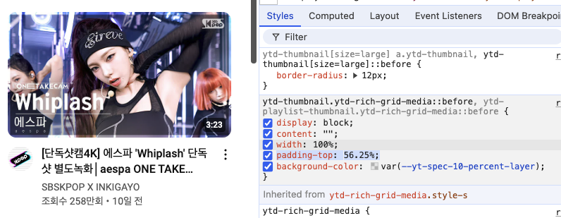
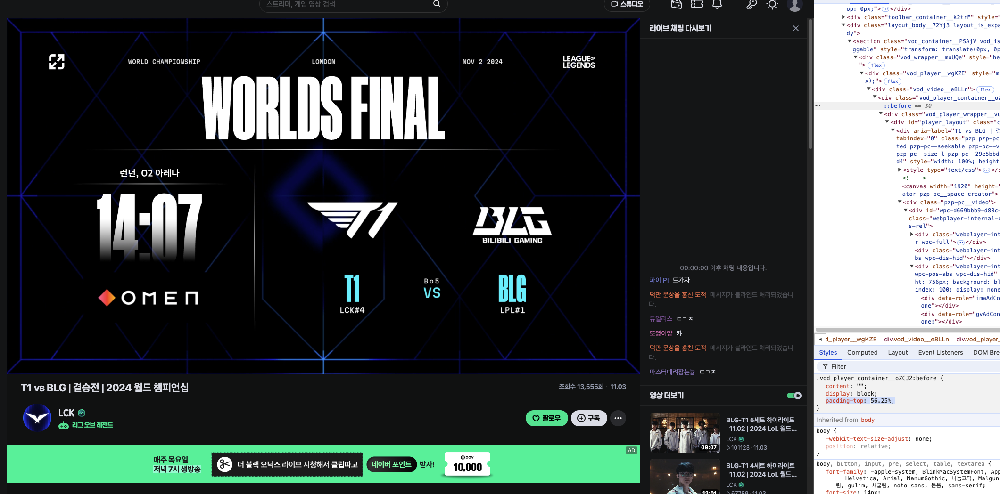
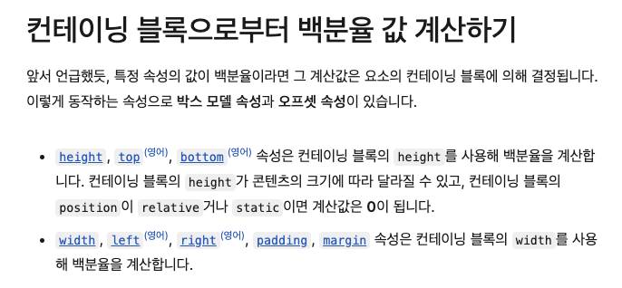
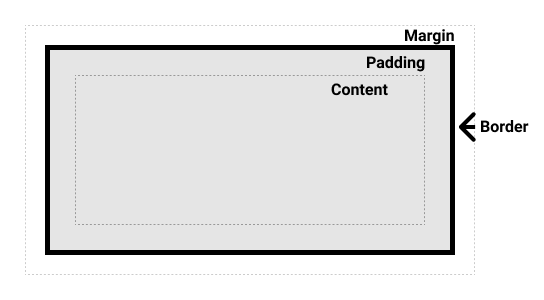
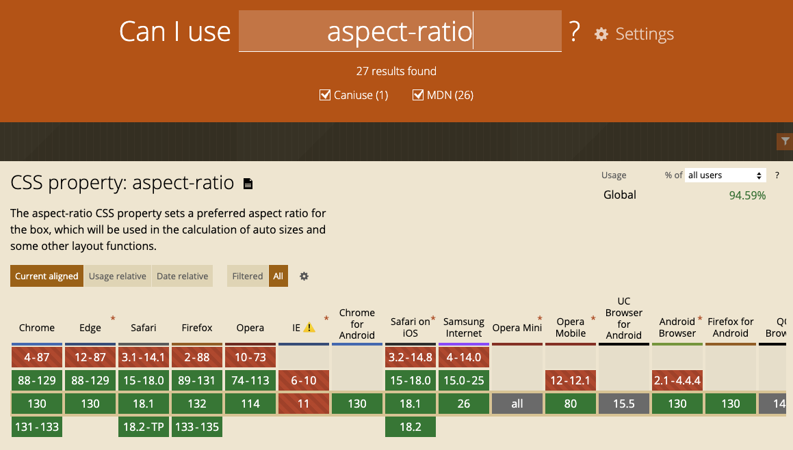

<!--truncate-->

<br />

# 반응형 비디오 플레이어 구현: 패딩 탑 기법




웹 개발을 하다 보면 다양한 화면 크기에서도 잘 동작하는 **반응형 비디오 플레이어**를 구현해야 할 때가 많습니다. 특히 YouTube와 같은 플랫폼에서 제공하는 동영상을 웹사이트에 자연스럽게 삽입하려면, 비디오의 종횡비를 유지하면서 다양한 디바이스에 맞게 크기가 조절되어야 합니다. 이번 글에서는 **패딩 탑(padding-top) 기법**을 사용하여 반응형 비디오 플레이어를 구현하는 방법과 그 이점을 자세히 알아보겠습니다.

## 목차

1. [패딩 탑 기법이란?](#패딩-탑-기법이란)
2. [왜 패딩 탑을 사용할까?](#왜-패딩-탑을-사용할까?)
3. [반응형 비디오 구현하기](#반응형-비디오-구현하기)
4. [컨테이닝 블록과 요소의 크기 결정 로직](#컨테이닝-블록과-요소의-크기-결정-로직)
5. [CSS를 모르는 사람을 위한 쉬운 설명](#css를-모르는-사람을-위한-쉬운-설명)
6. [패딩 탑 기법의 장점](#패딩-탑-기법의-장점)
7. [렌더링 최적화 예시](#렌더링-최적화-예시)
8. [패딩 탑 기법의 한계와 대안](#패딩-탑-기법의-한계와-대안)
9. [결론](#결론)

## 패딩 탑 기법이란?

패딩 탑 기법은 CSS에서 `padding-top` 속성의 백분율 값을 이용하여 요소의 높이를 부모 요소의 **너비**에 비례하여 설정하는 기법입니다. 이 방법을 통해 비디오의 종횡비를 유지하면서 다양한 화면 크기에 맞춰 비디오의 크기를 유연하게 조절할 수 있습니다.

### 왜 패딩 탑을 사용할까?

일반적으로 요소의 높이를 백분율로 설정하면 부모 요소의 **높이**를 기준으로 합니다. 하지만 부모 요소의 높이가 명시적으로 지정되지 않은 경우 자식 요소의 높이를 백분율로 설정하는 것은 어려울 수 있습니다. 반면에 패딩의 백분율 값은 항상 부모 요소의 **너비**를 기준으로 계산되기 때문에, 이를 활용하면 종횡비를 유지하면서 높이를 유연하게 설정할 수 있습니다.

## 반응형 비디오 구현하기

### 기본 구조

먼저, HTML과 CSS 코드를 통해 기본적인 반응형 비디오 플레이어 구조를 만들어보겠습니다.

```html
<article class="cont-video">
  <iframe
    class="video-whiplash"
    src="https://www.youtube.com/embed/jWQx2f-CErU"
    title="YouTube video player"
    frameborder="0"
    allowfullscreen
  ></iframe>
</article>
```

```css
.cont-video {
  position: relative;
  padding-top: 56.25%; /* 16:9 종횡비 */
}

.video-whiplash {
  position: absolute;
  top: 0;
  left: 0;
  right: 0;
  bottom: 0;
}
```

### 코드 설명

1. **컨테이너 설정 (`.cont-video`):**
   - `position: relative;`: 자식 요소인 iframe의 위치를 절대적으로 설정하기 위해 상대적인 위치 기준을 제공합니다.
   - `padding-top: 56.25%;`: 16:9 비율을 유지하기 위해 패딩 탑을 56.25%로 설정합니다. 9 ÷ 16 = 0.5625, 56.25%를 의미합니다.
2. **비디오 요소 설정 (`.video-whiplash`):**
   - `position: absolute;`: 부모 요소인 `.cont-video`를 기준으로 위치를 절대적으로 설정합니다.
   - `top: 0; left: 0; right: 0; bottom: 0;`: 부모 요소의 전체 영역을 채우도록 설정합니다.

## 컨테이닝 블록과 요소의 크기 결정 로직

패딩 탑 기법을 이해하려면 **컨테이닝 블록(containing block)**의 개념과 요소의 크기가 어떻게 결정되는지 알아야 합니다.

### 컨테이닝 블록이란?



컨테이닝 블록은 CSS에서 요소의 위치와 크기를 결정하는 기준이 되는 부모 요소를 말합니다. 자식 요소는 항상 자신의 컨테이닝 블록을 기준으로 위치와 크기가 결정됩니다.

### 요소의 크기 결정 로직



- 백분율 단위의 패딩과 마진은 부모 요소의 너비를 기준으로 계산됩니다.
- 부모 요소의 높이가 명시되지 않은 경우, 자식 요소의 높이를 백분율로 설정하면 값이 적용되지 않습니다.
- 패딩 탑 기법의 핵심은 padding-top에 백분율 값을 주어 부모의 너비에 비례한 높이를 만들어내는 것입니다.

## 패딩 탑을 추가하는데 왜 높이가 될까?

패딩은 요소 내부의 콘텐츠 주위에 추가되는 공간입니다. `padding-top`은 콘텐츠의 위쪽에 공간을 추가하는 것입니다. 패딩의 백분율 값은 부모 요소의 너비를 기준으로 계산되며, 이는 반응형 디자인을 구현하는 데 유용합니다.

## 패딩 탑 기법의 장점

1. **종횡비 유지:** 다양한 화면 크기에서도 비디오의 종횡비를 정확하게 유지할 수 있습니다.
2. **유연한 레이아웃:** 부모 요소의 너비에 따라 자동으로 크기가 조절되므로, 반응형 디자인에 최적화되어 있습니다.
3. **렌더링 최적화:** 컨테이너의 크기를 미리 계산하여 브라우저가 레이아웃을 빠르게 처리할 수 있습니다.

## 렌더링 최적화 예시

패딩 탑 기법은 반응형 비디오뿐만 아니라 이미지 렌더링에서도 **렌더링 최적화**를 위해 활용됩니다. 서버에서 이미지의 너비와 높이 값을 미리 받아와서 비율을 계산한 후, 해당 비율을 사용하여 레이아웃을 미리 지정함으로써 브라우저의 렌더링 성능을 향상시킬 수 있습니다.

## 패딩 탑 기법의 한계와 대안

패딩 탑 기법은 매우 유용하지만, 몇 가지 한계점도 존재합니다.

### 한계점

- **복잡한 레이아웃 관리:** 패딩 탑 기법을 사용하면 자식 요소를 `position: absolute;`로 설정해야 하기 때문에, 복잡한 레이아웃에서는 관리가 어려울 수 있습니다.
- **여러 요소와의 충돌 가능성:** 절대 위치를 사용하는 요소가 많아지면 예기치 않은 레이아웃 문제가 발생할 수 있습니다.

### 대안: `aspect-ratio` 속성

CSS의 `aspect-ratio` 속성은 요소의 종횡비를 간단하게 설정할 수 있는 방법을 제공합니다. 이 속성을 사용하면 패딩 탑 기법 없이도 종횡비를 유지할 수 있습니다.



## Q&A: 패딩 탑 기법 관련 자주 묻는 질문

1. **자식 요소 div가 `inline`이면 패딩 탑이 적용되지 않나요?**
   - 네, `inline` 요소는 패딩 탑이 적용되지 않습니다. `display: block;`이나 `display: inline-block;`으로 변경해야 합니다.
2. **마진 값도 퍼센트로 줄 수 있나요?**
   - 가능합니다. 마진의 퍼센트 값은 부모 요소의 **너비**를 기준으로 계산됩니다.
3. **부모의 높이가 `px`로 정해져 있어도 패딩의 퍼센트 기준은 부모의 너비인가요?**
   - 네, 패딩의 퍼센트 값은 항상 부모 요소의 **너비**를 기준으로 합니다.
4. **부모의 높이와 너비 값이 정해져 있지 않을 때 패딩의 기준은 무엇인가요?**
   - 부모 요소의 너비를 기준으로 합니다. 부모의 높이가 설정되어 있지 않아도 패딩 탑의 퍼센트는 부모의 너비를 기준으로 계산됩니다.
5. **왜 패딩 위치에 영상이 차지하고 있나요?**
   - 패딩 탑을 설정하면 부모 요소의 높이가 패딩에 의해 늘어나고, 자식 요소인 iframe이 그 공간을 채우게 됩니다. 따라서 영상이 패딩 영역을 차지하게 됩니다.
6. **마진과 패딩을 모두 퍼센트로 줄 때도 부모의 너비를 기준으로 산정되나요?**
   - 네, 마진과 패딩의 퍼센트 값은 모두 부모 요소의 **너비**를 기준으로 계산됩니다.

## 결론

패딩 탑 기법은 반응형 비디오 플레이어를 구현하는 데 매우 유용한 방법입니다. 부모 요소의 너비를 기준으로 높이를 설정하여 종횡비를 유지할 수 있기 때문에, 다양한 디바이스와 화면 크기에서 일관된 비디오 경험을 제공할 수 있습니다. 또한, `aspect-ratio` 속성을 활용하면 더욱 간단하게 종횡비를 유지할 수 있습니다.

---

**참고 자료:**

- [MDN Web Docs: Containing Block](https://developer.mozilla.org/ko/docs/Web/CSS/Containing_block)
- [MDN Web Docs: aspect-ratio](https://developer.mozilla.org/en-US/docs/Web/CSS/aspect-ratio)
- [Can I use: aspect-ratio](https://caniuse.com/?search=aspect-ratio)
- [Unsplash](https://unsplash.com/)
